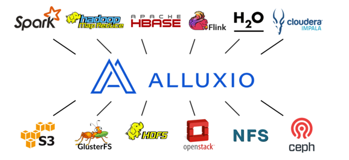
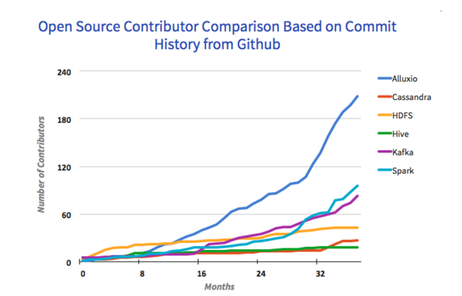
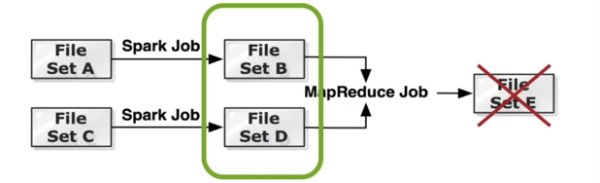
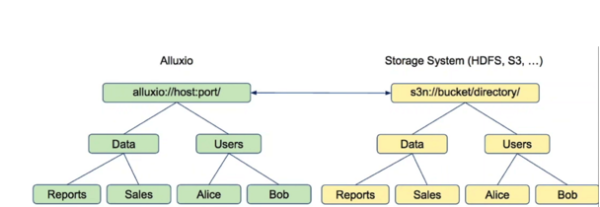
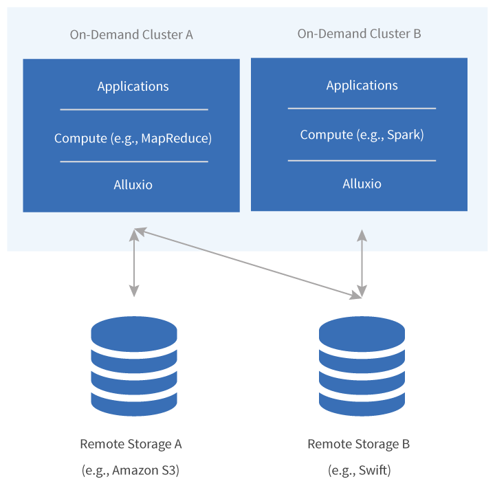

# 一文读懂Alluxio

# Alluxio简介

Alluxio是一个以内存为基础的的分布式文件系统，它是通过协调底层分布式文件系统和上层分布式计算框架，并且以文件形式在内存中提供数据服务的中间件。 在分布式系统的开源项目中，相比于同级别项目，Alluxio的增长非常迅速

其作用是在Apache Spark或MapReduce等集群框架中实现内存级速度的跨集群文件共享。可简单理解：Alluxio负责内存数据存储，而Spark负责内存数据计算。它具有类Java的文件API、兼容Hadoop MapReduce和Spark、底层文件系统可插拔等特性。Alluxio会像Apache Mesos以及Apache Spark一样，进入Apache Software Foundation（阿帕奇软件基金会）。

Alluxio 之前名为Tachyon, 是世界上第一个以内存为中心的虚拟的分布式存储系统。它统一了数据访问的方式，为上层计算框架和底层存储系统构建了桥梁。2012年诞生于UC Berkeley AMPLab，此前这个实验室孵化了Apache Mesos和Apache Spark等著名开源项目。2013年4月开源，现在由最初的Tachyon改名为Alluxio，基于Apache License 2.0开源标准

# Alluxio的场景分析

在很多大数据应用场景中，某些具体的处理问题通常只涉及到整体数据集的一个子集或部分数据。这导致长时间占用大规模集群的整体数据分析方式的资源有效利用率较低，并且总体代价较高，尤其在系统采用计算和存储并置（co-locate）部署架构的场景下各位严重。另外，在很多即席查询和计算应用中，数据的分析任务通常由上层用户零散地给出，与用于处理管道数据和流数据的连续运行分析任务不同，这种零散的分析任务会造成集群的计算能力有些时间段不能被充分利用。另一方面，集群的存储容量必须容纳可能被访问到的任何数据，尽管实际上每次需要使用的工作集合只是整体数据的一小部分。最后，集群本身还需要大量精心的维护管理工作，以确保集群使用者之间的隔离和性能不受彼此太多影响。
对于上述这些问题的简洁而优雅的解决方案是采用一种上层按需计算集群结合底层对象存储的架构。这种架构通过解耦需要连续运行的持久化存储模块和只有发生分析任务才使用的计算模块来解决这些问题的根源。与上段提到的需要连续运行的整体化集群架构相比，这种架构具有如下优势：

* 更高的存储性价比和可扩展性：对象存储的性价比很高，大多数对象存储服务提供商都为用户提供无缝扩展到任意数据量的功能。
* 更高的计算性价比和系统弹性：仅在需要时才使用计算资源，并在必要时扩展计算集群规模以适应不同规模的分析任务。
* 降低维护成本：计算集群变成一种消耗性资源，使用完后即可释放相关资源，并不需要长时间维护。用户也不需要担心数据的安全问题，因为通常提供给计算集群的数据是来自底层对象存储的数据副本。

事实上，这种计算和存储解耦的方案具备上述优势的同时，也存在着一个关键的缺点：性能损失。这是因为底层的对象存储通常并不是为高IO吞吐量而设计的，因此会导致上层的计算分析任务可能会因为数据访问效率低下而整体性能变地低效。

幸运的是新架构存在的这个问题可以通过在计算集群上部署Alluxio得到很好的解决。通过引入Alluxio，可以使得计算任务的I/O速度达到内存级别，并且不需要维护长时间运行的集群或昂贵的前期投入成本。

# Alluxio的优势分析

通过Alluxio虚拟化底层存储系统，使得任何基于Alluxio API接口（Alluxio提供HDFS兼容接口）编写的计算应用程序都能自动地访问用任何或多个底层存储系统，而不需要修改任何代码。此外，Alluxio是一个设计为可横向扩展的分布式存储系统，这意味着通过部署更多的机器来轻松地存储更大的数据集并提高访问性能。 事实上，部署和使用Alluxio对上层应用程序而言是简单和透明的。应用程序还是不断地访问数据，就好像作业直接访问的是远程存储上的数据，Alluxio会智能地将热数据保存在计算集群的内存中以供后续读取。整个过程对于应用程序是透明的，并且不需要进行手动ETL。一旦数据进入Alluxio，它将对集群的所有应用程序可用，因此在同一数据集被多次使用的场景中，应用的性能会大幅提高。 

Alluxio为用户提供较高的灵活性和效率。充分利用内存，成为趋势，而Memory locality成为影响相应时间最重要的因素之一。任何需要持久化的结果或转换都可以通过Alluxio直接完成，Alluxio可以将数据同步传播到底层存储系统，以确保数据不会因为节点故障而丢失。此外，用户还可以选择仅在Alluxio内存中存储临时数据或中间数据，从而允许计算任务对这些缓存的数据进行内存级速度访问。

# 现有的多样化功能

* 灵活的文件API: Alluxio的本地API类似于java.io.File类，提供了 InputStream和OutputStream的接口和对内存映射I/O的高效支持。我们推荐使用这套API以获得Alluxio的最好性能。 另外，Alluxio提供兼容Hadoop的文件系统接口，Hadoop MapReduce和Spark可以使用Alluxio代替HDFS。

* 可插拔的底层存储: 在容错方面，Alluxio备份内存数据到底层存储系统。Alluxio提供了通用接口以简化插入 不同的底层存储系统。目前我们支持Microsoft Azure Blob Store，Amazon S3，Google Cloud Storage，OpenStack Swift，GlusterFS， HDFS，MaprFS，Ceph，NFS，Alibaba OSS，Minio以及单节点本地文件系统，后续也会支持很多其它的文件系统。

* 层次化存储: 通过分层存储，Alluxio不仅可以管理内存，也可以管理SSD 和HDD,能够让更大的数据集存储在Alluxio上。数据在不同层之间自动被管理，保证热数据在更快的存储层上。自定义策 略可以方便地加入Alluxio，而且pin的概念允许用户直接控制数据的存放位置。

* 统一命名空间: Alluxio通过挂载功能在不同的存储系统之间实现高效的数据管理。并且，透明命名在持久化这些对象到底层存储系统时可以保留这些对象的文件名和目录层次结构。Alluxio可以挂载多个不同的文件系统到一个统一的命名空间当中，如不同的文件系统A和文件系统B可以同时挂载到Alluxio上面的不同目录当中。

* 世系(Lineage): 通过世系(Lineage)，Alluxio可以不受容错的限制实现高吞吐的写入， 丢失的输出可以通过重新执行创建这一输出的任务来恢复。应用将输出写入内存，Alluxio以异步方式定期备份数据到底层 文件系统。写入失败时，Alluxio启动任务重执行恢复丢失的文件。当数据丢失后，通过世代找到相应的之前数据，重新部署一个Job将数据重新计算。

* 网页UI & 命令行: 用户可以通过网页UI浏览文件 系统。在调试模式下，管理员可以查看每一个文件的详细信息，包括存放位置，检查点路径等等。用户也可以通 过./bin/alluxio fs与Alluxio交互，例如：将数据从文件系统拷入拷出。

* 透明命名: Alluxio可以提供将创建，重命名和删除文件等操作从Alluxio映射到底层存储层（比如上图中的HDFS 或者S3)的对象中，从而实现将底层存储系统中的文件与其Alluxio自身管理的文件系统的完全同步。

* Alluxio 和Spark RDD缓存: 将RDD数据存储在Alluxio中，Spark job不需要配置存储数据所需的额外内存，只需配置数据计算所需的内存大小。Alluxio提供了数据存储所需内存，所以RDD数据仍然在内存中。如果Spark job崩溃，数据将仍然存储在Alluxio的内存中，可以被接下来的任务调用。

# 应用现状

巴克莱银行使用Alluxio将他们的作业分析的耗时从小时级降到秒级。 去哪儿网基于Alluxio进行实时数据分析。 除性能外，Alluxio为新型大数据应用作用于传统存储系统的数据建立了桥梁。 用户可以以 独立集群模式,在例如 Amazon EC2, Google Compute Engine运行Alluxio, 或者用 Apache Mesos或 Apache Yarn安装Alluxio。

Alluxio与Hadoop是兼容的。现有的数据分析应用，如Spark和MapReduce程序，可以不修改代码直接在Alluxio上运行。Alluxio是一个已在多家公司部署的开源项目(Apache License 2.0)。 Alluxio是发展最快的开源大数据项目之一。自2013年4月开源以来，已有超过100个组织机构的 500多贡献者参与到Alluxio的开发中。包括 阿里巴巴, Alluxio, 百度, 卡内基梅隆大学,Google，IBM，Intel, 南京大学, Red Hat，UC Berkeley和 Yahoo。Alluxio处于伯克利数据分析栈 (BDAS)的存储层，也是 Fedora发行版的一部分。 到今天为止，Alluxio已经在超过100家公司的生产中进行了部署，并且在超过1000个节点的集群上运行着。

# 资料

[Tachyon: An Open Source Memory-Centric Distributed Storage System](http://docs.huihoo.com/alluxio/Tachyon-An-Open-Source-Memory-Centric-Distributed-Storage-System.pdf)
[Alluxio @ GitHub](https://github.com/Alluxio/alluxio)
[Alluxio官网](http://alluxio.org/)
[Pivotal和EMC谈下一代数据湖技术：Tachyon + Spark将极为重要](http://www.infoq.com/cn/news/2014/10/pivotal-tachyon)
[Alluxio : 开源分布式内存文件系统](https://zhuanlan.zhihu.com/p/20624086)