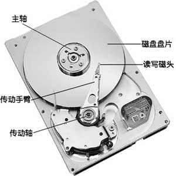
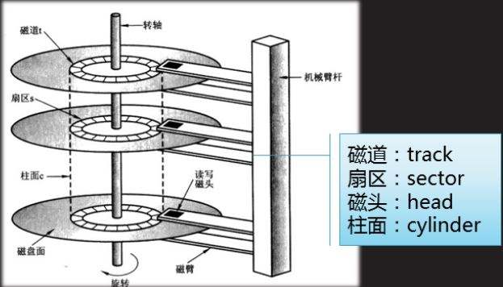
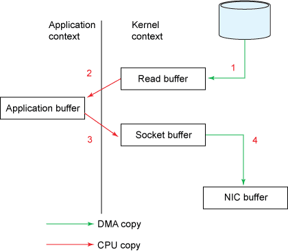
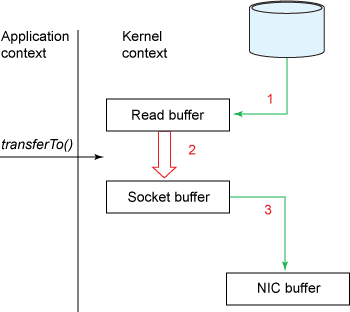

## 前言
本文简单介绍了Apache Kafka服务端的一些设计，因为没有详细的介绍一些基础概念和适合有对Kafka有一定了解的同学们阅读。如果想深入了解Kafka，推荐阅读[Kafka官方文档](http://kafka.apache.org/documentation/)和[源代码](https://github.com/apache/kafka)。

Kafka被设计出来的目标是做为海量实时数据传输的分布式数据流平台，主要用来传输和聚合日志数据、追踪网站活动、传输监控数据和作为消息队列等。为了满足这些功能，Kafka需要具有如下特性：
1. 高吞吐
作为海量数据的传输平台，Kafka需要极大的吞吐量来保证海量数据的传输。
2. 低延迟
实时数据处理最重要的指标之一就是延迟，需要低延迟来保证它作为消息队列时的性能。
3. 高可用
为了避免服务器故障、JVM崩溃等问题带来的数据丢失情况，需要具备较好的容错性。
4. 多次消费
据统计，在LinkedIn公司内Kafka中的每条消息平均要被消费5次以上。为了支持海量数据的可重复消费，Kafka需要很大的容量。

为了实现这些特性，Kafka使用了相当多的”黑科技“。下面让我们一一解读一下。
## 一、顺序写入
可以说，Kafka是重度依赖文件系统的，它会把所有的数据写入到硬盘上。可是按照我们平时的理解，对硬盘的读写不是很慢么？其实还真不一定。要理解影响硬盘读写速度的因素，首先我们要了解硬盘的结构。
#### 硬盘结构
首先，我们来看一张硬盘的结构图：

如上图所示，磁盘主要由磁盘盘片、传动手臂、读写磁头和主轴组成。为了更好的利用盘片资源，每张盘片的两面都可以记录信息，所以每张盘片会对应上下两个磁头读写数据。由于单张盘片能存储的数据量有限，所以一般磁盘都有多个盘片。盘面被分为许多扇形区域，称为扇区。围绕着盘面中心的不同半径的同心圆被称为磁道。不同盘片间相同半径的磁道组成的圆柱体称为柱面。如下图所示：

#### 硬盘的读写过程
磁盘中的数据全部存储在磁盘的盘片上面，读取数据时转动主轴到指定位置，传动手臂进行伸展，最后由读写磁头完成实际的读写操作。那么为什么大家会觉得硬盘的读写很慢呢？因为一次硬盘IO需要以下三个步骤：
1. 寻道
磁盘要想读写数据，首先要找到正确的磁道。读写磁头移动到需要被读写的磁道上的时间被称为寻道时间。
2. 旋转
旋转、跳跃，磁盘闭着眼。要想读写数据，光找到正确的磁道还不够，硬盘要通过主轴的旋转找到正确的扇区。磁盘通过旋转找到正确扇区的时间被称为旋转延迟。我们平时经常听到的这种磁盘7200转，那种磁盘15000转，指的就是磁盘的转速（每分钟能转多少圈）。转的越快，旋转延迟越短，IO速度越快。
3. 数据传输
到这里才是数据才能真正进行读写。数据传输的速度很快，好一些的磁盘通常能达到百兆甚至几百兆每秒。

看到这里我们知道了，一次完整的磁盘IO时间实际上为：
> 寻道时间 + 旋转延迟 + 数据传输时间

一般的磁盘操作，绝大部分的时间花在了前两个步骤上。也就是说，对磁盘进行顺序读写很快（因为基本不用进行前两个步骤），而随机读写就很慢了。根据Kafka官方给出的数据，在7200rpm/s的SATA RAID-5磁盘阵列上进行顺序写入速度达到600MB/sec，而随机写入大概只有100KB/sec，相差了6000倍！而Kafka正是使用了顺序读写，才能获得如此高的性能。

## 二、Page Cache与Memory Map
如果仅仅使用顺序读写，那么Kafka也不会有现在这么好的性能。事实上，Kafka充分利用了现代操作系统中的文件缓存系统。

在现代操作系统中，为了弥补硬盘写入的速度的不足，系统越来越激进的使用内存作为文件系统的缓存，甚至会使用所有空闲的内存作为磁盘缓存(即*page cache*)。Page cache提供了预读和回写功能。简单来说，预读就是当顺序读取文件内容时，page cache会提前将当前读取页面之后的几个页面也加载到page cache当中，这样程序相当于直接读取cache中的内容，而不必直接与磁盘交互。回写就是当磁盘进行写入时，会写入到page cache当中，由操作系统在恰当的时候再写入磁盘。很多人不知道的是，*所有我们的常规IO操作全部都要经过page cache*，这个特性是在操作系统层面决定的，很难取消掉。

有了page cache，一切看起来都很美好。可实际情况是，这里面仍然存在一些问题。首先，当我们使用常规方式读取文件内容时，系统内核必须将page cache中的文件内容复制到user buffer中。这不仅浪费了CPU时间，而且还将导致系统的物理内存中出现两份数据，浪费了物理内存空间。另外，由于Kafka是构建在JVM上的，对于JVM比较了解的同学都会知道这样两条规律：
1. JVM中对象消耗的内存非常大，经常会达到实际数据的两倍甚至更多。
2. 随着数据量的增长，JVM的垃圾回收将会越来越慢，甚至不可忍受。

所以基于以上考虑，Kafka并没有使用常规的磁盘操作，而是使用了*Memory-mapped files*。当使用Memory-mapped files时，系统内核会将程序的virtual memory直接映射到page cache，使我们可以把文件数据当做内存数据一样操作。这样不仅避免了数据在内核空间和用户空间之间复制，也避免了使用java对象带来的一些问题，从而极大提高了Kafka读写效率。在java的NIO中提供了使用memory-mapped files的api，即MappedByteBuffer（继承自ByteBuffer），感兴趣的同学可以去深入研究。关于page cache和memory-mapped files，可以阅读这篇博客：[Page Cache, the Affair Between Memory and Files](http://duartes.org/gustavo/blog/post/page-cache-the-affair-between-memory-and-files/)。

## 三、Zero-Copy
按照前两节所讲述的，我们使用顺序读写最大化磁盘性能；使用page cache和高效的memory-mapped files，避免对磁盘进行直接操作。按道理来讲，性能上应该非常出色了。但是尽管如此，还是有两个问题影响着系统的性能：频繁的小数据量网络IO操作和过多的字节拷贝。

为了避免频繁的网络往返带来的性能开销，Kafka将消息组合在一起形成一个“消息集”。使用这种方式可以将消息分批发送，而不是单条发送，从而分摊了网络往返的开销。当数据量巨大的时候，这种方式可以极大的提升网络IO的性能。Kafka的生产者和消费者都是采用这种方式向Kafka发送数据和从Kafka拉取数据的。

接下来我们来介绍一下zero-copy。Kafka使用了Linux的系统调用sendfile来发送系统中的消息，为了了解sendfile系统调用带来的优势，我们先来了解一下通过socket发送数据的传统方式：

由上图我们可以看到，如果要将磁盘上的数据发送出去，需要经过以下四个步骤：
1. 操作系统从磁盘读取数据，并写入到内核空间的page cache中。
2. 应用程序从内核空间读取数据，并复制到用户空间中。
3.应用程序将用户空间中的数据写回到内核空间的socket缓冲中去。
4.操作系统将socket缓冲中的数据复制到网卡缓冲中，并经过网卡发送出去。

可以看到这种传统发送数据的方式经过了四次数据复制和两次系统调用，效率很差。那么使用sendfile系统调用后是什么情况呢？

从图中我们可以看到，使用sendfile可以直接从page cache复制数据到网卡缓冲，避免了不必要的系统调用和数据复制，非常高效。

由于Kafka的一个topic往往有多个消费者组在消费，所以采用zero-copy的方式，让数据只从磁盘读取到page cache一次，就可以服务所有的消费了。通过使用page cache和sendfile，在消费者消费Kafka中数据的时候，磁盘几乎没有任何读取活动，全部的数据都来自于page cache中。

在java中，java.nio.channels.FileChannel类提供了transferTo()方法来实现zero copy（当然还取决与操作系统，在Unix和多数Linux上transferTo()方法会进行sendfile系统调用）。

## 四、端到端批量压缩
很多时候，数据传输的性能瓶颈不在于CPU或硬盘，而在于网络带宽。这种情况在远距离的公网传输中最为常见。为了解决这个问题，Kafka提供了端到端的批量压缩功能。虽然用户也可以对每条消息自行压缩，但是一些数据格式可能导致单条压缩的压缩比较低。举例来说，在一批JSON数据中，字段名称其实是重复的，单条压缩会造成很多冗余。

而Kafka把一批消息抽象为“消息集”（上节讲到过），producer对数据集进行压缩，这些数据将会以被压缩的格式传输到服务器并写入到数据日志中，只有当消费者读取这些数据后它们才会被解压缩。Kafka目前支持GZIP，Snappy和LZ4压缩方式。

## 五、ISR
Kafka使用ISR机制来保证系统的高可用。在创建topic时，我们可以通过设置replication-factor参数来控制topic的复制因子（之后通过Kafka提供的工具也可以动态改变这个参数）。比如在下面创建topic的语句中：
> bin/kafka-topics.sh --create --zookeeper localhost:2181 --replication-factor 3 --partitions 5 --topic test

我们设置了 replication-factor 为3，即有三个副本。副本的作用就是当集群中的某个服务器发生故障时，系统可以自动使用其他服务器上的副本提供服务，不会影响到消息的生产和消费。

副本的单位是partition。每个partition会有一个leader，零或多个follower。所有leader和follower的数量加在一起就是replication-factor参数的值。比如上面设置了replication-factor为3，那么这个topic中的每个partition就有1个leader和2个follower。在对topic的partition进行读写时，所有的读写操作都会去直接请求leader，follower只是被动的去同步leader中的消息。而follower中的消息，不论是消息的顺序还是offset全部与leader相同。当然，由于消息先被写入leader，follower再去拉取数据，所以同步上会存在很小一段时间的延迟。

与一般的分布式系统不同，Kafka没有使用“alive”或者“failed”来标志副本的存活情况，而是使用了一个新的概念：“in-sync”。所有在“in-sync”状态的replication（副本）构成了这个partition的“同步副本队列”，即ISR。那么Kafka如何判断一个replication是否在“in-sync”状态下呢？
1. 副本所在的节点必须持有 Zookeeper的session。
2. 副本复制leader上写入消息的位置不能“落后太多”。

如果违反了其中任意一条，那么这个副本会被暂时移出ISR队列，当它重新满足这两条要求时，又会被加入进来。当然，如果leader挂掉，那么会有一个follower被选举成为新的leader，为partition的读写提供服务。使用命令：
> bin/kafka-topics.sh --describe --zookeeper localhost:2181 --topic my-topic

可以看到此topic下每个partition的replicas和ISR情况。
## 总结
作为目前最流行的分布式消息系统，Apache Kafka的很多设计都非常精妙，值得我们学习和借鉴。由于篇幅所限，本文只是简单的列举了一些Kafka服务端设计中的主要内容，还有许多其他的内容没有写出来，而这些设计的具体代码实现也远比本文中这些三言两句的复述要复杂的多。学习任何开源项目最好的途径就是官方文档与源代码，欢迎各位感兴趣的同学去深入挖掘和研究。
