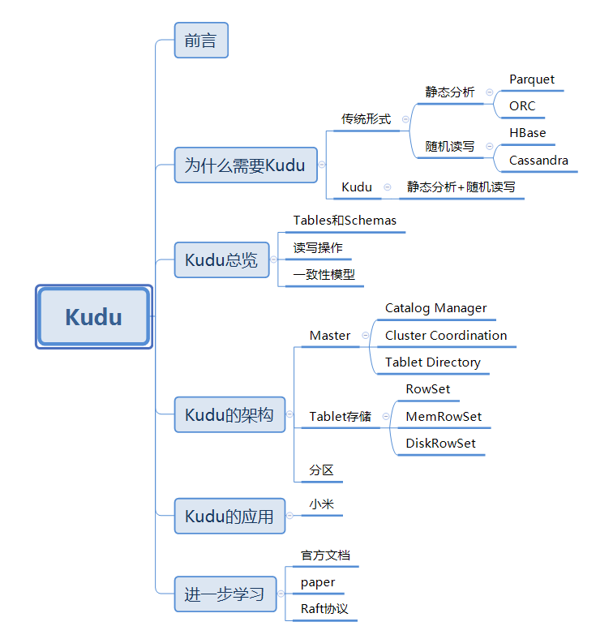
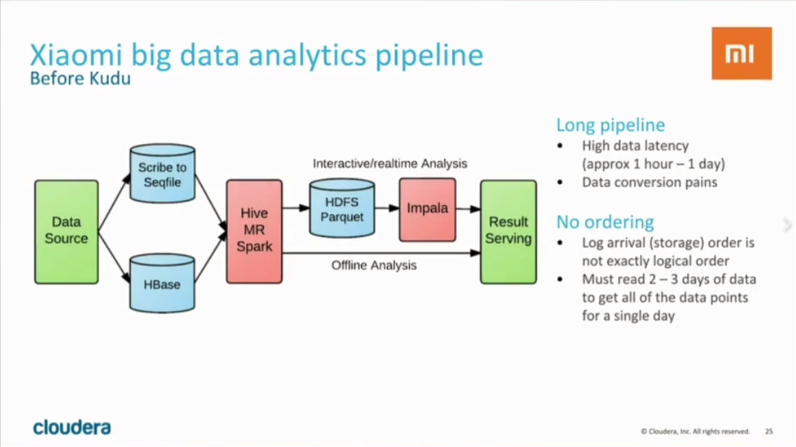
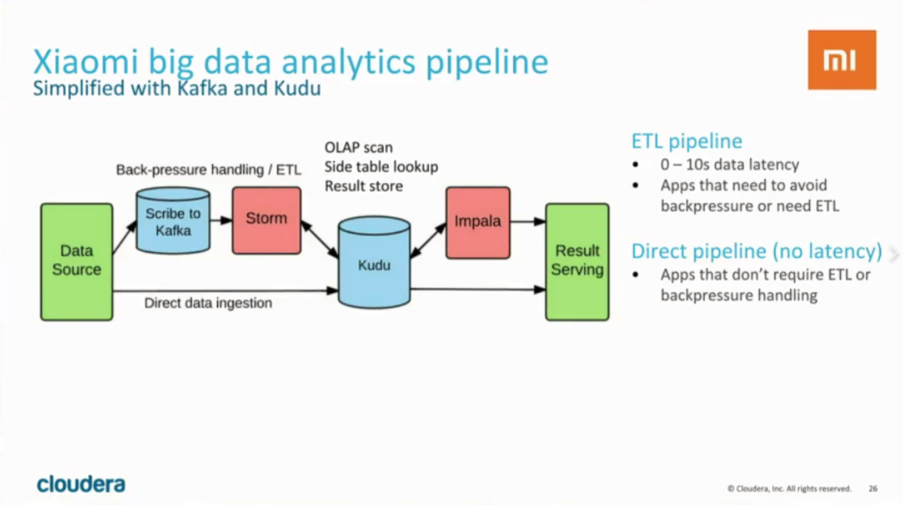

## 前言
Apache Kudu是由Cloudera开源的存储引擎，可以同时提供低延迟的随机读写和高效的数据分析能力。Kudu支持水平扩展，使用Raft协议进行一致性保证，并且与Cloudera Impala和Apache Spark等当前流行的大数据查询和分析工具结 合紧密。本文将为您介绍Kudu的一些基本概念和架构以及在企业中的应用，使您对Kudu有一个较为全面的了解。

## 一、为什么需要Kudu
Kudu这个名字听起来可能有些奇怪，实际上，Kudu是一种非洲的大羚羊，中文名叫“捻角羚”，就是下图这个样子：

比较有意思的是，同为Cloudera公司开源的另一款产品Impala，是另一种非洲的羚羊，叫做“黑斑羚”，也叫“高角羚”。不知道Cloudera公司为什么这么喜欢羚羊，也许是因为羚羊的速度快吧。  
言归正传，现在提起大数据存储，我们能想到的技术有很多，比如HDFS，以及在HDFS上的列式存储技术Apache Parquet，Apache ORC，还有以KV形式存储半结构化数据的Apache HBase和Apache Cassandra等等。既然有了如此多的存储技术，Cloudera公司为什么要开发出一款全新的存储引擎Kudu呢？
事实上，当前的这些存储技术都存在着一定的局限性。对于会被用来进行分析的静态数据集来说，使用Parquet或者ORC存储是一种明智的选择。但是目前的列式存储技术都不能更新数据，而且随机读写性能感人。而可以进行高效随机读写的HBase、Cassandra等数据库，却并不适用于基于SQL的数据分析方向。所以现在的企业中，经常会存储两套数据分别用于实时读写与数据分析，先将数据写入HBase中，再定期通过ETL到Parquet进行数据同步。但是这样做有很多缺点：
1. 用户需要在两套系统间编写和维护复杂的ETL逻辑。
2. 时效性较差。因为ETL通常是一个小时、几个小时甚至是一天一次，那么可供分析的数据就需要一个小时至一天的时间后才进入到可用状态，也就是说从数据到达到可被分析之间是会存在一个较为明显的“空档期”的。
3. 更新需求难以满足。在实际情况中可能会有一些对已经写入的数据的更新需求，这种情况往往需要对历史数据进行更新，而对Parquet这种静态数据集的更新操作，代价是非常昂贵的。
4. 存储资源浪费。两套存储系统意味着占用的磁盘资源翻倍了，造成了成本的提升。

我们知道，基于HDFS的存储技术，比如Parquet，具有高吞吐量连续读取数据的能力；而HBase和Cassandra等技术适用于低延迟的随机读写场景，那么有没有一种技术可以同时具备这两种优点呢？Kudu提供了一种“happy medium”的选择：

Kudu不但提供了行级的插入、更新、删除API，同时也提供了接近Parquet性能的批量扫描操作。使用同一份存储，既可以进行随机读写，也可以满足数据分析的要求。

## 二、Kudu总览
### Tables和Schemas
从用户角度来看，Kudu是一种存储结构化数据表的存储系统。在一个Kudu集群中可以定义任意数量的table，每个table都需要预先定义好schema。每个table的列数是确定的，每一列都需要有名字和类型，每个表中可以把其中一列或多列定义为主键。这么看来，Kudu更像关系型数据库，而不是像HBase、Cassandra和MongoDB这些NoSQL数据库。不过Kudu目前还不能像关系型数据一样支持二级索引。
Kudu使用确定的列类型，而不是类似于NoSQL的“everything is byte”。这可以带来两点好处：
1. 确定的列类型使Kudu可以进行类型特有的编码。
2. 可以提供 SQL-like 元数据给其他上层查询工具，比如BI工具。

### 读写操作
用户可以使用 *Insert*，*Update*和*Delete* API对表进行写操作。不论使用哪种API，都必须指定主键。但批量的删除和更新操作需要依赖更高层次的组件（比如Impala、Spark）。Kudu目前还不支持多行事务。
而在读操作方面，Kudu只提供了*Scan*操作来获取数据。用户可以通过指定过滤条件来获取自己想要读取的数据，但目前只提供了两种类型的过滤条件：主键范围和列值与常数的比较。由于Kudu在硬盘中的数据采用列式存储，所以只扫描需要的列将极大地提高读取性能。

### 一致性模型
Kudu为用户提供了两种一致性模型。默认的一致性模型是*snapshot consistency*。这种一致性模型保证用户每次读取出来的都是一个可用的快照，但这种一致性模型只能保证单个client可以看到最新的数据，但不能保证多个client每次取出的都是最新的数据。另一种一致性模型*external consistency*可以在多个client之间保证每次取到的都是最新数据，但是Kudu没有提供默认的实现，需要用户做一些额外工作。
为了实现*external consistency*，Kudu提供了两种方式：
1. 在client之间传播timestamp token。在一个client完成一次写入后，会得到一个timestamp token，然后这个client把这个token传播到其他client，这样其他client就可以通过token取到最新数据了。不过这个方式的复杂度很高。
2. 通过*commit-wait*方式，这有些类似于Google的Spanner。但是目前基于NTP的*commit-wait*方式延迟实在有点高。不过Kudu相信，随着Spanner的出现，未来几年内基于real-time clock的技术将会逐渐成熟。

## 三、Kudu的架构
与HDFS和HBase相似，Kudu使用单个的Master节点，用来管理集群的元数据，并且使用任意数量的Tablet Server节点用来存储实际数据。可以部署多个Master节点来提高容错性。

### Master
Kudu的master节点负责整个集群的元数据管理和服务协调。它承担着以下功能：
1. 作为*catalog manager*，master节点管理着集群中所有table和tablet的schema及一些其他的元数据。
2. 作为*cluster coordinator*，master节点追踪着所有server节点是否存活，并且当server节点挂掉后协调数据的重新分布。
3. 作为*tablet directory*，master跟踪每个tablet的位置。

#### Catalog Manager
Kudu的master节点会持有一个单tablet的table——catalog table，但是用户是不能直接访问的。master将内部的catalog信息写入该tablet，并且将整个catalog的信息缓存到内存中。随着现在商用服务器上的内存越来越大，并且元数据信息占用的空间其实并不大，所以master不容易存在性能瓶颈。catalog table保存了所有table的schema的版本以及table的状态（创建、运行、删除等）。

#### Cluster Coordination
Kudu集群中的每个tablet server都需要配置master的主机名列表。当集群启动时，tablet server会向master注册，并发送所有tablet的信息。tablet server第一次向master发送信息时会发送所有tablet的全量信息，后续每次发送则只会发送增量信息，仅包含新创建、删除或修改的tablet的信息。
作为cluster coordination，master只是集群状态的观察者。对于tablet server中tablet的副本位置、Raft配置和schema版本等信息的控制和修改由tablet server自身完成。master只需要下发命令，tablet server执行成功后会自动上报处理的结果。

#### Tablet Directory
因为master上缓存了集群的元数据，所以client读写数据的时候，肯定是要通过master才能获取到tablet的位置等信息。但是如果每次读写都要通过master节点的话，那master就会变成这个集群的性能瓶颈，所以client会在本地缓存一份它需要访问的tablet的位置信息，这样就不用每次读写都从master中获取。
因为tablet的位置可能也会发生变化（比如某个tablet server节点crash掉了），所以当tablet的位置发生变化的时候，client会收到相应的通知，然后再去master上获取一份新的元数据信息。

### Tablet存储
在数据存储方面，Kudu选择完全由自己实现，而没有借助于已有的开源方案。tablet存储主要想要实现的目标为：
1. 快速的列扫描。
2. 低延迟的随机读写。
3. 一致性的性能。

#### RowSets
在Kudu中，tablet被细分为更小的单元，叫做*RowSets*。一些RowSet仅存在于内存中，被称为*MemRowSets*，而另一些则同时使用内存和硬盘，被称为*DiskRowSets*。任何一行未被删除的数据都只能存在于一个RowSet中。
无论任何时候，一个tablet仅有一个MemRowSet用来保存最新插入的数据，并且有一个后台线程会定期把内存中的数据flush到硬盘上。
当一个MemRowSet被flush到硬盘上以后，一个新的MemRowSet会替代它。而原有的MemRowSet会变成一到多个DiskRowSet。flush操作是完全同步进行的，在进行flush时，client同样可以进行读写操作。

#### MemRowSet
MemRowSets是一个可以被并发访问并进行过锁优化的B-tree，主要是基于MassTree来设计的，但存在几点不同：
1. Kudu并不支持直接删除操作，由于使用了MVCC，所以在Kudu中删除操作其实是插入一条标志着删除的数据，这样就可以推迟删除操作。
2. 类似删除操作，Kudu也不支持原地更新操作。
3. 将tree的leaf链接起来，就像B+-tree。这一步关键的操作可以明显地提升scan操作的性能。
4. 没有实现字典树（trie树），而是只用了单个tree，因为Kudu并不适用于极高的随机读写的场景。

与Kudu中其他模块中的数据结构不同，MemRowSet中的数据使用行式存储。因为数据都在内存中，所以性能也是可以接受的，而且Kudu对在MemRowSet中的数据结构进行了一定的优化。

#### DiskRowSet
当MemRowSet被flush到硬盘上，就变成了DiskRowSet。当MemRowSet被flush到硬盘的时候，每32M就会形成一个新的DiskRowSet，这主要是为了保证每个DiskRowSet不会太大，便于后续的增量compaction操作。Kudu通过将数据分为base data和delta data，来实现数据的更新操作。Kudu会将数据按列存储，数据被切分成多个page，并使用B-tree进行索引。除了用户写入的数据，Kudu还会将主键索引存入一个列中，并且提供布隆过滤器来进行高效查找。

#### Compaction
为了提高查询性能，Kudu会定期进行compaction操作，合并delta data与base data，对标记了删除的数据进行删除，并且会合并一些DiskRowSet。

### 分区
和许多分布式存储系统一样，Kudu的table是水平分区的。BigTable只提供了range分区，Cassandra只提供hash分区，而Kudu提供了较为灵活的分区方式。当用户创建一个table时，可以同时指定table的的partition schema，partition schema会将primary key映射为partition key。一个partition schema包括0到多个hash-partitioning规则和一个range-partitioning规则。通过灵活地组合各种partition规则，用户可以创造适用于自己业务场景的分区方式。

## 四、Kudu的应用
Kudu的应用场景很广泛，比如可以进行实时的数据分析，用于数据可能会存在变化的时序数据应用等，甚至还有人探讨过使用Kudu替代Kafka的可行性（详情请戳[这里](http://blog.rodeo.io/2016/01/24/kudu-as-a-more-flexible-kafka.html)）。不过Kudu最有名和最成功的应用案例，还是国内的小米。小米公司不仅使用Kudu，还深度参与了Kudu的开发。Kudu项目在2012年10月由Cloudera公司发起，2015年10月对外公布，2015年12月进入Apache孵化器，但是小米公司早在2014年9月就加入到Kudu的开发中了。
下面我们可以跟随Cloudera在宣传Kudu时使用的ppt来看一看Kudu在小米的使用。

从上图中我们可以看到，Kudu在小米主要用来对手机app和后端服务的RPC调用事件进行追踪，以及对服务进行监控。在小米的使用场景下，Kudu集群已经达到每天200亿次写入，并且还在增长。
Kudu除了优秀的性能，更为重要的是可以简化数据处理的流程。在使用Kudu以前，小米的数据处理流程是这样的：

可以看到，数据处理的流程很长。这种处理模式不但较为复杂，而且latency较高，通常需要等待较长的时间（1 hour - 1day）才能得到分析结果。下面再来看看使用Kudu以后的数据处理流程是怎样的：

使用Kudu以后，数据处理的链路被简化了，而且得益于Kudu对随机读写和数据分析操作的支持都很好，可以直接对Kudu中的数据进行交互式分析，降低了系统复杂度，并且latency被大大缩短（0 ~ 10s）。

## 五、进一步学习
如果您看了本文的介绍后想进一步学习Kudu，以下途径可以帮助您快速入门：
1. [Documentation](http://kudu.apache.org/docs/)，官方文档永远是学习开源项目的最好去处。
2. [Paper](http://kudu.apache.org/kudu.pdf)，Kudu的论文可以帮助您深入了解Kudu的设计思想。
3. [Raft协议](https://raft.github.io/)，虽然不属于Kudu的内容，但是Kudu的一致性协议使用了Raft协议，了解Raft协议可以帮助您更好地了解Kudu及其他分布式开源系统。
4. [Apache Kudu as a More Flexible And Reliable Kafka-style Queue](http://blog.rodeo.io/2016/01/24/kudu-as-a-more-flexible-kafka.html)，这篇博客也许能对您在如何使用Kudu的问题上有一些启发。

比较遗憾的是，由于Kudu还很年轻，所以并没有比较好的相关书籍出版。计算机是一门实践性较强的学科，所以动手实践是成为Kudu专家的必经之路：[github地址](https://github.com/apache/kudu)。
