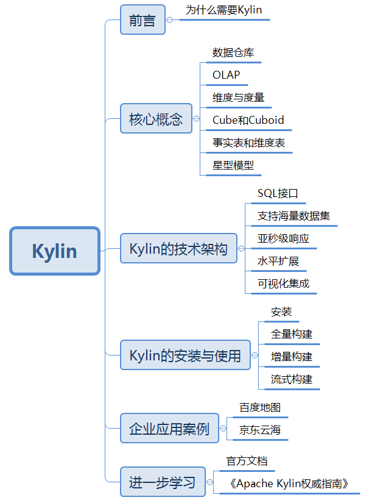
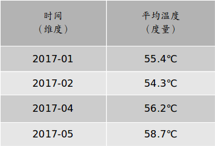
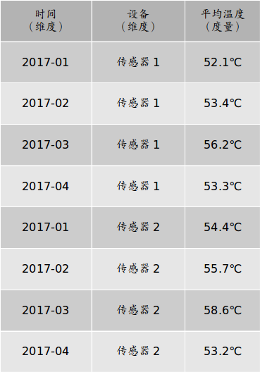
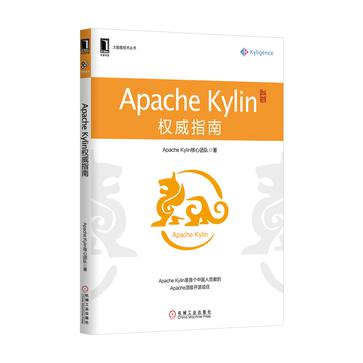

“麒麟出没，必有祥瑞。”
 　　　　　　　　　　　　　　　　　　　　　　　　　　　　　　—— 中国古谚语

## 前言
随着移动互联网、物联网等技术的发展，近些年人类所积累的数据正在呈爆炸式的增长，大数据时代已经来临。但是海量数据的收集只是大数据技术的第一步，如何让数据产生价值才是大数据领域的终极目标。Hadoop的出现解决了数据存储问题，但如何对海量数据进行OLAP查询，却一直令人十分头疼。

企业中的查询大致可分为即席查询和定制查询两种。之前出现的很多OLAP引擎，包括Hive、Presto、SparkSQL等，虽然在很大程度上降低了数据分析的难度，但它们都只适用于即席查询的场景。它们的优点是查询灵活，但是随着数据量和计算复杂度的增长，响应时间不能得到保证。而定制查询多数情况下是对用户的操作做出实时反应，Hive等查询引擎动辄数分钟甚至数十分钟的响应时间显然是不能满足需求的。在很长一段时间里，企业只能对数据仓库中的数据进行提前计算，再将算好后的结果存储在MySQL等关系型数据库中，再提供给用户进行查询。但是当业务复杂度和数据量逐渐升高后，使用这套方案的开发成本和维护成本都显著上升。因此，如何对已经固化下来的查询进行亚秒级返回一直是企业应用中的一个痛点。

在这种情况下，Apache Kylin应运而生。不同于“大规模并行处理”（Massive Parallel Processing，MPP）架构的Hive、Presto等，Apache Kylin采用“预计算”的模式，用户只需要提前定义好查询维度，Kylin将帮助我们进行计算，并将结果存储到HBase中，为海量数据的查询和分析提供亚秒级返回，是一种典型的“空间换时间”的解决方案。Apache Kylin的出现不仅很好地解决了海量数据快速查询的问题，也避免了手动开发和维护提前计算程序带来的一系列麻烦。

Apache Kylin最初由eBay公司开发，并贡献给Apache基金会，但是目前Apache Kylin的核心开发团队已经自立门户，创建了Kyligence公司。值得一提的是，Apache Kylin是第一个由中国人主导的Apache顶级项目（2017年4月19日，华为的 CarbonData成为Apache顶级项目，因此Apache Kylin不再是唯一由国人贡献的Apache顶级项目）。由于互联网技术和开源思想进入我国的时间较晚，开源软件的世界一直是由西方国家主导，在数据领域也不例外。从Hadoop到Spark，再到最近大热的机器学习平台TenserFlow等，均是如此。但近些年来，我们很欣喜地看到以Apache Kylin为首的各种以国人主导的开源项目不断地涌现出来，这些技术不断缩小着我国与西方开源技术强国之间的差距，提升我国技术人员在国际开源社区的影响力。

## 一、核心概念
在了解Apache Kylin的使用以前，我们有必要先来了解一下在Apache Kylin中会出现的核心概念。

#### 数据仓库
Data Warehouse，简称DW，中文名数据仓库，是商业智能（BI）中的核心部分。主要是将不同数据源的数据整合到一起，通过多维分析等方式为企业提供决策支持和报表生成。那么它与我们熟悉的传统关系型数据库有什么不同呢？

简而言之，用途不同。数据库面向事务，而数据仓库面向分析。数据库一般存储在线的业务数据，需要对上层业务的改变做出实时反应，涉及到增删查改等操作，所以需要遵循三大范式，需要ACID。而数据仓库中存储的则主要是历史数据，主要目的是为企业决策提供支持，所以可能存在大量数据冗余，但利于多个维度查询，为决策者提供更多观察视角。

在传统BI领域中，数据仓库的数据同样存储在Oracle、MySQL等数据库中，而在大数据领域中最常用的数据仓库就是Apache Hive，Hive也是Apache Kylin默认的数据源。

#### OLAP
OLAP（Online Analytical Process），联机分析处理，以多维度的方式分析数据，一般带有主观的查询需求，多应用在数据仓库。与之对应的是OLTP（Online Transaction Process），联机事务处理，侧重于数据库的增删查改等常用业务操作。了解了上面数据库与数据仓库的区别后，OLAP与OLTP的区别就不难理解了。

#### 维度和度量
维度和度量是数据分析领域中两个常用的概念。

简单地说，维度就是观察数据的角度。比如传感器的采集数据，可以从时间的维度来观察：

也可以进一步细化，从时间和设备两个角度观察：

维度一般是离散的值，比如时间维度上的每一个独立的日期，或者设备维度上的每一个独立的设备。因此统计时可以把维度相同的记录聚合在一起，然后应用聚合函数做累加、均值、最大值、最小值等聚合计算。

度量就是被聚合的统计值，也就是聚合运算的结果，它一般是连续的值，如以上两个图中的温度值，或是其他测量点，比如湿度等等。通过对度量的比较和分析，我们就可以对数据做出评估，比如这个月设备运行是否稳定，某个设备的平均温度是否明显高于其他同类设备等等。

#### Cube和Cuboid
了解了维度和度量之后，我们可以将数据模型上的所有字段进行分类：它们要么是维度，要么是度量。根据定义好的维度和度量，我们就可以构建Cube了。

对于一个给定的数据模型，我们可以对其上的所有维度进行组合。对于N个维度来说，组合所有可能性共有2的N次方种。对于每一种维度的组合，将度量做聚合计算，然后将运算的结果保存为一个物化视图，称为Cuboid。所有维度组合的Cuboid作为一个整体，被称为Cube。

举个例子。假设有一个电商的销售数据集，其中维度包括时间（Time）、商品（Item）、地点（Location）和供应商（Supplier），度量为销售额（GMV）。那么所有维度的组合就有2的4次方，即16种，比如一维度（1D）的组合有[Time]、[Item]、[Location]、[Supplier]4种；二维度（2D）的组合有[Time Item]、[Time Location]、[Time Supplier]、[Item Location]、[Item Supplier]、[Location Supplier]6种；三维度（3D）的组合也有4种；最后零维度（0D）和四维度（4D）的组合各有1种，总共16种。

计算Cubiod，即按维度来聚合销售额。如果用SQL语句来表达计算Cuboid [Time, Location]，那么SQL语句如下：
> select Time, Location, Sum(GMV) as GMV from Sales group by Time, Location

将计算的结果保存为物化视图，所有Cuboid物化视图的总称就是Cube。

#### 事实表和维度表
事实表（Fact Table）是指存储有事实记录的表，如系统日志、销售记录、传感器数值等；事实表的记录是动态增长的，所以它的体积通常远大于维度表。

维度表（Dimension Table）或维表，也成为查找表（Lookup Table），是与事实表相对应的一种表；它保存了维度的属性值，可以跟事实表做关联；相当于将事实表上经常重复的属性抽取、规范出来用一张表进行管理。常见的维度表有：日期表（存储与日期对应的周、月、季度等属性）、地区表（包含国家、省/州、城市等属性）等。维度表的变化通常不会太大。使用维度表有许多好处：

- 缩小了事实表的大小。
- 便于维度的管理和维护，增加、删除和修改维度的属性，不必对事实表的大量记录进行改动。
- 维度表可以为多个事实表重用。

#### 星形模型
星形模型（Star Schema）是数据挖掘中常用的几种多维数据模型之一。它的特点是只有一张事实表，以及零到多个维度表，事实表与维度表通过主外键相关联，维度表之间没有关联，就像许多小星星围绕在一颗恒星周围，所以名为星形模型。

另一种常用的模型是雪花模型（SnowFlake Schema），就是将星形模型中的某些维表抽取成更细粒度的维表，然后让维表之间也进行关联，这种形状酷似雪花的的模型称为雪花模型。

还有一种各位复杂的模型，具有多个事实表，维表可以在不同事实表之间公用，这种模型被称为星座模型。

不过，Kylin目前只支持星形模型。

##  二、Apache Kylin的技术架构
Apache Kylin系统主要可以分为在线查询和离线构建两部分，具体架构图如下：

首先来看离线构建部分。从图中可以看出，左侧为数据源，目前Kylin默认的数据源是Apache Hive，保存着待分析的用户数据。根据元数据的定义，构建引擎从数据源抽取数据，并构建Cube。数据以关系表的形式输入，并且必须符合星形模型。构建技术主要为MapReduce（Spark目前在beta版本）。构建后的Cube保存在右侧存储引擎中，目前Kylin默认的存储为Apache HBase。

完成离线构建后，用户可以从上方的查询系统发送SQL进行查询分析。Kylin提供了RESTful API、JDBC/ODBC接口供用户调用。无论从哪个接口进入，SQL最终都会来到REST服务层，再转交给查询引擎进行处理。查询引擎解析SQL，生成基于关系表的逻辑执行计划，然后将其转译为基于Cube的物理执行计划，最后查询预计算生成的Cube并产生结果。整个过程不会访问原始数据源。如果用户提交的查询语句未在Kylin中预先定义，Kylin会返回一个错误。

值得一提的是，Kylin对数据源、执行引擎和Cube存储三个核心模块提取出了抽象层，这意味着这三个模块可以被任意地扩展和替换。比如可以使用Spark替代MapReduce作为Cube的构建引擎，使用Cassandra替代HBase作为Cube计算后数据的存储等。良好的扩展性使得Kylin可以在这个技术发展日新月异的时代方便地使用更先进的技术替代现有技术，做到与时俱进，也使用户可以针对自己的业务特点对Kylin进行深度定制。

Apache Kylin的这种架构使得它拥有许多非常棒的特性：

- SQL接口：
Kylin主要的对外接口就是以SQL的形式提供的。SQL简单易用的特性极大地降低了Kylin的学习成本，不论是数据分析师还是Web开发程序员都能从中收益。
- 支持海量数据集
不论是Hive、SparkSQL，还是Impala、Presto，都改变不了这样一个事实：查询时间随着数据量的增长而线性增长。而Apache Kylin使用预计算技术打破了这一点。Kylin在数据集规模上的局限性主要取决于维度的个数和基数，而不是数据集的大小，所以Kylin能更好地支持海量数据集的查询。
- 亚秒级响应
同样受益于预计算技术，Kylin的查询速度非常快，因为复杂的连接、聚合等操作都在Cube的构建过程中已经完成了。
- 水平扩展
Apache Kylin同样可以使用集群部署方式进行水平扩展。但部署多个节点只能提高Kylin处理查询的能力，而不能提升它的预计算能力。
- 可视化集成
Apache Kylin提供了ODBC/JDBC接口和RESTful API，可以很方便地与Tableau等数据可视化工具集成。数据团队也可以在开放的API上进行二次开发。

## 三、Apache Kylin的安装与使用
关于Apache Kylin的安装，官网上有详细的教程：
- [Apache Kylin安装](http://kylin.apache.org/docs20/install/index.html)
- [集群部署](http://kylin.apache.org/docs20/install/kylin_cluster.html)

在此就不再赘述了。但有两处问题官网不曾提及：
1. Apache Kylin依赖于Hadoop，但使用Standalone模式部署Hadoop可能会造成构建Cube出现问题，推荐大家使用虚拟机集群搭建Hadoop和Kylin。
2. Hadoop除了需要开启HDFS和YARN，还需要开启**jobhistoryserver**，启动命令为：`sbin/mr-jobhistory-daemon.sh start historyserver`

部署成功后，可以使用Kylin官方自带的[quick start教程](http://kylin.apache.org/docs20/tutorial/kylin_sample.html)来验证一下Kylin是否安装正确。

接下来我们来谈谈Cube构建。Apache Kylin的Cube构建分为三种，分别为全量构建、增量构建、流式构建。最简单的是全量构建，就是每次构建都对Hive表进行全表构建。但是全量构建在实际环境中并不常用，因为大多数业务场景下，事实数据都在不断地增长中，所以最常使用的构建方式其实是增量构建。

增量构建可以使Cube每次只构建Hive表中新增部分的数据，而不是全部数据，因此大大降低了构建的成本。为了实现增量构建，Apache Kylin将Cube分为多个Segment，每个Segment用起始时间和结束时间来标识。关于Cube的构建，可以参考官网文档：
- [Kylin Cube Creation](http://kylin.apache.org/docs20/tutorial/create_cube.html)
- [Kylin Cube Build and Job Monitoring](http://kylin.apache.org/docs20/tutorial/cube_build_job.html)
官网的教程中图文并茂地讲述了Cube的构建方法和过程。此处需要注意的是使用Web UI构建Cube的过程中增量构建与全量构建的不同之处：
1. 创建Model时在第五步（Settings）需要指定 Partition Date Column，用日期字段来对Cube进行分割。
2. 创建Cube时在第四步（Refresh Setting）需要指定 Partition Start Date，即Cube默认的第一个Segment的起始时间。

增量构建的方式解决了业务数据动态增长的问题。但却仍然不能满足分钟级的近实时返回结果的需求，因为增量构建与全量构建一样，使用Hive作为数据源，而Hive中的数据一般是经过ETL定时导入的（比如每天一次）。数据的时效性对于数据价值的重要性不言而喻，为了满足实时数据更新这一普遍需求，Apache Kylin给出了流式构建方案。

不同于前两种使用Hive做为数据源的构建方式，流式构建使用Kafka做为数据源，构建引擎定时从Kafka中拉取数据进行构建，这一设计与Spark-Streaming的微批次（Micro-Batch）思想非常像。官网上同样给出了如何使用流式构建的文档：[Build Cube with Streaming Data](http://kylin.apache.org/docs20/tutorial/cube_streaming.html)，需要注意的一点是，Apache Kylin现在的流式构建方式是v1.6后才存在的，之前的版本可能会出现构建方式不同或不存在流式构建方式等情况。

Apache Kylin除了可以在Web UI界面进行构建和查询，还为Cube的构建提供了RESTful API，为数据的查询提供了RESTful API和JDBC/ODBC接口，用户可以根据自身情况选择合适的构建和查询方式。另外，Kylin还支持使用第三方数据分析工具来对Kylin中计算好的数据进行分析，如Apache Zeppelin、Tableau等。

## 四、企业应用案例
Apache Kylin虽然还很年轻，但已经在多个企业的生产项目中得到了应用。下面我们来看一看Kylin在国内两个著名企业内的应用。

### 百度地图
百度地图数据智能组是国内最早的一批在生产环境中使用Apache Kylin的技术团队。在2014年末，百度地图团队正要搭建一套完整的OLAP数据分析平台，用来提供百亿行级数据单条SQL毫秒到秒级的多维分析查询服务。在技术选型的过程中，百度地图团队参考了Apache Drill、Presto、Impala、Spark SQL、Apache Kylin等技术。当时Apache Drill和Presto因生产环境案例较少，而Impala和Spark SQL则主要基于内存计算，对机器资源要求较高，交互页面通常含有多条SQL查询请求，在超大规模的数据集下，动态计算亦难以满足要求。
最终，百度地图团队关注到了基于MapReduce预计算生成Cube并提供低延迟查询的Apache Kylin解决方案，他们在Apache Kylin集群上跑了多个Cube测试，结果表明它能够有效解决大数据计算分析的3大痛点：
**痛点一**：百亿级海量数据多维指标动态计算耗时问题，Apache Kylin通过预计算生成Cube结果数据集并存储到HBase的方式解决。  
**痛点二**：复杂条件筛选问题，用户查询时，Apache Kylin利用router查找算法及优化的HBase Coprocessor解决；  
**痛点三**：跨月、季度、年等大时间区间查询问题，对于预计算结果的存储，Apache Kylin利用Cube的Data Segment分区存储管理解决。

这3个痛点的解决，使百度地图在百亿级大数据规模下，且数据模型确定的具体多维分析产品中，达到单条SQL毫秒级响应。

### 京东云海
京东云海是由京东和ISV（与京东云合作的第三方服务厂商）共同合作的模式对商家提供服务。云海提供基础的京东POP(商家开放平台)数据，包括商品、商家、客服绩效、品牌、行业等主题数据。ISV通过商家授权可以获取商家基础数据，ISV通过JOS的API接口上传相关维表数据，数据上传到数据仓库后，ISV可以在云海开放平台上开发相关的Hive SQL对上传数据和商家基础数据进行关联计算，计算结果可以通过数据开放API查询，ISV获取到数据后通过应用展现给商家使用。
JOS开放接近500个API，每天调用量在7亿次左右。针对API的调用情况进行多维分析，分析查询延迟要求达到秒级，并使用BI工具进行分析展现。JOS的API访问日志数据通过定时抓取存储在Hive数据仓库中。所以需要一种能够在大数据量情况下进行交互式多维分析的SQL on Hadoop引擎，并且要支持和BI工具的集成，提供标准的JDBC、ODBC接口。
虽然开源社区各种优秀的SQL on Hadoop引擎不断涌现，比如Impala，SparkSQL等。但是针对于以上场景的考虑：大数据量情况下秒级多维分析、支持与传统BI工具无缝集成、在大数据量基础上使用标准SQL查询小数据量结果集能够达到毫秒级、完全基于Hadoop生态系统、支持水平扩展等。最终京东云海选择了了Apache Kylin。
## 五、进一步学习
- 官方文档：
学习一个开源软件最好的途径永远是官方文档。官网地址：http://kylin.apache.org/
- 《Apache Kylin权威指南》

这本《Apache Kylin权威指南》由Apache Kylin的核心开发团队所作，基本涵盖了Apache Kylin的方方面面，结合官网阅读效果拔群。美中不足的就是这本书是基于v1.5，而在v1.6中，流式构建进行了彻底的重写。但瑕不掩瑜，这本书依然是除了官网之外最好的入门书，本文在成文的过程中也大量地参考了这本书中的内容。

## 六、总结
Apache Kylin的出现，填补了OLAP on Hadoop解决方案的空白，相比于市面上其他预计算系统，Apache Kylin具有更强的易用性（使用过Druid的人会对这一点深有体会）。Apache Kylin已经在eBay、百度、京东、美团等著名互联网公司得到应用，在实际生产环境中证明了自己。对预计算系统有需求的同学们可以踊跃尝试Apache Kylin。

## 七、参考
- Apache Kylin官方文档：http://kylin.apache.org/docs20/
- 《Apache Kylin权威指南》：https://book.douban.com/subject/26975003/
- Apache Kylin在百度地图的实践：http://www.infoq.com/cn/articles/practis-of-apache-kylin-in-baidu-map
- 京东王晓雨：Apache Kylin在云海的实践：http://www.csdn.net/article/2015-11-27/2826343
