一文读懂HADOOP
==============

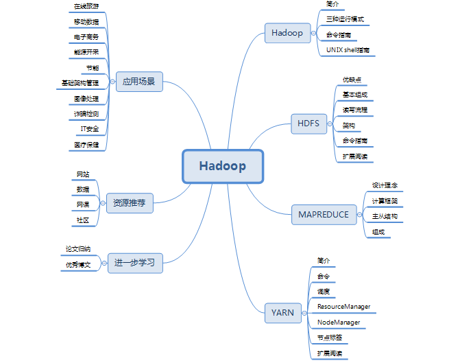

一、前言
--------

随着全球经济的不断发展，大数据时代早已悄悄到来，而Hadoop又是大数据环境的基础，想入门大数据行业首先需要了解hadoop的知识，2017年年初apache发行了hadoop3.0，也意味着一直有一群人在对hadoop不断的做优化，不仅如此，各个hadoop的商业版本也有好多公司正在使用，这也印证了它的商业价值。

本篇文章的主要架构是以先介绍hadoop为主，继而分别详细介绍HDFS、MAPREDUCE、YARN的所有知识点，读者通过对此篇文章的阅读可以对hadoop技术有个全面的了解，它涵盖了hadoop官网的所有知识点，并且通俗易懂，英文不好的读者完全可以通过阅读此篇文章来了解hadoop。

二、HADOOP
----------

### 1.简介

#### 1.1Hadoop概述

Hadoop是一个高可靠性、高扩展性的分布式计算的开源软件。是一个能够允许大量数据在计算机集群中使用简单的编程模型进行分布式处理的框架。其设计的规模可从单一的服务器到上千台机器上，每一个均可提供局部运算和存储功能。而不是依靠于硬件以支持高效性。

Hadoop的创始人是Doug
cutting，在Yahoo就职期间开发了Hadoop项目，主要原因是此人对搜索引擎的研究比较感兴趣，当时用的技术是lucene与nutch。

#### 1.2Lucene&Nutch

1.  Lucene

是一个开源的全文检索引擎工具包，它不是一个完整的全文搜索引擎，而是一个全文检索引擎的一个架构，提供了完整的查询引擎与搜索引擎，部分文本分析引擎，lucene的目的是为软件开发人员提供一个简单易用的工具包，以方便在目标系统中实现全文检索功能，或者以此为基础，建立完整的全文检索引擎。

1.  Nutch

Nutch是一个开源java实现的搜索引擎,它提供了我们自己运行搜索引擎所需的全部工具,包括全文检索与web爬虫。

#### 1.3Hadoop的产生

Doug
cutting在用lucene与nutch的时候遇到了数据与计算难题。主要有两方面的问题，一方面爬取的大量页面如何存储，另一方面就是搜索算法还有待优化，因此他用了2年的时间实现了DFS与MapReduce，一个微缩版的Nutch，2005年hadoop作为lucene的子项目的nutch的一部分，正式引入Apache基金会。2006年3月份MapReduce和Nutch
Distributed File System(NDFS)分别被纳入Hadoop项目。

#### 1.4Hadoop项目的思想来源

Hadoop项目的思想来源于谷歌的3篇论文

1.  GFS-\>HDFS

2.  Map-Reduce-\>Map-Reduce

3.  Bigtable-\>Hbase

#### 1.5Hadoop的组成

1.  Hadoop Distributed File System (HDFS)分布式文件系统

一个提供高吞吐量来访问应用程序的数据的分布式文件系统。

1.  Hadoop YARN

一个对作业进行调度和对集群资源管理的框架。

1.  Hadoop MapReduce

以yarn为基础的大型数据集并行处理系统。

### 2.三种运行模式

#### 2.1单机（本地）模式

这种模式在一台单机上运行，没有分布式文件系统，而是直接读写本地操作系统的文件系统。在单机模式（standalone）中不会存在守护进程，所有东西都运行在一个JVM上。这里同样没有DFS，使用的是本地文件系统。单机模式适用于开发过程中运行MapReduce程序，这也是最少使用的一个模式。

#### 2.2伪分布式模式

这种模式在一台单机上运行，但用不同的Java进程模仿分布式运行中的各类节点，伪分布式（Pseudo）适用于开发和测试环境，在这个模式中，所有守护进程都在同一台机器上运行。

#### 2.3完全分布式模式

这种模式通常被用于生产环境，使用N台主机组成一个Hadoop集群，Hadoop守护进程运行在每台主机之上。这里会存在Namenode运行的主机，Datanode运行的主机，以及resourcemanager运行的主机等。在分布式环境下，主节点和从节点会分开。

### 3.命令指南

#### 3.1概述

所有Hadoop命令和子项目都遵循相同的基本结构：

用法：shellcommand [SHELL\_OPTIONS] [COMMAND] [GENERIC\_OPTIONS]
[COMMAND\_OPTIONS]

| **命令选项**     | **描述**                                                                         |
|------------------|----------------------------------------------------------------------------------|
| shellcommand     | 调用项目的命令。例如，Hadoop常用hadoop，HDFS使用hdfs，YARN使用yarn。             |
| SHELL\_OPTIONS   | shell在执行Java之前处理的选项。                                                  |
| COMMAND          | 要执行的操作。                                                                   |
| GENERIC\_OPTIONS | 多个命令支持的通用选项集。                                                       |
| COMMAND\_OPTIONS | 在本文档中针对Hadoop公共子项目，描述了各种命令及其选项。HDFS和YARN会在下面介绍。 |

#### 3.2shell选项

所有shell命令都将接受一组公共选项。对于某些命令，将忽略这些选项。例如，对仅在单个主机上执行的命令传递
--hostnames将被忽略。

| **命令选项**         | **描述**                                                                                                                                                                                                                                                                         |
|----------------------|----------------------------------------------------------------------------------------------------------------------------------------------------------------------------------------------------------------------------------------------------------------------------------|
| \--buildpaths        | 启用jars的开发版本。                                                                                                                                                                                                                                                             |
| \--config confdir    | 覆盖默认的配置目录。默认是\$HADOOP\_HOME/etc/hadoop。                                                                                                                                                                                                                            |
| \--daemon mode       | 如果命令支持守护进程（例如，hdfs namenode），请在适当的模式下执行。支持的模式start 启动守护进程模式，stop，停止进程，status，确定过程中的活动状态。status将返回符合LSB的结果代码。如果没有提供选项，那么支持守护进程的命令将在前台运行。对于不支持守护进程的命令，将忽略此选项。 |
| \--debug             | 启用shell级别配置调试信息                                                                                                                                                                                                                                                        |
| \--help              | Shell脚本使用信息。                                                                                                                                                                                                                                                              |
| \--hostnames         | 当使用--workers时，使用以空格分隔的主机名列表覆盖workers文件，以在其中执行多主机子命令。如果--workers不使用，则忽略此选项。                                                                                                                                                      |
| \--hosts             | 当使用--workers时，使用包含要在其中执行多主机子命令的主机名列表的另一个文件覆盖工作程序文件。如果--workers不使用，则忽略此选项。                                                                                                                                                 |
| \--loglevel loglevel | 覆盖日志级别。有效的日志级别是FATAL，ERROR，WARN，INFO，DEBUG和TRACE。默认值为INFO。                                                                                                                                                                                             |
| \--workers           | 如果可能，请在workers文件中的所有主机上执行此命令。                                                                                                                                                                                                                              |

#### 3.3通用选项

许多子命令遵循一组常用的配置选项来更改其行为：

| **GENERIC\_OPTION**                             | **Description**                                             |
|-------------------------------------------------|-------------------------------------------------------------|
| \-archives \<comma separated list of archives\> | 指定要在计算机上存档的逗号分隔的归档。仅适用于作业。        |
| \-conf \<configuration file\>                   | 指定一个应用程序配置文件。                                  |
| \-D \<property\>=\<value\>                      | 使用给定属性的值。                                          |
| \-files \<comma separated list of files\>       | 指定要复制到映射reduce集群的逗号分隔文件。仅适用于作业。    |
| \-fs \<file:///\> or \<hdfs://namenode:port\>   | 指定要使用的默认文件系统URL。从配置覆盖'fs.defaultFS'属性。 |
| \-jt \<local\> or \<resourcemanager:port\>      | 指定ResourceManager。仅适用于作业。                         |
| \-libjars \<comma seperated list of jars\>      | 指定要包括在类路径中的逗号分隔的jar文件。仅适用于作业。     |

#### 3.4hadoop通用命令

所有这些命令都是从hadoop shell命令执行的。

##### 3.4.1用户命令

对hadoop集群的用户有用的命令。

###### 3.4.1.1Archive

Hadoop档案是一个特殊格式的档案，一个hadoop档案映射到文件系统的一个目录，hadoop档案的扩展名是.har，hadoop
Archive目录包含元数据文件（ \_index 和
\_masterindex）和数据文件（part-\*），这个\_index文件包含了所有文件的名称和他对应part文件的位置。

###### 3.4.1.2checknative

此命令检查Hadoop本地代码的可用性。

###### 3.4.1.3classpath

打印获取Hadoop
jar和所需库所需的类路径。如果无参数调用，则打印由命令脚本设置的类路径，这可能在类路径条目中包含通配符。其他选项在通配符扩展后打印类路径或将类路径写入jar文件的清单。后者在不能使用通配符且扩展的类路径超过支持的最大命令行长度的环境中非常有用。

###### 3.4.1.4credential

该命令在凭证提供者内部管理凭证及密码。Hadoop的CredentialProvider
API支持应用程序拆分，并且要求拆分后的应用
如何储存所需的密码。为了指明一个Provider的位置和类型，需要在core-site.xml添加hadoop.security.credential.provider.
path配置项，或者通过指令中-provider命令选项进行设置。Provider路径是一串以逗号分割的URL字符串。这些字符串会说明Provider的类型和位置。

###### 3.4.1.5distch

一次更改许多文件的所有权和权限。

###### 3.4.1.6distcp

递归的拷贝文件或者目录。

###### 3.4.1.7dtutil

在凭据文件中获取和管理hadoop委托令牌的实用程序。它旨在替换更简单的命令fetchdt。有多个子命令，每个都有自己的标志和选项。对于写出文件的每个子命令，-format选项将指定要使用的内部格式。java是与fetchdt匹配的旧格式。默认值为protobuf。对于连接到服务的每个子命令，提供方便标志以指定用于认证的kerberos主体名称和keytab文件。

###### 3.4.1.8fs

和hdfs脚本的dfs类似。

###### 3.4.1.9gridmix

Hadoop
Gridmix是针对hadoop系统的基准测试程序。它具备评测大规模数据处理系统所需的各个功能模块，包括：产生数据，生成并提交作业，统计作业完成时间等。

###### 3.4.1.10jar

运行一个jar文件。

###### 3.4.1.11jnipath

打印计算java.library.path。

###### 3.4.1.12kerbname

通过auth\_to\_local规则将命名主体转换为Hadoop用户名。

###### 3.4.1.13key

通过KeyProvider管理密钥。

###### 3.4.1.14kms

运行KMS，密钥管理服务器。

###### 3.4.1.15trace

查看和修改Hadoop跟踪设置。

###### 3.4.1.16version

打印版本。

###### 3.4.1.17classname

运行名为classname的类。类必须是包的一部分。

###### 3.4.1.18envvars

显示Hadoop环境变量。

##### 3.4.2管理命令

###### 3.4.2.1daemonlog

获取/设置由守护程序中的限定类名称标识的日志的日志级别。默认情况下，该命令发送HTTP请求，但可以通过使用参数-protocol
https发送HTTPS请求来覆盖此请求。

##### 3.4.3文件

etc/hadoop/hadoop-env.sh

此文件存储所有Hadoop shell命令使用的全局设置。

etc/hadoop-user-functions.sh

此文件允许高级用户覆盖某些shell功能。

〜/ .hadooprc

这存储了个人用户的个人环境。它在hadoop-env.sh和hadoop-user-functions.sh文件之后处理，并且可以包含相同的设置。

### 4.UNIX shell指南

#### 4.1重要的最终用户环境变量

Apache
Hadoop有许多控制软件各个方面的环境变量。（请参阅hadoop-env.sh和相关文件。）其中一些环境变量专用于帮助最终用户管理其运行时。

##### 4.1.1HADOOP\_CLIENT\_OPTS

此环境变量用于所有最终用户，非守护程序操作。它可以用于通过系统属性定义设置任何Java选项以及任何Apache
Hadoop选项。

##### 4.1.2(command)\_(subcommand)\_OPTS

也可以在每个子命令的基础上设置选项。这允许为特定情况创建特殊选项。模式的第一部分是正在使用的命令，但是都是大写的。命令的第二部分是正在使用的子命令。然后最后跟着字符串\_OPT。

##### 4.1.3HADOOP\_CLASSPATH

Apache
Hadoop脚本能够通过设置此环境变量将更多内容注入正在运行的命令的类路径中。它是目录、文件或通配符位置的冒号分隔列表。

##### 4.1.4变量的自动设置

如果用户有一组通用的设置，可以将它们放在\$
{HOME}/.hadoop-env文件中。始终读取此文件以初始化并覆盖用户可能想要自定义的任何变量。它使用bash语法，类似于.bashrc文件。

#### 4.2管理员环境

除了各种XML文件之外，管理员还有两个关键功能可以在使用Unix Shell时配置。

##### 4.2.1(command)\_(subcommand)\_OPTS

最重要的是控制守护进程如何工作的一系列\_OPTS变量。这些变量应包含这些守护程序的所有相关设置。

##### 4.2.2(command)\_(subcommand)\_USER

Apache
Hadoop提供了一种方法来执行用户检查每个子命令。虽然这种方法很容易规避，不应被视为安全特征，但它确实提供了防止事故的机制。例如，设置HDFS\_NAMENODE\_USER
= hdfs将使hdfs namenode和hdfs –daemon start
namenode命令通过检查USER环境变量来验证运行命令的用户是否为hdfs用户。这也适用于非守护进程。在允许执行hadoop
distcp命令之前，设置HADOOP\_DISTCP\_USER = jane将验证USER是否设置为jane。

#### 4.3开发者和高级管理员环境

##### 4.3.1 Shell Profiles

Apache
Hadoop允许第三方通过各种可插拔接口轻松添加新功能。这包括一个shell代码子系统，可以方便地将必要的内容注入基本安装。这个功能的核心是shell配置文件的概念。Shell配置文件是可以执行诸如向类路径添加jar，配置Java系统属性等等的shell代码片段。

##### 4.3.2Shell API

Apache
Hadoop的shell代码具有一个函数库，供管理员和开发人员使用以帮助他们的配置和高级特性管理。

##### 4.3.3用户级API访问

除了.hadoop-env，它允许单个用户重写hadoop-env.sh，用户的也可以使用.hadooprc。这是在配置Apache
Hadoop shell环境后调用的，并允许完整的shell API函数调用。

##### 4.3.4动态子命令

利用Shell API，第三方可以将其自己的子命令添加到主Hadoop
shell脚本（hadoop，hdfs，mapred，yarn）。在执行子命令之前，主脚本将检查是否存在（scriptname）\_subcommand\_（子命令）函​​数。该函数将参数设置为所有剩余的命令行参数。

HDFS
----

### 1.优缺点

#### 1.1HDFS优点

##### 1.1.1高容错性

1.  可以由数百或数千个服务器机器组成，每个服务器机器存储文件系统数据的一部分。

2.  数据自动保存多个副本。

3.  副本丢失后检测故障快速，自动恢复。

##### 1.1.2适合批处理

1.  移动计算而非数据。

2.  数据位置暴露给计算框架。

3.  数据访问的高吞吐量。

4.  运行的应用程序对其数据集进行流式访问。

##### 1.1.3适合大数据处理

1.  典型文件大小为千兆字节到太字节。

2.  支持单个实例中的数千万个文件。

3.  10K+节点。

##### 1.1.4可构建在廉价的机器上

1.  通过多副本提高可靠性。

2.  提供了容错与恢复机制。

##### 1.1.5跨异构硬件和软件平台的可移植性强

1.  轻松地从一个平台移植到另一个平台。

##### 1.1.6简单一致性模型

1.  应用程序需要一次写入多次读取文件的访问模型。

2.  除了追加和截断之外，不需要更改已创建，写入和关闭的文件。

3.  简化了数据一致性问题，并实现了高吞吐量数据访问。

4.  高度可配置，具有非常适合于许多安装的默认配置。大多数时候，只需要为非常大的集群调整配置。

#### 1.2HDFS缺点

##### 1.2.1不适合低延迟的数据访问

1.  HDFS设计更多的是批处理，而不是用户交互使用。重点在于数据访问的高吞吐量，而不是数据访问的低延迟。

##### 1.2.2不适合小文件存取

1.  占用NameNode大量内存。

2.  寻道时间超过读取时间。

##### 1.2.3无法并发写入、文件随即修改

1.  一个文件只能有一个写者。

2.  仅支持追加和截断。

### 2.基本组成

#### 2.1Namenode

##### 2.1.1接受客户端的读写服务

执行文件系统命名空间操作，如打开，关闭和重命名文件和目录。

##### 2.1.2管理文件系统命名空间

记录对文件系统命名空间或其属性的任何更改。

##### 2.1.3metadata组成

Metadata是存储在Namenode上的元数据信息，它存储到磁盘的文件名为：fsimage。并且有个叫edits的文件记录对metadata的操作日志。总体来说，fsimage与edits文件记录了Metadata中的权限信息和文件系统目录树、文件包含哪些块、确定块到DataNode的映射、Block存放在哪些DataNode上(由DataNode启动时上报)。

NameNode将这些信息加载到内存并进行拼装，就成为了一个完整的元数据信息。

##### 2.1.4文件系统命名空间

HDFS支持传统的分层文件组织。用户或应用程序可以在这些目录中创建目录和存储文件。文件系统命名空间层次结构与大多数其他现有文件系统类似：可以创建和删除文件，将文件从一个目录移动到另一个目录，或重命名文件。HDFS支持用户配额和访问权限。但不支持硬链接或软链接。

NameNode维护文件系统命名空间。对文件系统命名空间或其属性的任何更改由NameNode记录。应用程序可以指定应由HDFS维护的文件的副本数。文件的副本数称为该文件的复制因子。此信息由NameNode存储。

##### 2.1.5文件系统元数据的持久性

NameNode的metadata信息在启动后会加载到内存，由于加载到内存的数据很不安全，断电后就没有了，因此必须对内存中存放的信息做持久化处理。

Namenode上保存着HDFS的命名空间。对于任何对文件系统元数据产生修改的操作，Namenode都会使用一种称为Edits的事务日志记录下来。例如，在HDFS中创建一个文件，Namenode就会在Edits中插入一条记录来表示；同样地，修改文件的副本系数也将往Edits插入一条记录。Namenode在本地操作系统的文件系统中存储这个Edits。整个文件系统的命名空间，包括数据块到文件的映射、文件的属性等，都存储在一个称为FsImage的文件中，这个文件也是放在Namenode所在的本地文件系统上。

Namenode在内存中保存着整个文件系统的命名空间和文件数据块映射(Blockmap)的映像。这个关键的元数据结构设计得很紧凑，因而一个有4G内存的Namenode足够支撑大量的文件和目录。当Namenode启动时，它从硬盘中读取Edits和FsImage，将所有Edits中的事务作用在内存中的FsImage上，并将这个新版本的FsImage从内存中保存到本地磁盘上，然后删除旧的Edits，因为这个旧的Edits的事务都已经作用在FsImage上了。这个过程称为一个检查点(checkpoint)。

Datanode将HDFS数据以文件的形式存储在本地的文件系统中，它并不知道有关HDFS文件的信息。它把每个HDFS数据块存储在本地文件系统的一个单独的文件中。Datanode并不在同一个目录创建所有的文件，实际上，它用试探的方法来确定每个目录的最佳文件数目，并且在适当的时候创建子目录。在同一个目录中创建所有的本地文件并不是最优的选择，这是因为本地文件系统可能无法高效地在单个目录中支持大量的文件。当一个Datanode启动时，它会扫描本地文件系统，产生一个这些本地文件对应的所有HDFS数据块的列表，然后作为报告发送到Namenode，这个报告就是块状态报告。

#### 2.2SecondaryNameNode

它不是NameNode的备份，但可以作为NameNode的备份，当因为断电或服务器损坏的情况，可以用SecondNameNode中已合并的fsimage文件作为备份文件恢复到NameNode上，但是很有可能丢失掉在合并过程中新生成的edits信息。因此不是完全的备份。

由于NameNode仅在启动期间合并fsimage和edits文件，因此在繁忙的群集上，edits日志文件可能会随时间变得非常大。较大编辑文件的另一个副作用是下一次重新启动NameNode需要更长时间。SecondNameNode的主要功能是帮助NameNode合并edits和fsimage文件，从而减少NameNode启动时间。

##### 2.2.1SNN执行合并时机

1.  根据配置文件配置的时间间隔fs.checkpoint.period默认1小时。

2.  dfs.namenode.checkpoint.txns，默认设置为1百万，也就是Edits中的事务条数达到1百万就会触发一次合并，即使未达到检查点期间。

##### 2.2.2SNN合并流程

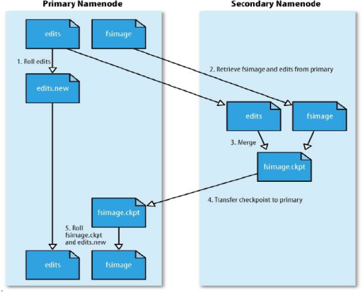

1.  首先生成一个名叫edits.new的文件用于记录合并过程中产生的日志信息。

2.  当触发到某一时机时（时间间隔达到1小时或Edits中的事务条数达到1百万）时SecondaryNamenode将edits文件、与fsimage文件从NameNode上读取到SecondNamenode上。

3.  将edits文件与fsimage进行合并操作，合并成一个fsimage.ckpt文件。

4.  将生成的合并后的文件fsimage.ckpt文件转换到NameNode上。

5.  将fsimage.ckpt在NameNode上变成fsimage文件替换NameNode上原有的fsimage文件，并将edits.new文件上变成edits文件替换NameNode上原有的edits文件。

SNN在hadoop2.x及以上版本在非高可用状态时还存在，但是在hadoop2.x及以上版本高可用状态下SNN就不存在了，在hadoop2.x及以上版本在高可用状态下，处于standby状态的NameNode来做合并操作。

#### 2.3DataNode

1.  管理附加到它们运行的​​节点的存储，并允许用户数据存储在文件中。

2.  在内部，文件被分割成一个或多个块（Block），并且这些块被存储在一组DataNode中。

3.  负责提供来自文件系统客户端的读取和写入请求。

4.  执行块创建，删除

5.  启动DN进程的时候会向NN汇报Block信息。

6.  通过向NN发送心跳保持与其联系（3秒一次），如果NN10分钟没有收到DN的心跳，则认为DN已经丢失，并且复制其上的Block到其他的DN上。

##### 2.3.1HDFS存储单元（block）

###### 2.3.1.1文件被切分成固定大小的数据块

1.  默认数据块大小为64MB（hadoop1.x）、128MB（hadoop2.x）、256MB(hadoop3.x)，可配置。

2.  若文件大小不到一个块大小，则单独存成一个block，block块是一个逻辑意义上的概念。文件大小是多少，就占多少空间。

###### 2.3.1.2一个文件存储方式

1.  按大小被切分成不同的block，存储到不同的节点上。

2.  默认情况下，每个block都有3个副本。

3.  block大小与副本数通过client端上传文件时设置，文件上传成功后副本数可以变更，block
    size不可变更。

###### 2.3.1.3设计思想

将大文件拆分成256MB的block块，每个block块分别随机存放在不同的节点上，从而避免了数据倾斜的问题，但是在开发过程中，如果算法、程序写的不好，同样也会出现数据倾斜的问题。

##### 2.3.2数据复制

###### 2.3.2.1数据复制概述

HDFS被设计成能够在一个大集群中跨机器可靠地存储超大文件。它将每个文件存储成一系列的数据块，除了最后一个，所有的数据块都是同样大小的。为了容错，文件的所有数据块都会有副本。每个文件的数据块大小和副本系数都是可配置的。应用程序可以指定某个文件的副本数目。副本系数可以在文件创建的时候指定，也可以在之后改变。HDFS中的文件都是一次性写入的，并且严格要求在任何时候只能有一个写入者。

Namenode全权管理数据块的复制，它周期性地从集群中的每个Datanode接收心跳信号和块状态报告(Blockreport)。接收到心跳信号意味着该Datanode节点工作正常。块状态报告包含了一个该Datanode上所有数据块的列表。

HDFS数据节点

###### 2.3.2.2Block的副本放置策略

副本的存放是HDFS可靠性和性能的关键。优化的副本存放策略是HDFS区分于其他大部分分布式文件系统的重要特性。这种特性需要做大量的调优，并需要经验的积累。HDFS采用一种称为机架感知(rack-aware)的策略来改进数据的可靠性、可用性和网络带宽的利用率。目前实现的副本存放策略只是在这个方向上的第一步。实现这个策略的短期目标是验证它在生产环境下的有效性，观察它的行为，为实现更先进的策略打下测试和研究的基础。

大型HDFS实例一般运行在跨越多个机架的计算机组成的集群上，不同机架上的两台机器之间的通讯需要经过交换机。在大多数情况下，同一个机架内的两台机器间的带宽会比不同机架的两台机器间的带宽大。

通过一个机架感知的过程，Namenode可以确定每个Datanode所属的机架id。一个简单但没有优化的策略就是将副本存放在不同的机架上。这样可以有效防止当整个机架失效时数据的丢失，并且允许读数据的时候充分利用多个机架的带宽。这种策略设置可以将副本均匀分布在集群中，有利于当组件失效情况下的负载均衡。但是，因为这种策略的一个写操作需要传输数据块到多个机架，这增加了写的代价。

在大多数情况下，副本系数是3，HDFS的存放策略是将一个副本存放在本地机架的节点上，一个副本放在同一机架的另一个节点上，最后一个副本放在不同机架的节点上。这种策略减少了机架间的数据传输，这就提高了写操作的效率。机架的错误远远比节点的错误少，所以这个策略不会影响到数据的可靠性和可用性。于此同时，因为数据块只放在两个（不是三个）不同的机架上，所以此策略减少了读取数据时需要的网络传输总带宽。在这种策略下，副本并不是均匀分布在不同的机架上。三分之一的副本在一个节点上，三分之二的副本在一个机架上，其他副本均匀分布在剩下的机架中，这一策略在不损害数据可靠性和读取性能的情况下改进了写的性能。

###### 2.3.2.3副本选择

为了降低整体的带宽消耗和读取延时，HDFS会尽量让读取程序读取离它最近的副本。如果在读取程序的同一个机架上有一个副本，那么就读取该副本。如果一个HDFS集群跨越多个数据中心，那么客户端也将首先读本地数据中心的副本。

###### 2.3.2.4安全模式

1.  NameNode在启动的时候会进入一个称为安全模式的特殊状态，它首先将映像文件（fsimage）载入内存，并执行编辑日志（edits）中的各项操作。

2.  一旦在内存中成功建立文件系统元数据映射，则创建一个新的fsimage文件（这个操作不需要SecondNameNode来做）与一个空的编辑日志。

3.  此刻namenode运行在安全模式，即namenode的文件系统对于客户端来说是只读的，显示目录、显示文件内容等，写、删除、重命名都会失败。

4.  在此阶段namenode搜集各个datanode的报告，当数据块达到最小副本数以上时，会被认为是“安全”的，在一定比例的数据块被认为是安全的以后（可设置），再过若干时间，安全模式结束。

5.  当检测到副本数不足数据块时，该块会被复制，直到达到最小副本数，系统中数据块的位置并不是由namenode维护的，而是以块列表形式存储在datanode中。

##### 2.4数据组织

###### 2.4.1数据块

HDFS被设计成支持大文件，适用HDFS的是那些需要处理大规模的数据集的应用。这些应用都是只写入数据一次，但却读取一次或多次，并且读取速度应能满足流式读取的需要。HDFS支持文件的“一次写入多次读取”语义。一个典型的数据块大小是256MB。因而，HDFS中的文件总是按照256M被切分成不同的块，每个块尽可能地存储于不同的Datanode中。

###### 2.4.2分段

客户端创建文件的请求其实并没有立即发送给Namenode，事实上，在刚开始阶段HDFS客户端会先将文件数据缓存到本地的一个临时文件。应用程序的写操作被透明地重定向到这个临时文件。当这个临时文件累积的数据量超过一个数据块的大小，客户端才会联系Namenode。Namenode将文件名插入文件系统的层次结构中，并且分配一个数据块给它。然后返回Datanode的标识符和目标数据块给客户端。接着客户端将这块数据从本地临时文件上传到指定的Datanode上。当文件关闭时，在临时文件中剩余的没有上传的数据也会传输到指定的Datanode上。然后客户端告诉Namenode文件已经关闭。此时Namenode才将文件创建操作提交到日志里进行存储。如果Namenode在文件关闭前宕机了，则该文件将丢失。

上述方法是对在HDFS上运行的目标应用进行认真考虑后得到的结果。这些应用需要进行文件的流式写入。如果不采用客户端缓存，由于网络速度和网络堵塞会对吞估量造成比较大的影响。这种方法并不是没有先例的，早期的文件系统，比如AFS，就用客户端缓存来提高性能。为了达到更高的数据上传效率，已经放松了POSIX标准的要求。

###### 2.4.3管道复制

当客户端向HDFS文件写入数据的时候，一开始是写到本地临时文件中。假设该文件的副本系数设置为3，当本地临时文件累积到一个数据块的大小时，客户端会从Namenode获取一个Datanode列表用于存放副本。然后客户端开始向第一个Datanode传输数据，第一个Datanode一小部分一小部分(4
KB)地接收数据，将每一部分写入本地仓库，并同时传输该部分到列表中第二个Datanode节点。第二个Datanode也是这样，一小部分一小部分地接收数据，写入本地仓库，并同时传给第三个Datanode。最后，第三个Datanode接收数据并存储在本地。因此，Datanode能流水线式地从前一个节点接收数据，并在同时转发给下一个节点，数据以流水线的方式从前一个Datanode复制到下一个。

### 3.读写流程

#### 3.1HDFS读流程

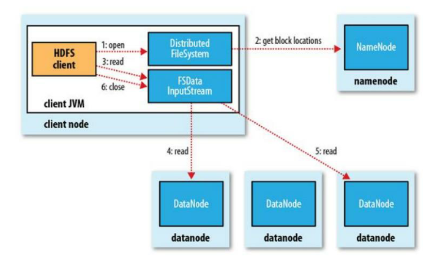

1.  首先HDFS的客户端通过DistributedFileSystem。

2.  通过DistributedFileSystem来对NameNode进行请求，同时将用户信息及文件名的信息等发送给NameNode，并返回给DistributedFileSystem该文件包含的block所在的DataNode位置。

3.  HDFS客户端通过FSDataInputStream按顺序去读取DataNode中的block信息（它会选择负载最低的或离客户端最近的一台DataNode去读block）。

4.  FSDataInputStream按顺序一个一个的读，直到所有的block都读取完毕。

5.  当读取完毕后会将FSDataInputStream关闭。

#### 3.2HDFS写流程

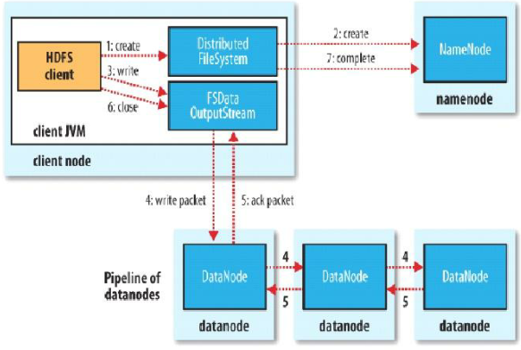

1.  首先HDFS的客户端通过Distributed FileSystem（HDFS中API里的一个对象）。

2.  通过Distributed
    FileSystem发送客户端的请求给NameNode（NameNode主要是接受客户端请求）并且会带着文件要保存的位置、文件名、操作的用户名等信息一起发送给NameNode。

3.  NameNode会给客户端返回了一个FSDataOutputStream，同时也会返回文件要写入哪些DataNode上（负载较低的）。

4.  通过FSDataOutputStream进行写操作，在写之前就做文件的拆分，将文件拆分成多个Block，第一个写操作写在负载比较低的DataNode上，并将这个block复制到其他的DataNode上。

5.  当所有的block副本复制完成后会反馈给FSDataOutputStream。

6.  当所有的block副本全都复制完成，就可以将FSDataOutputStream流关闭。

7.  通过Distributed FileSystem更新NameNode中的源数据信息。

### 4.架构

#### 4.1NameNode和DataNode

HDFS采用master/worker架构。一个HDFS集群是由一个Namenode和一定数目的Datanodes组成。Namenode是一个中心服务器，负责管理文件系统的命名空间(namespace)以及客户端对文件的访问。集群中的Datanode一般是一个节点一个，负责管理它所在节点上的存储。HDFS暴露了文件系统的命名空间，用户能够以文件的形式在上面存储数据。从内部看，一个文件其实被分成一个或多个数据块，这些块存储在一组Datanode上。Namenode执行文件系统的命名空间操作，比如打开、关闭、重命名文件或目录。它也负责确定数据块到具体Datanode节点的映射。Datanode负责处理文件系统客户端的读写请求。在Namenode的统一调度下进行数据块的创建、删除和复制。

HDFS架构

Namenode和Datanode被设计成可以在普通的商用机器上运行。这些机器一般运行着GNU/Linux操作系统(OS)。HDFS采用Java语言开发，因此任何支持Java的机器都可以部署Namenode或Datanode。由于采用了可移植性极强的Java语言，使得HDFS可以部署到多种类型的机器上。一个典型的部署场景是一台机器上只运行一个Namenode实例，而集群中的其它机器分别运行一个Datanode实例。这种架构也可以在一台机器上运行多个Datanode，但这样的情况比较少见。

集群中单一Namenode的结构大大简化了系统的架构。Namenode是所有HDFS元数据的管理者，用户数据永远不会流过Namenode。

##### 4.1.1通信协议

所有的HDFS通讯协议都是建立在TCP/IP协议之上。客户端通过一个可配置的TCP端口连接到Namenode，通过ClientProtocol协议与Namenode交互。而Datanode使用DatanodeProtocol协议与Namenode交互。一个远程过程调用(RPC)模型被抽象出来封装ClientProtocol和Datanodeprotocol协议。在设计上，Namenode不会主动发起RPC，而是响应来自客户端或
Datanode 的RPC请求。

#### 4.2基础架构

Hadoop分布式文件系统(HDFS)被设计成适合运行在通用硬件上的分布式文件系统。它和现有的分布式文件系统有很多共同点。但同时，它和其他的分布式文件系统的区别也是很明显的。HDFS是一个高度容错性的系统，适合部署在廉价的机器上。HDFS能提供高吞吐量的数据访问，非常适合大规模数据集上的应用。HDFS放宽了一部分POSIX约束，来实现流式读取文件系统数据的目的。HDFS在最开始是作为Apache
Nutch搜索引擎项目的基础架构而开发的。HDFS是Apache Hadoop Core项目的一部分。

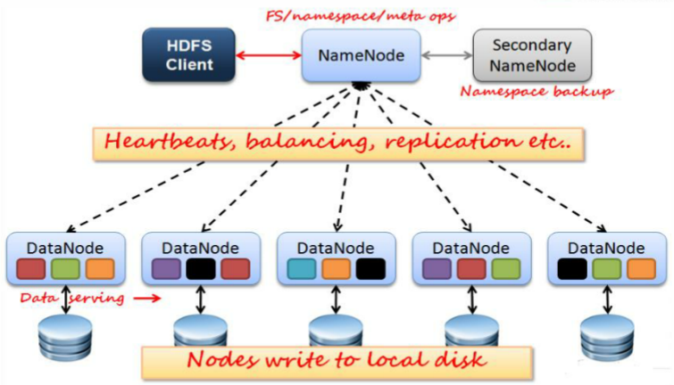

1.  客户端的请求全部落到了NameNode上。

2.  元数据信息存在NameNode。

3.  在Hadoop集群中有且只有一个处于Active状态的NameNode。

4.  SecondaryNameNode不是NameNode的备份节点或从节点（确切的说它只能备份NameNode的部分内容，而不是全部）。

5.  NameNode与DataNode之间有心跳机制，从而NameNode可以知道DataNode的运行情况与负载情况。

##### 4.2.1健壮性

HDFS的主要目标就是即使在出错的情况下也要保证数据存储的可靠性。常见的三种出错情况是：Namenode出错,
Datanode出错和网络分区。

###### 4.2.1.1磁盘数据错误，心跳检测和重新复制

每个Datanode节点周期性地向Namenode发送心跳信号。网络原因有可能导致一部分Datanode跟Namenode失去联系。Namenode通过心跳信号的缺失来检测这一情况，并将这些近期不再发送心跳信号的Datanode标记为宕机，不会再将新的IO请求发给它们。任何存储在宕机Datanode上的数据将不再有效。Datanode的宕机可能会引起一些数据块的副本系数低于指定值，Namenode不断地检测这些需要复制的数据块，一旦发现就启动复制操作。在下列情况下，可能需要重新复制：某个Datanode节点失效、某个副本遭到损坏、Datanode上的硬盘错误或者文件的副本系数增大。

###### 4.2.1.1.1DataNode热插拔驱动器

Datanode支持热插拔驱动器。可以添加或替换HDFS数据卷，而不必不关闭DataNode。下面简要介绍典型的热插拔驱动程序：

1.  如果存在新的存储目录，则应格式化它们并适当地装载它们。

2.  将数据卷目录更新到DataNode的配置dfs.datanode.data.dir中。

3.  通过运行dfsadmin -reconfig datanode HOST：PORT
    start来使我们配置的目录生效，并且可以使用dfsadmin -reconfig datanode
    HOST：PORT status查询重新配置任务的运行状态。

4.  一旦重新配置任务完成，我们就可以安全地卸载、删除数据卷目录并物理删除磁盘。

###### 4.2.1.2负载均衡

HDFS的架构支持数据均衡策略。如果某个Datanode节点上的空闲空间低于特定的临界点，按照均衡策略系统就会自动地将数据从这个Datanode移动到其他空闲的Datanode。在对特定文件的突然高需求的情况下，此方案可以动态地创建附加的副本并重新平衡群集中的其他数据。

###### 4.2.1.2.1平衡器

HDFS的数据也许并不是非常均匀的分布在各个DataNode中。一个常见的原因是在现有的集群上经常会增添新的DataNode节点。当新增一个数据块（一个文件的数据被保存在一系列的块中）时，NameNode在选择DataNode接收这个数据块之前，会考虑到很多因素。其中的一些考虑的是：

1.  将数据块的一个副本放在正在写这个数据块的节点上。

2.  尽量将数据块的不同副本分布在不同的机架上，这样集群可在完全失去某一机架的情况下还能存活。

3.  一个副本通常被放置在和写文件的节点同一机架的某个节点上，这样可以减少跨越机架的网络I/O。

4.  尽量均匀地将HDFS数据分布在集群的DataNode中。

###### 4.2.1.2.2磁盘平衡器

Diskbalancer是一个命令行工具，可以将数据均匀分布在数据节点的所有磁盘上。此工具不同于平衡器，它负责群集范围的数据平衡。由于几个原因，数据可能在节点上的磁盘之间具有不均匀分布。这可能是由于大量的写入和删除或由于更换磁盘而发生的。该工具针对给定的数据编码进行操作，并将块从一个磁盘移动到另一个磁盘。

###### 4.2.1.2.2.1架构

磁盘平衡器通过创建计划进行操作，然后在数据节点上执行该计划。一个计划是一组描述两个磁盘之间移动数据的语句。一个计划由多个步骤组成。移动步骤具有源磁盘，目标磁盘和要移动的字节数。可以针对操作数据节点执行计划。

一共包含3个阶段,Discover(发现)到Plan(计划),再从Plan(计划)到Execute(执行):

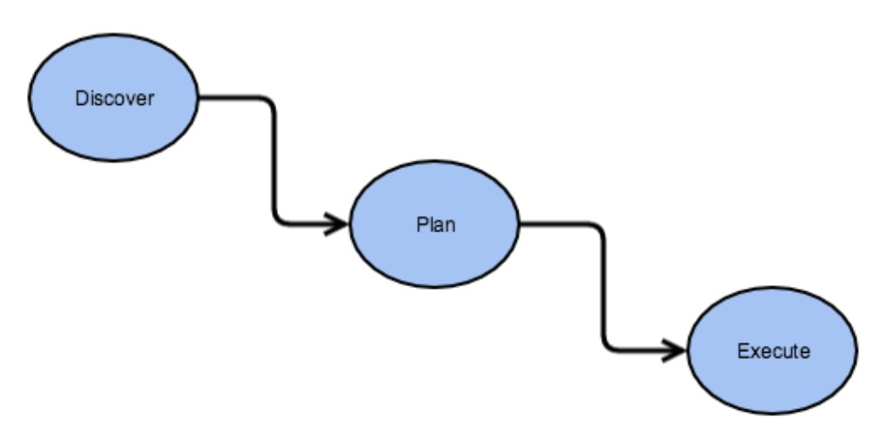

###### 4.2.1.2.2.1.1Discover

发现阶段做的事情实际上就是通过计算各个节点内的磁盘使用情况,然后得出需要数据平衡的磁盘列表.这里会通过Volume
Data
Density磁盘使用密度的概念作为一个评判的标准,这个标准值将会以节点总使用率作为比较值.举个例子,如果一个节点,总使用率为75%,就是0.75,其中A盘使用率0.5(50%),那么A盘的volumeDataDensity密度值就等于0.75-0.5=0.25.同理,如果超出的话,则密度值将会为负数.于是我们可以用节点内各个盘的volumeDataDensity的绝对值来判断此节点内磁盘间数据的平衡情况,如果总的绝对值的和越大,说明数据越不平衡,这有点类似于方差的概念.Discover阶段将会用到如下的连接器对象:

1.  DBNameNodeConnector 

2.  JsonConnector 

3.  NullConnector

其中第一个对象会调用到Balancer包下NameNodeConnector对象,以此来读取集群节点,磁盘数据情况。

###### 4.2.1.2.2.1.2Plan

拿到上一阶段的汇报结果数据之后,将会进行执行计划的生成.Plan并不是一个最小的执行单元,它的内部由各个Step组成.Step中会指定好源、目标磁盘.这里的磁盘对象是一层经过包装的对象:DiskBalancerVolume,并不是原来的FsVolume.这里顺便提一下DiskBalancer中对磁盘节点等概念的转化:

1.  DiskBalancerCluster.通过此对象可以读取到集群中的节点信息,这里的节点信息以DiskBalancerDataNode的方式所呈现.

2.  DiskBalancerDataNode.此对象代表的是一个包装好后的DataNode。

3.  DiskBalancerVolume和DiskBalancerVolumeSet.DataNode磁盘对象以及磁盘对象集合.DiskBalancerVolumeSet内的磁盘存储目录类型需要是同种StorageType。

###### 4.2.1.2.2.1.3Execute

最后一部分是执行阶段,所有的plan计划生成好了之后,就到了执行阶段.这些计划会被提交到各自的DataNode上,然后在DiskBalancer类中进行执行.DiskBalancer类中有专门的类对象来做磁盘间数据平衡的工作,这个类名称叫做DiskBalancerMover.在磁盘间数据平衡的过程中,高使用率的磁盘会移动数据块到相对低使用率的磁盘,等到满足一定阈值关系的情况下时,DiskBalancer会渐渐地退出.在DiskBalancer的执行阶段,有以下几点需要注意:

1.  带宽的限制.DiskBalancer中同样可以支持带宽的限制,默认是10M,通过配置dfs.disk.balancer.max.disk.throughputInMBperSec进行控制。

2.  失败次数的限制.DiskBalancer中会存在失败次数的控制.在拷贝block数据块的时候,出现IOException异常,会进行失败次数的累加计数,如果超出最大容忍值,DiskBalancer也会退出。

3.  数据平衡阈值控制.DiskBalancer中可以提供一个磁盘间数据的平衡阈值,以此作为是否需要继续平衡数据的标准,配置项为dfs.disk.balancer.block.tolerance.percent。

###### 4.2.1.3数据完整性

从某个Datanode获取的数据块有可能是损坏的，损坏可能是由Datanode的存储设备错误、网络错误或者软件bug造成的。HDFS客户端软件实现了对HDFS文件内容的校验和(checksum)检查。当客户端创建一个新的HDFS文件，会计算这个文件每个数据块的校验和，并将校验和作为一个单独的隐藏文件保存在同一个HDFS名字空间下。当客户端获取文件内容后，它会检验从Datanode获取的数据跟相应的校验和文件中的校验和是否匹配，如果不匹配，客户端可以选择从其他Datanode获取该数据块的副本。

###### 4.2.1.3.1回收站机制

###### 4.2.1.3.1.1文件的删除和恢复

如果启用了回收站功能，FS
Shell删除的文件不会立即从HDFS中删除。而是将其移动到回收目录（每个用户在/user
/\<username\>/.Trash下都有自己的回收目录）。只要文件保留在回收站中，文件就可以快速恢复。

最近删除的文件移动到当前回收目录（/user/\<username\>/.Trash/Current），并在可配置的时间间隔内，HDFS创建对/user/\<username\>/.Trash/\<date\>目录下的一个检查点，并在过期后删除旧检查点。

当文件在回收站期满之后，NameNode将从HDFS命名空间中删除该文件。删除文件会导致与该文件关联的块被释放。需要说明的是，文件被用户删除的时间和对应的释放空间的时间之间有一个明显的时间延迟。

###### 4.2.1.3.1.2减少副本

当文件的副本因子减小时，NameNode选择可以删除的多余副本。下一个心跳将此信息传输到DataNode。DataNode然后删除相应的块并且释放对应的空间。同样，在设置副本因子完成和集群中出现新的空间之间有个时间延迟。

###### 4.2.1.4元数据磁盘错误

FsImage和Edits是HDFS的核心数据结构。如果这些文件损坏了，整个HDFS实例都将失效。因而，Namenode可以配置成支持维护多个FsImage和Edits的副本。任何对FsImage或者Edits的修改，都将同步到它们的副本上。这种多副本的同步操作可能会降低Namenode每秒处理的命名空间事务数量。然而这个代价是可以接受的，因为即使HDFS的应用是数据密集型的，它们的元数据信息的量也不会很大。当Namenode重启的时候，它会选取最近的完整的FsImage和Edits来使用。

###### 4.2.1.4.1检查点节点

NameNode采用两个文件来保存命名空间的信息：fsimage，它是最新的已执行检查点的命名空间的信息：edits，它是执行检查点后命名空间变化的日志文件。当NameNode启动时，fsimage和edits合并，提供一个最新的文件系统的metadata，然后NameNode将新的HDFS状态写入fsimage，并开始一个新的edits日志。

Checkpoint节点周期性地创建命名空间的检查点。它从NameNode下载fsimage和edits，在本地合并它们，并将其发回给活动的NameNode。Checkpoint节点通常与NameNode不在同一台机器上，因为它们有同样的内存要求。Checkpoint节点由配置文件中的bin/hdfs
namenode –checkpoint来启动。

Checkpoint(或Backup)节点的位置以及附带的web接口由dfs.namenode.backup.address
anddfs.namenode.backup.http-address参数指定。

Checkpoint进程的运行受两个配置参数控制：

1.  dfs.namenode.checkpoint.period，两次连续的检查点之间的最大的时间间隔，缺省值是1小时

2.  dfs.namenode.checkpoint.txns，最大的没有执行检查点的事务数目，默认设置为1百万，也就是Edits中的事务条数达到1百万就会触发一次合并，即使未达到检查点期间。

Checkpoint节点上保存的最新的检查点，其目录结构与NameNode上一样，这样，如果需要，NameNode总是可以读取这上面的已执行检查点的文件映像。多个Checkpoint节点可以在集群的配置文件中指定。

###### 4.2.1.4.2备份节点

Backup节点与Checkpoint节点提供同样的执行检查点功能，只不过它还在内存中保存一份最新的命名空间的的拷贝，该拷贝与NameNode中的保持同步。除了接收NameNode中发送的edits并把它保存到磁盘之外，Backup还将edits用到自己的内存中，因而创建出一份命名空间的备份。

因为Backup节点在内存中保持有最新的命名空间的状态，因此它不需要从NameNode下载fsimage和edits文件来创建一个检查点，而这是Checkpoint节点或备用NameNode所必需的步骤。Backup节点的检查点进程更高效，因为它只需要将命名空间信息保存到本地的fsimage文件并重置edits就可以了。

由于Backup节点内存中维护了一份命名空间的拷贝，它的内存要求与NameNode一致。NameNode同一时刻只支持一个Backup节点。如果Backup在用，则不能注册Checkpont节点。

Backup节点的配置与Checkpoint节点一样，它采用bin/hdfs namenode
–backup启动。Backup(或Checkup)节点的位置及其web接口由配置参数dfs.namenode.backup.address和 dfs.namenode.backup.http-address指定。

使用Backup节点，NameNode就可以选择不进行存储，而将保持命名空间状态的责任交给Backup节点。为此，在NameNode的配置中，采用选项-importCheckpoint来启动NameNode，并且不设置edits的存储位置选项dfs.namenode.edits.dir。

###### 4.2.1.4.3导入检查点

如果其它所有的映像文件和edits都丢失了，可以将最后的检查点导入到NameNode，为此，需要以下步骤：

1.  创建一个空目录，在dfs.namenode.name.dir项中配置为该目录。

2.  设置dfs.namenode.checkpoint.dir为检查点目录。

3.  采用-importCheckpoint选项来启动NameNode。

NameNode将从dfs.namenode.checkpoint.dir设置的目录中上载检查点，并将其保存在dfs.namenode.name.dir指定的目录中。如果dfs.namenode.name.dir中存在一个映像文件，NameNode就会启动失败，NameNode要验证dfs.namenode.checkpoint.dir中的映像文件是否有问题，但在任何情况下，都不会修改该文件。

###### 4.2.1.4.4恢复模式

通常，你要配置多个metadata存储位置，当一个存储位置崩溃后，你可以从其它位置读取到metadata。但是，如果仅有的一个存储位置崩溃后怎么办呢？在这种情况下，有一个特别的NameNode启动模式，叫恢复模式，允许你恢复大部分数据。你可以像这样启动恢复模式：namenode
–recover，在恢复模式时，NameNode以命令行的方式与你交互，显示你可能采取的恢复数据的措施。如果你不想采用交互模式，你可以加上选项-force，这个选项将强制选取第一个选择恢复，通常，这是最合理的选择。由于恢复模式可能使数据丢失，你应该在使用它之前备份edits日志文件和fsimage。

###### 4.2.1.4.5离线Edits文件视图

离线Edits文件视图是解析Edits日志文件的工具。当前处理器主要用于不同格式之间的转换，包括可读且比本地二进制格式更容易编辑的XML。该工具可以解析Edits日志文件格式（大致Hadoop
0.19）和更高版本。该工具仅对文件操作，它不需要运行Hadoop集群。

支持的输入格式：

1.  **binary**：Hadoop在内部使用的本地二进制格式。

2.  **xml**：XML格式，由xml处理器生成，如果filename具有.xml（不区分大小写）扩展名，则使用。

离线Edits文件视图提供了多个输出处理器（除非另有说明，否则处理器的输出可以转换回原始Edits日志文件）：

1.  **binary**：Hadoop在内部使用的本地二进制格式。

2.  **xml**：XML格式。

3.  **stats**：打印出统计信息，不能转换回Edits日志文件。

###### 4.2.1.4.6离线Image文件视图

离线Image文件视图是一个工具，用于将hdfs
fsimage文件的内容转储为可读的格式，并提供只读WebHDFS
API，以允许离线分析和检查Hadoop集群的命名空间。该工具能够相对快速地处理非常大的image文件。该工具处理Hadoop版本2.4及更高版本中包含的布局格式。如果要处理较早的布局格式，可以使用oiv\_legacy
Command的离线Image文件视图。如果该工具无法处理fsimage文件，它会完全退出。另外，离线Image文件视图不需要运行Hadoop集群。它完全离线运行。

离线Image文件视图提供了几个输出处理器：

1.  Web是默认的输出处理器。它启动一个HTTP服务器，公开只读WebHDFS
    API。用户可以通过使用HTTP REST API交互地查看命名空间。

2.  XML创建fsimage的XML文档，并包含fsimage中的所有信息。此处理器的输出可通过XML工具进行自动处理和分析。

3.  FileDistribution是用于分析命名空间Image中文件大小的工具。为了运行工具，应该通过指定maxSize和一个步骤来定义整数[0，maxSize]的范围。整数范围被分成指定步长的段：[0，s
    [1]，...，s [n-1]，maxSize]，并且处理器计算系统中有多少文件落入每个段（s [i
    -1]，s
    [i]）。请注意，大于maxSize的文件总是落入最后一个段。默认情况下，输出文件格式化为一个制表符分隔的两个列表：Size和NumFiles。其中Size代表段的开始，numFiles是形成Image的文件数，该大小落在该段中。通过指定选项-format，输出文件将以可读的方式格式化。

4.  分隔：生成一个文本文件，其中包含inode和inode下的inode所共有的所有元素，用分隔符分隔。默认分隔符为\\t，但可以通过-delimiter参数更改。

5.  ReverseXML：与XML处理器功能相反，它从XML文件重建fsimage。此处理器可以轻松地创建fsimages进行测试。

###### 4.2.1.5快照

HDFS快照是文件系统的只读时间点副本。利用快照，可以让HDFS在数据损坏时恢复到过去一个已知正确的时间点。可以对文件系统的子树或整个文件系统进行快照。快照的一些常见用例是数据备份，防止用户错误和灾难恢复。

HDFS快照的实现是高效的：

1.  快照创建是即时的：成本是O（1）*，*不包括inode查找时间。

2.  仅当相对于快照进行修改时才使用附加内存：内存使用为O（M），其中M是修改的文件/目录的数量。

3.  不复制datanode中的块：快照文件记录块列表和文件大小。没有数据复制。

4.  快照不会对常规HDFS操作产生不利影响：按照时间倒序顺序记录修改，以便可以直接访问当前数据。通过从当前数据中减去修改来计算快照数据。

###### 4.2.1.5.1Snapshottable目录

一旦目录设置为可快照，就可以对任何目录进行快照。snaphottable目录能够容纳65,536个同步快照。可快照目录的数量没有限制。管理员可以将任何目录设置为可快照。如果快照目录中有快照，则在删除所有快照之前，不能删除或重命名目录。

当前不允许嵌套snaphottable目录。换句话说，如果一个目录的祖先或后代是一个snaphottable目录，则不能将其设置为snaphottable。

##### 4.2.2辅助功能

###### 4.2.2.1浏览器界面

典型的HDFS安装配置Web服务器以通过可配置的TCP端口公开HDFS命名空间。这允许用户使用web浏览器导航HDFS命名空间并查看其文件的内容。

NameNode和DataNode每个都运行内部Web服务器，以显示有关集群当前状态的基本信息。如果使用默认配置，NameNode
首页位于[http://namenode-name:9870/](http://namenode-name:9870/(hadoop3.x)（hadoop3.X）。它列出集群中的DataNode和集群的基本统计信息。Web界面也可以用于浏览文件系统（使用NameNode首页上的“浏览文件系统”链接）。

###### 4.2.2.2插件

有一种用插件访问其内部数据的方式，将hadoop-eclipse-plugin-version.jar包拷贝到eclipse中的plugins目录下，并进行相应的配置，即可直接用eclipse访问HDFS的数据，已及对其进行操作，操作方式与在windows环境操作文件相似。

###### 4.2.2.3JAVA编程

HDFS提供了一个FileSystem Java API,支持用写java代码的方式来访问HDFS的数据。

##### 4.2.3可扩展性

现在，Hadoop已经运行在上千个节点的集群上。HDFS集群只有一个NameNode节点。目前，NameNode上可用内存大小是一个主要的扩展限制。在超大型的集群中，增大HDFS存储文件的平均大小能够增大集群的规模，而不需要增加NameNode的内存。默认配置也许并不适合超大规模的集群。

##### 4.2.4文件权限和安全性

这里的文件权限和其他常见平台如Linux的文件权限类似。R:read w:write
x:execute权限x对于文件忽略，对于文件夹表示是否允许访问其内容。如果zhangsan在linux系统中使用hadoop命令创建一个文件，那么这个文件在HDFS中的owner就是zhangsan。

目前，安全性不仅仅限于简单的文件权限。HDFS还支持网络验证协议（比如Kerberos）来对用户身份进行验证和对数据进行加密传输。

###### 4.2.4.1HDFS权限指南

Hadoop分布式文件系统（HDFS）为共享大多数POSIX模型的文件和目录实现了一个权限模型。每个文件和目录都与所有者和组相关联。文件或目录对作为所有者的用户，对于该组成员的其他用户以及对所有其他用户具有单独的权限。对于文件，读取文件需要r权限，并且需要w权限写入或附加到文件。对于目录，需要r权限列出目录的内容，需要w权限才能创建或删除文件或目录，并且需要x权限才能访问目录的子目录。

与POSIX模型相反，没有针对文件的setuid或setgid位，因为没有可执行文件的概念。对于目录，没有setuid或setgid
bits目录作为简化。防止除超级用户、目录所有者或文件所有者之外的任何人删除或移动目录中的文件。总的来说，文件或目录的权限是它的模式。通常，将使用用于表示和显示模式的Unix习惯，包括使用八进制数。创建文件或目录时，其所有者是客户端进程的用户标识，其组是父目录（BSD规则）的组。

HDFS还为POSIX
ACL（访问控制列表）提供了可选的支持，以通过针对特定命名用户或命名组的细粒度规则扩充文件权限。访问HDFS的每个客户端进程都具有由用户名和组列表组成的两部分身份。每当HDFS必须对客户端进程访问的文件或目录foo执行权限检查时：

1.  如果用户名与foo的所有者匹配，则测试所有者权限;

2.  否则，如果foo的组匹配组列表的任何成员，则测试组权限;

3.  否则，将测试foo的其他权限。

如果权限检查失败，则客户端操作失败。

#### 4.3HDFS高可用性（QJM）

在Hadoop
2.0.0之前，NameNode是HDFS集群中的单点故障（SPOF）。每个集群都有一个NameNode，如果该机器或进程不可用，则作为整体的集群将不可用，直到NameNode被重新启动或在单独的机器上启动。

这会以两种主要方式影响HDFS集群的总可用性：

1.  在计划外事件（如计算机崩溃）的情况下，群集将不可用，直到操作员重新启动NameNode。

2.  计划的维护事件（如NameNode计算机上的软件或硬件升级）将导致集群停机时间的窗口。

HDFS高可用性功能通过在具有热备份的主/从配置中提供在同一集群中运行两个（以及3.0.0或更多个）冗余NameNode的选项来解决上述问题。这允许在机器崩溃的情况下快速故障切换到新的NameNode，或者出于计划维护的目的，由管理员主动发起故障切换。

##### 4.3.1原理

hadoop2.x之后，Clouera提出了QJM/Qurom Journal
Manager，这是一个基于Paxos算法实现的HDFS
HA方案，它给出了一种较好的解决思路和方案,
在典型的HA群集中，两个或多个单独的计算机配置为NameNode。在任何时间点，只有一个NameNode处于活动状态，而其他的处于待机状态。活动NameNode负责集群中的所有客户端操作，而Standby只维护足够的状态以在必要时提供快速故障转移。示意图如下：

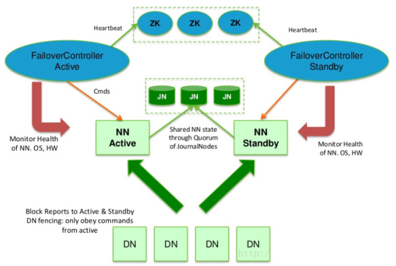

为了使备用节点保持其与活动节点同步的状态，两个节点都与一组称为“日志节点”（JN）的独立守护进程通信。当活动节点执行任何命名空间修改时，它持久地将修改的记录记录到这些JN中的大多数。备用节点能够从JN读取编辑。

基本原理就是用2N+1台 JN
存储Edits，每次写数据操作有大多数（\>=N+1）返回成功时即认为该次写成功。当然这个算法所能容忍的是最多有N台机器挂掉，如果多于N台挂掉，这个算法就失效了。这个原理是基于Paxos算法。

在HA架构里面SecondaryNameNode这个角色已经不存在了，为了保持standby
NN时时的与主Active
NN的元数据保持一致，他们之间交互通过一系列守护的轻量级进程JournalNode

任何修改操作在 Active
NN上执行时，JN进程同时也会记录修改log到至少半数以上的JN中，这时 Standby NN
监测到JN 里面的同步log发生变化了会读取 JN
里面的修改log，然后同步到自己的的目录镜像树里面，如下图：

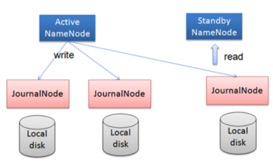

当发生故障时，Active的 NN 挂掉后，Standby NN 会在它成为Active NN
前，读取所有的JN里面的修改日志，这样就能高可靠的保证与挂掉的NN的目录镜像树一致，然后无缝的接替它的职责，维护来自客户端请求，从而达到一个高可用的目的。

为了提供快速故障转移，还必需备用节点具有关于集群中块的位置的最新信息。为了实现这一点，DataNode被配置有所有NameNode的位置，并且向所有NameNode发送块位置信息和心跳。

##### 4.3.2QJM的主要优势

1.  不需要配置额外的高共享存储，降低了复杂度和维护成本。

2.  消除spof。

3.  系统健壮的程度是可配置的。

4.  JN不会因为其中一台的延迟而影响整体的延迟，而且也不会因为JN的数量增多而影响性能（因为NN向JN发送日志是并行的）。

##### 4.3.3只有一个NN能命令DN

1.  每个NN改变状态的时候，向DN发送自己的状态和一个序列号。

2.  DN在运行过程中维护此序列号，当failover时，新的NN在返回DN心跳时会返回自己的active状态和一个更大的序列号。DN接收到这个返回则认为该NN为新的active。

3.  如果这时原来的active
    NN恢复，返回给DN的心跳信息包含active状态和原来的序列号，这时DN就会拒绝这个NN的命令。

##### 4.3.4只有一个NN响应客户端

访问standby
nn的客户端直接失败。在RPC层封装了一层，通过FailoverProxyProvider以重试的方式连接NN。通过若干次连接一个NN失败后尝试连接新的NN，对客户端的影响是重试的时候增加一定的延迟。客户端可以设置重试次数和时间。

Hadoop提供了ZKFailoverController角色，部署在每个NameNode的节点上，作为一个deamon进程,
简称zkfc，示例图如下：

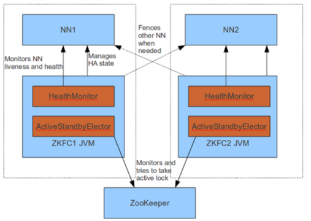

##### 4.3.5FailoverController组成

1.  HealthMonitor:
    监控NameNode是否处于unavailable或unhealthy状态。当前通过RPC调用NN相应的方法完成。

2.  ActiveStandbyElector: 管理和监控自己在ZK中的状态。

3.  ZKFailoverController 它订阅HealthMonitor 和ActiveStandbyElector
    的事件，并管理NameNode的状态。

##### 4.3.6ZKFailoverController职责

1.  健康监测：周期性的向它监控的NN发送健康探测命令，从而来确定某个NameNode是否处于健康状态，如果机器宕机，心跳失败，那么zkfc就会标记它处于一个不健康的状态。

2.  会话管理：如果NN是健康的，zkfc就会在zookeeper中保持一个打开的会话，如果NameNode同时还是Active状态的，那么zkfc还会在Zookeeper中占有一个类型为短暂类型的znode，当这个NN挂掉时，这个znode将会被删除，然后备用的NN，将会得到这把锁，升级为主NN，同时标记状态为Active。

3.  当宕机的NN新启动时，它会再次注册zookeper，发现已经有znode锁了，便会自动变为Standby状态，如此往复循环，保证高可靠，目前可以支持两个以上NN。

4.  master选举：如上所述，通过在zookeeper中维持一个短暂类型的znode，来实现抢占式的锁机制，从而判断哪个NameNode为Active状态。

注意，在HA群集中，Standby
NameNode还执行命名空间状态的检查点，因此不需要在HA群集中运行Secondary
NameNode，CheckpointNode或BackupNode。

#### 4.4HDFS高可用性（NFS）

NFS的方式的HA的配置与启动，和QJM方式基本上是一样，唯一不同的地方就是active
namenode和standby
namenode共享edits文件的方式。QJM方式是采用journalnode来共享edits文件，而NFS方式则是采用NFS远程共享目录来共享edits文件。

NFS允许用户像访问本地文件系统一样访问远程文件系统，而将NFS引入HDFS后，用户可像读写本地文件一样读写HDFS上的文件，大大简化了HDFS使用，这是通过引入一个NFS
gateway服务实现的，该服务能将NFS协议转换为HDFS访问协议，具体如下图所示。

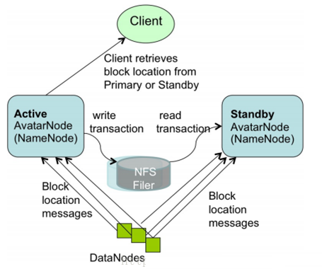

#### 4.5HDFS Federation

##### 4.5.1HDFS的两个主要层

**命名空间**

1.  由目录，文件和块组成。

2.  它支持所有与命名空间相关的文件系统操作，如创建，删除，修改和列出文件和目录。

**块存储服务**，包括两部分：

1.  块管理（在Namenode中执行）

①通过处理注册和定期心跳提供Datanode集群成员身份。

②处理并维护块的位置。

③支持块相关操作，如创建，删除，修改和获取块位置。

④管理副本放置，低复制块的块复制，以及删除超过复制的块。

1.  存储

>   由Datanodes通过在本地文件系统上存储块并允许读/写访问来提供。

>   先前的HDFS架构仅允许整个集群使用单个命名空间。在该配置中，单个Namenode管理命名空间。HDFS
>   Federration通过向HDFS添加对多个Namenodes /命名空间的支持来解决此限制。

##### 4.5.2原理

单Active
NN的架构使得HDFS在集群扩展性和性能上都有潜在的问题，当集群大到一定程度后，NN进程使用的内存可能会达到上百G，NN成为了性能的瓶颈。

常用的估算公式为1G对应1百万个块，按缺省块大小计算的话，大概是64T
(这个估算比例是有比较大的富裕的，其实，即使是每个文件只有一个块，所有元数据信息也不会有1KB/block)。

为了水平扩展名称服务，Federration使用多个独立的Namenodes/命名空间。Namenodes之间管理的数据是共享的，但同时也是独立的，不需要彼此协调。Datanodes被所有Namenode用作块的公共存储。每个Datanode注册集群中的所有Namenode。Datanodes发送定期心跳和块报告。它们还处理来自Namenode的命令。

为了解决这个问题,Hadoop 2.x、Hadoop 3.x提供了HDFS Federation, 示意图如下：

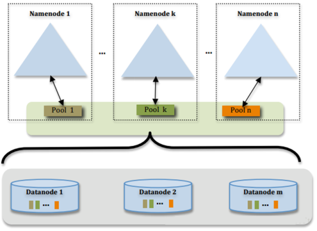

多个NN共用一个集群里的存储资源，每个NN都可以单独对外提供服务。

每个NN都会定义一个存储池，有单独的id，每个DN都为所有存储池提供存储。

DN会按照存储池id向其对应的NN汇报块信息，同时，DN会向所有NN汇报本地存储可用资源情况。

如果需要在客户端方便的访问若干个NN上的资源，可以使用客户端挂载表，把不同的目录映射到不同的NN，但NN上必须存在相应的目录。

##### 4.5.3设计优势

1.  改动最小，向前兼容；现有的NN无需任何配置改动；如果现有的客户端只连某台NN的话，代码和配置也无需改动。

2.  分离命名空间管理和块存储管理。

3.  客户端挂载表：通过路径自动对应NN、使Federation的配置改动对应用透明。

##### 4.5.4ViewF

View文件系统（ViewFs）提供了一种管理多个Hadoop文件系统命名空间（或命名空间卷）的方法。它对于在HDFS
Federation中具有多个命名空间的集群特别有用。ViewF类似于一些Unix/Linux系统中的客户端安装表。ViewF可用于创建个性化命名空间视图以及每个集群的常见视图。

View文件系统具有多个集群的Hadoop系统的上下文中显示，每个集群可以联合到多个命名空间中，以提供每个群集的全局命名空间，以便应用程序可以以类似于联合前的方式运行。

###### 4.5.4.1单个Namenode集群

在HDFS联合之前，集群具有单个命名空间，为该集群提供单个文件系统命名空间。如果有多个集群。则每个集群的文件系统命名空间是完全独立和不相交的。此外，物理存储不是在集群之间共享（即Datanodes不是跨集群共享的）。

###### 4.5.4.2Federation和ViewF

如果有多个集群。每个集群都有一个或多个命名空间。每个namenode都有自己的命名空间。namenode属于一个且仅一个集群。但是与单个namenode集群不同的是：同一集群中的namenode共享该集群的物理存储。集群中的命名空间与前面一样是独立的。

操作根据存储需求决定群集中每个namenode上存储的内容。例如，他们可以将所有用户数据（/user/\<username\>）放在一个命名空间中，将所有feed数据（/data）放置在另一个命名空间中，将所有项目（/projects）放在另一个命名空间等等。

###### 4.5.4.3使用ViewF的每个集群的全局命名空间

为了提供透明度，ViewF文件系统（即客户端装载表）用于创建每个集群独立的集群命名空间视图，这与单个Namenode集群中的命名空间类似。客户端安装表（如Unix安装表），并使用旧的命名约定安装新的命名空间卷。下图显示了装载四个命名空间卷/user，/data，/projects和/tmp的装载表：

ViewF实现了Hadoop文件系统接口，就像HDFS和本地文件系统一样。这是一个普通的文件系统，它只允许链接到其他文件系统。所有shell命令与ViewFS一起使用，与HDFS和本地文件系统一样。

### 5.命令指南

所有的hadoop命令均由bin/hdfs脚本引发。不指定参数运行hdfs脚本会打印所有命令的描述。

用法：hdfs [SHELL\_OPTIONS] COMMAND [GENERIC\_OPTIONS] [COMMAND\_OPTIONS]

Hadoop有一个选项解析框架用于解析一般的选项和运行类。

| **命令选项**             | **描述**                                                                 |
|--------------------------|--------------------------------------------------------------------------|
| SHELL\_OPTIONS           | 常见的一组shell选项。                                                    |
| GENERIC\_OPTIONS         | 多个命令支持的通用选项集。                                               |
| COMMAND COMMAND\_OPTIONS | 以下各节将介绍具有其选项的各种命令。这些命令已分组为用户命令和管理命令。 |

#### 5.1用户命令

hadoop集群用户的常用命令。

##### 5.1.1classpath

打印获取Hadoop
jar和所需库所需的类路径。如果无参数调用，则打印由命令脚本设置的类路径，可以在类路径条目中包含通配符。其他选项在通配符扩展后打印类路径或将类路径写入jar文件的清单。后者在不能使用通配符且扩展的类路径超过支持的最大命令行长度的环境中非常有用。

##### 5.1.2dfs

HDFS允许以文件和目录的形式组织用户数据。它提供了一个称为FS
shell的命令行界面，允许用户与HDFS中的数据交互。此命令集的语法类似于我们已经熟悉的shell。

| **示例**                               | **命令**                                |
|----------------------------------------|-----------------------------------------|
| 在HDFS的根目录创建一个名为foodir的目录 | bin /hadoop dfs -mkdir /foodir          |
| 在HDFS的根目录删除一个名为foodir的目录 | bin /hadoop dfs -rm -R /foodir          |
| 查看/foodir下的myfile.txt文件的内容    | bin /hadoop dfs -cat /foodir/myfile.txt |

FS
shell是针对需要脚本语言以与存储的数据交互的应用程序。具体命令将在手把手教环节来详细讲解。

##### 5.1.3envvars

显示计算的Hadoop环境变量。

##### 5.1.4fetchdt

HDFS支持fetchdt命令来获取授权标识，并将其存储在本地文件系统的一个文件中。一个“非安全”的客户端可以用这个标识来访问受限的服务器（例如NameNode）。获取这个标识，采用RPC或HTTPS(over
Kerberos)方式，然后，在获取之前需要提交Kerberos凭证（运行kinit来获得凭证）。HDFS
fechedt命令不是一个Hadoop shell命令。它以bin/hadoop fetchdt
DTfile方式运行。当你获得授权标识后，通过指定环境变量HADOOP\_TOKEN\_FILE\_LOCATION为授权标识文件名，你就可以运行HDFS命令，而不需要Kerberros凭证了。

##### 5.1.5fsck

HDFS支持fsck命令来检查系统中的各种不一致状况。这个命令被设计来报告各种文件存在的问题，比如文件缺少数据块或者副本数目不够。不同于在本地文件系统上传统的fsck工具，这个命令并不会修正它检测到的错误。一般来说，NameNode会自动修正大多数可恢复的错误。HDFS的fsck不是一个Hadoop
shell命令。它通过'bin/hadoop fsck'执行。 

##### 5.1.6getconf

从配置目录获取配置信息。

##### 5.1.7groups

返回给定一个或多个用户名的组信息。

##### 5.1.8lsSnapshottableDir

获取快照目录的列表。当它作为超级用户运行时，它返回所有可快照目录。否则，它返回那些由当前用户拥有的目录。

##### 5.1.9jmxget

从服务转储JMX信息。

##### 5.1.10oev

Hadoop离线edits查看器。

##### 5.1.11oiv

Hadoop离线image查看器用于Hadoop 2.4或更高版本中的映像文件。

##### 5.1.12oiv\_legacy

Hadoop的旧版本的Hadoop离线image查看器。

##### 5.1.13snapshotDiff

确定HDFS快照之间的差异。

##### 5.1.14version

打印版本。

#### 5.2管理命令

hadoop集群管理员常用的命令。

##### 5.2.1balancer

运行集群平衡工具。管理员可以简单的按Ctrl-C来停止平衡过程。

##### 5.2.2 cacheadmin

HDFS缓存管理。

##### 5.2.3 crypto

HDFS透明加密。

##### 5.2.4 datanode

运行HDFS datanode。

##### 5.2.5dfsadmin

DFSAdmin命令集用于管理HDFS集群。这些是仅由HDFS管理员使用的命令。以下是一些示例/命令对：

| **示例**               | **命令**                           |
|------------------------|------------------------------------|
| 将集群置于Safemode中   | bin /hdfs dfsadmin -safemode enter |
| 生成DataNode的列表     | bin /hdfs dfsadmin -report         |
| 重新提交或停用DataNode | bin /hdfs dfsadmin -refreshNodes   |

##### 5.2.6 diskbalancer

运行磁盘调度程序CLI。

##### 5.2.7erasurecode

运行ErasureCoding CLI。

##### 5.2.8 haadmin

在带有NFS的HDFS HA或带有QJM的HDFS HA中使用。

##### 5.2.9journalnode

这个命令启动一个journalnode用于带有QJM的HDFS HA。

##### 5.2.10 mover

运行数据迁移实用程序。

##### 5.2.11 namenode

运行namenode。以及升级和回滚。

##### 5.2.12nfs3

这个comamnd启动NFS3网关用于HDFS NFS3服务。

##### 5.2.13 portmap

这个comamnd启动RPC portmap用于HDFS NFS3服务。

##### 5.2.14secondarynamenode

运行HDFS辅助节点。

##### 5.2.15storagepolicies

列出所有/获取/设置/取消设置存储策略。

##### 5.2.16zkfc

这个命令启动一个Zookeeper故障转移控制器过程与带有QJM的HDFS HA一起使用。

#### 5.3调试命令

有效的帮助管理员调试HDFS问题。这些命令仅适用于高级用户。

##### 5.3.1verifyMeta

验证HDFS元数据和块文件。如果指定了块文件，我们将验证元数据文件中的校验和是否与块文件匹配。

##### 5.3.2 computeMeta

从块文件计算HDFS元数据。如果指定了块文件，我们将从块文件计算校验和，并将其保存到指定的输出元数据文件。

**注意**：使用它是有风险的，如果块文件已损坏，并覆盖它的元文件，它将在HDFS中显示为“正常”，但却无法读取数据。当你100％确定块文件正常的时候才能使用。

##### 5.3.3 recoverLease

在指定的路径上恢复租约。路径必须驻留在HDFS文件系统上。默认的重试次数为1。

### 6.扩展阅读

#### 6.1.档案存储，SSD和内存

归档存储是将增长的存储容量与计算能力分离的解决方案。具有使较高密度和具有低计算能力的较低成本存储器的节点变得可用，并且可以用作集群中的冷存储器。基于策略，来自热的数据可以被移动到冷。向冷存储中添加更多节点可以增加存储，而与集群中的计算能力无关。

异构存储和归档存储提供的框架将HDFS架构概括为包括其他种类的存储介质，包括SSD和存储器。用户可以选择将其数据存储在SSD或内存中以获得更好的性能。

##### 6.1.1存储类型

异构存储的第一阶段将datanode存储模型从单个存储（其可以对应于多个物理存储介质）改变为存储的集合，其中每个存储对应于物理存储介质。它还添加了存储类型的概念，DISK和SSD，其中DISK是默认存储类型。

添加了新的存储类型ARCHIVE，它具有高存储密度（PB级存储），但计算能力很低，用于支持存档存储。

添加了另一个新的存储类型RAM\_DISK，用于支持在内存中写入单个副本文件。

##### 6.1.2存储策略

引入了存储策略的新概念，以便允许根据存储策略将文件存储在不同的存储类型中。

我们有以下存储策略：

1.  **Hot**：用于存储和计算。一直在使用的数据将保留在此策略中。当块经常被用到时，所有副本都存储在DISK中。

2.  **Cold**：仅适用于有限计算的存储。不再使用的数据或需要归档的数据将从热存储移动到冷存储。当块不经常被用到时，所有副本都存储在ARCHIVE中。

3.  **Warm**：部分热和部分冷的数据。当块热时，其一些副本存储在DISK中，其余的副本存储在ARCHIVE中。

4.  **All\_SSD**：用于存储SSD中的所有副本。

5.  **One\_SSD**：用于存储SSD中的一个副本。剩余的副本存储在DISK中。

6.  **Lazy\_Persist**：用于在内存中写入单个副本的块。副本首先写入RAM\_DISK，然后它被持久化在DISK中。

##### 6.1.3存储策略解析

创建文件或目录时，其存储策略未指定。可以使用“storagepolicies
-setStoragePolicy”命令指定存储策略。文件或目录的有效存储策略由以下规则解决。

1.  如果使用存储策略指定文件或目录，请返回。

2.  对于未指定的文件或目录，如果它是根目录，请返回默认存储策略。否则，返回其父级的有效存储策略。

可以通过“storagepolicies -getStoragePolicy”命令检索有效的存储策略。

##### 6.1.4Mover新的数据迁移工具

添加了一个新的数据迁移工具，用于归档数据。该工具类似于Balancer。它定期扫描HDFS中的文件，以检查块布局是否满足存储策略。对于违反存储策略的块，它会将副本移动到不同的存储类型，以满足存储策略要求。

#### 6.2升级和回滚

当在一个已有集群上升级Hadoop时，像其他的软件升级一样，可能会有新的bug或一些会影响到现有应用的非兼容性变更出现。在任何有实际意义的HDSF系统上，丢失数据是不被允许的，更不用说重新搭建启动HDFS了。HDFS允许管理员退回到之前的Hadoop版本，并将集群的状态回滚到升级之前。HDFS在一个时间可以有一个这样的备份。在升级之前，管理员需要用bin/hadoop
dfsadmin
-finalizeUpgrade命令删除存在的备份文件。下面简单介绍一下一般的升级过程：

1.  升级Hadoop软件之前，请检查是否已经存在一个备份，如果存在，可执行相应操作删除这个备份。通过dfsadmin
    -upgradeProgress status命令能够知道是否需要对一个集群执行该操作。

2.  停止集群并部署新版本的Hadoop。

3.  使用-upgrade选项运行新的版本（bin/start-dfs.sh -upgrade）。

4.  在大多数情况下，集群都能够正常运行。一旦我们认为新的HDFS运行正常（也许经过几天的操作之后），就可以对之执行删除存在的备份文件操作。

5.  如果需要退回到老版本。

>   停止集群并且部署老版本的Hadoop。

>   在namenode（bin /hdfs namenode -rollback）上运行rollback命令。

用回滚选项启动集群（bin/start-dfs.h -rollback）。

当升级到新版本的HDFS时，有必要重命名或删除在新版本的HDFS中保留的任何路径。如果NameNode在升级期间遇到保留路径，它将打印如下错误：

/.reserved是保留路径，.snapshot是此版本的HDFS中的保留路径组件。请回滚并删除或重命名此路径，或使用-rename
Reserved [键值对]选项升级以在升级期间自动重命名这些路径。

指定-upgrade -renameReserved
[可选键值对]使NameNode自动重命名启动期间找到的任何保留路径。例如，要将名为.snapshot的所有路径重命名为.my-snapshot并将.reserved重命名为.my-reserved，用户将指定-upgrade
–rename Reserved .snapshot = .my-snapshot，.reserved = .my-reserved。

如果没有使用-renameReserved指定键值对，NameNode将使用\<LAYOUT-VERSION\>
.UPGRADE\_RENAMED。

这个重命名过程有一些注意事项。如果可能，建议在升级之前先引用hdfs
dfsadmin -saveNamespace。这是因为如果编辑日志操作引用自动重命名文件的目标，则可能导致数据不一致。

#### 6.3HDFS滚动升级

HDFS滚动升级允许升级单个HDFS守护进程。例如，可以独立于数据节点升级数据节点。一个namenode可以独立于其他namenode升级。可以独立于datanode和journal节点升级namenode。

##### 6.3.1升级

在Hadoop
v2中，HDFS支持高可用性（HA）namenode服务和线路兼容性。这两个功能使升级HDFS成为可能，而不会导致HDFS停机。为了在不停机的情况下升级HDFS集群，必须使用HA设置集群。

如果在新软件版本中启用了任何新功能，升级后可能无法使用旧软件版本。在这种情况下，升级应通过以下步骤完成。

1.  禁用新功能。

2.  升级集群。

3.  启用新功能。

请注意，滚动升级仅受Hadoop-2.4.0及更高版本的支持。

###### 6.3.1.1无停机升级

在HA群集中，有两个或更多NameNode（NN），许多DataNodes（DN），一些JournalNodes（JN）和一些ZooKeeperNodes（ZKN）。JNs相对稳定，在大多数情况下升级HDFS时不需要升级。无停机升级仅考虑NN和DN，JN和ZKN不是。升级JN和ZKN可能会导致集群停机。

###### 6.3.1.2随着停机时间升级

对于非HA群集，无法在不停机的情况下升级HDFS，因为需要重新启动namenode。但是，datanode仍然可以滚动方式升级。

##### 6.3.2降级和回滚

当升级版本不受欢迎时，或者在某些情况下，升级失败（由于较新版本中的错误），管理员可以选择将HDFS降级回升级前版本，或者将HDFS回滚到升级前版本，升级前的状态。

###### 6.3.2.1降级

降级将软件恢复到升级前版本，并保留用户数据。假设时间T是滚动升级开始时间，升级通过降级终止。然后，在T之前或之后创建的文件在HDFS中仍然可用。在T之前或之后删除的文件在HDFS中保持删除。

只有在这两个版本之间不更改namenode布局版本和datanode布局版本时，较新版本才可降级到升级前版本。

###### 6.3.2.2回滚

回滚将软件恢复到升级前版本，但还会将用户数据恢复为升级前状态。假设时间T是滚动升级开始时间，并且通过回滚终止升级。在T之前创建的文件在HDFS中保持可用，但在T之后创建的文件变得不可用。在T之前删除的文件在HDFS中保持删除，但在T之后删除的文件将恢复。

始终支持从较新版本回滚到预升级版本。然而，它不能以滚动方式完成。它需要集群停机。

#### 6.4HDFS配额指南

##### 6.4.1概述

HDFS允许管理员为使用的命名和每个个人的文件夹设置配额。命名配额和空间配额独立操作，但是这两种情况的管理和实现是连接紧密的。

##### 6.4.2命名配额

命名配额是一个在这个文件夹下文件和文件夹的数目。如果超过限额那么文件和文件夹的创建会失败，重命名后命名配额仍然起作用。如果重命名操作违反配额的限制，那么重命名会失败。新创建的目录中没有配额的限制。Long.Max\_Value表示最大限额。如果配额为1那么这个文件夹会强制为空。(一个目录也占用自己的配额)。

配额被持久化在fsimage中，当启动后，如果fsimage
马上违反了配额限制（由于fsimage偷偷的改变），这是会打印警告。设置或删除配额会创建一个空的日志。

##### 6.4.3空间配额

空间配额是设置一个文件夹的大小。如果超过那么块写入会失败。副本也算配额中的一部分。重命名文件夹后配额还是起作用，如果已经违反了配额，那么重命名操作会失败。新创建的文件夹不会有配额的限制，Long.Max\_Value可以设置最大的配额。配额设置为0还是运行文件创建，但是不能向文件中写入块。文件夹不使用主机文件系统不计算在空间配额里面，主机文件系统用来记录文件源数据的数据不算在配额中。

配额被持久化在fsimage中，当启动后，如果fsimage
马上违反了配额限制（由于fsimage会慢慢的改变），这是会打印警告。设置或删除配额会创建一个空的日志。

##### 6.4.4存储类型配额

存储类型配额是对目录中根目录的树中的文件对特定存储类型（SSD，DISK，ARCHIVE）的使用的限制。它在许多方面类似于存储空间配额，但对群集存储空间使用提供细粒度控制。要在目录上设置存储类型配额，必须在目录上配置存储策略，以便允许根据存储策略将文件存储在不同的存储类型中。

存储类型配额可以与空间配额和名称配额组合，以有效地管理群集存储使用。例如，

1.  对于配置了存储策略的目录，管理员应为资源约束存储类型（如SSD）设置存储类型配额，并为其他存储类型保留配额，并使用限制较少的值或默认无限制总空间配额。HDFS将根据存储策略和总空间配额从两种目标存储类型中扣除配额。

2.  对于未配置存储策略的目录，管理员不应配置存储类型配额。即使特定存储类型不可用（或可用但未正确配置存储类型信息），也可以配置存储类型配额。但是，在这种情况下，建议使用总空间配额，因为存储类型信息对于存储类型配额强制不可用或不准确。

3.  DISK上的存储类型配额使用有限，除非DISK不是主要的存储介质。（例如，主要具有ARCHIVE存储的集群）。

#### 6.5HDFS短路本地读

在HDFS中，读取通常通过DataNode。因此，当客户端请求DataNode读取文件时，DataNode从磁盘读取该文件，并通过TCP将数据发送到客户端。所谓的“短路”读取就是绕过DataNode，允许客户端直接读取文件。显然，这仅在客户端与数据位于同一位置的情况下是可能的。短路读数为许多应用提供了实质性的性能提升。

#### 6.6HDFS中的集中式缓存管理

集中式缓存管理在HDFS是一个明确的缓存机制，允许用户指定路径由HDFS进行缓存。NameNode将与在磁盘上具有所需块的DataNode通信，并指示它们在堆外高速缓存中缓存块。

HDFS中的集中式缓存管理具有许多显着的优点。

1.  显式锁定可防止频繁使用的数据从内存中逐出。当工作集的大小超过主存储器的大小时，这是特别重要的，这对于许多HDFS工作负载是常见的。

2.  由于DataNode缓存由NameNode管理，因此应用程序可以在进行任务放置决策时查询缓存的块位置集合。将任务与缓存的块副本共置可提高读取性能。

3.  当块由DataNode缓存时，客户端可以使用一个新的，更高效的零拷贝读取API。由于缓存数据的校验和验证由DataNode完成，因此客户端在使用此新API时可能会产生基本上为零的开销。

4.  集中式缓存可以提高整体集群内存利用率。当依赖每个DataNode的OS缓冲区缓存时，重复读取一个块将导致该块的所有n个副本都被拉入缓冲区缓存。通过集中式缓存管理，用户可以明确地仅定位n个副本中的m个，从而节省nm内存。

#### 6.7HDFS NFS网关

NFS网关支持NFSv3，并允许将HDFS作为客户端本地文件系统的一部分加载。当前NFS网关支持并启用以下使用模式：

1.  用户可以通过NFSv3客户端兼容操作系统上的本地文件系统浏览HDFS文件系统。

2.  用户可以将文件从HDFS文件系统下载到本地文件系统。

3.  用户可以将文件从本地文件系统直接上传到HDFS文件系统。

4.  用户可以通过挂载点直接将数据流传输到HDFS。支持文件追加，但不支持随机写入。

NFS网关机器需要相同的东西来运行HDFS客户端，如Hadoop
JAR文件，HADOOP\_CONF目录。NFS网关可以与DataNode，NameNode或任何HDFS客户端位于同一主机上。

#### 6.8HDFS中的扩展属性

扩展属性（缩写为xattrs）是一种文件系统功能，允许用户应用程序将其他元数据与文件或目录相关联。与系统级inode元数据（如文件权限或修改时间）不同，扩展属性不由系统解释，而是由应用程序用于存储有关inode的附加信息。扩展属性可以用于例如指定纯文本文档的字符编码。

##### 6.8.1HDFS扩展属性

HDFS中的扩展属性是在Linux中扩展属性之后建模的。扩展属性是名称/值对，具有字符串名称和二进制值。Xattrs名称也必须用一个前缀的命名空间。例如，在用户命名空间中名为myXattr的xattr 将被指定为user.myXattr。多个xattrs可以与单个inode关联。

##### 6.8.2命名空间和权限

在HDFS中，有五个有效的命名空间：user，trusted，system，security和raw。这些命名空间中的每一个都有不同的访问限制。

用户的命名空间通常是由客户端应用程序使用的命名空间。在用户命名空间中对扩展属性的访问由相应的文件权限控制。

这个命名空间通常不能通过用户空间方法访问。这个xattr只能对文件设置，并且会阻止超级用户读取文件的内容。超级用户仍然可以读取和修改文件元数据，例如所有者，权限等。此xattr可以由任何用户设置和访问，这个xattr也是一次写，一旦设置就不能删除。此xattr不允许设置值。

#### 6.9HDFS中的透明加密

##### 6.9.1概述

Hadoop Key Management Server（KMS）是一个基于HadoopKeyProvider
API编写的密钥管理服务器。他提供了一个client和一个server组件，client和server之间基于HTTP协议使用REST
API通信。Client是一个KeyProvider的实现，使用KMS HTTP REST
API与KMS交互。KMS和它的client有内置的安全机制，支持HTTP SPNEGO
Kerberos认证和HTTPS安全传输。KMS是一个Java
Web应用程序，运行在与Hadoop发行版绑定在一起的预先配置好的Tomcat服务器上。

　　HDFS
实现透明，端到端加密。配置完成后，用户往hdfs上存储数据的时候，无需用户做任何程序代码的更改（意思就是调用KeyProvider
API
，用于在数据存入到HDFS上面的时候进行数据加密，解密的过程一样）。这意味着数据加密和解密由客户端完成的。HDFS
不会存储或访问未加密的数据或数据加密密钥（由kms管理）。

##### 6.9.2背景介绍

越来越多的用户关注安全问题，都在寻找一种有效的，方便的加密方式。hadoop提供了几种不同形式的加密，最底层的加密，加密所有节点数据，有效地保护了数据，但是却缺乏更细粒度的加密；

kms 透明加密可以做到更细粒度的加密；

加密可以在不同的层级进行，包括软件/软件堆栈，选择不同的加密层级各有优缺点

1.  应用程序级加密。这是最安全、最灵活的方法。该应用程序可以极大地控制加密的内容，并可以精确地反映用户的需求。但是，编写应用程序是很难的。对于不支持加密的现有应用程序的客户，这也不是一个选择。

2.  数据库级加密。与其属性相似的应用级加密。大多数数据库供应商提供某种形式的加密。但是，可能会出现性能问题。一个例子是索引不能被加密。

3.  文件系统级进行加密。此选项提供高性能，应用程序透明度，通常易于部署。但是，它无法建模一些应用程序级策略。例如，多租户应用程序可能希望基于最终用户进行加密。数据库可能需要对单个文件中存储的每个列进行不同的加密设置。

4.  磁盘级别加密。容易部署和高性能,但也很不灵活。

HDFS级加密适用于此堆栈中的数据库级和文件系统级加密。这有很大的积极作用。HDFS加密能够提供良好的性能，现有的Hadoop应用程序能够透明地运行加密数据。在制定政策决策时，HDFS还具有比传统文件系统更多的上下文。

HDFS级别的加密还可以防止在文件系统级别及以下的攻击（所谓的“操作系统级攻击”）。操作系统和磁盘只与加密的字节进行交互，因为数据已被HDFS加密。

#### 6.10HDFS支持多宿主网络

在多宿主网络中，集群节点连接到多个网络接口。这样做可能有多种原因。

1.  **安全性**：安全性要求可能决定集群内业务被限制在与用于将数据传入和传出集群的网络不同的网络中。

2.  **性能**：集群内流量可能使用一个或多个高带宽互连，如光纤通道，Infiniband或10GbE。

3.  **故障转移/冗余**：节点可能有多个网络适配器连接到单个网络以处理网络适配器故障。

#### 6.11HDFS中的内存存储支持

HDFS支持写入由数据节点管理的堆外存储器。数据节点会将内存中的数据异步刷入磁盘，从而从性能要求比较高的IO路径中去掉磁盘IO和校验和计算，因此我们称这种写入为Lazy
Persist写入。HDFS为Lazy Persist
写入提供持久性保证。在将副本保留到磁盘之前，在节点重新启动的情况下，可能会发生数据丢失。应用程序可以选择使用Lazy
Persist写入来折衷一些持久性保证，以减少延迟。

此功能从Apache Hadoop 2.6.0开始提供。

目标使用案例是将受益于以低延迟写入相对少量的数据（从几GB到几十GB，取决于可用存储器）的应用。内存存储用于在集群中运行并与HDFS数据节点并置的应用程序。我们已经观察到，网络复制的延迟开销抵消了写入内存的好处。

使用Lazy Persist
写入的应用程序将继续工作，如果内存不足或未配置，则回到DISK存储。

#### 6.12.HDFS纠删码

##### 6.12.1概述

随着大数据技术的发展，HDFS作为Hadoop的核心模块之一得到了广泛的应用。为了系统的可靠性，HDFS通过复制来实现这种机制。但在HDFS中每一份数据都有两个副本，这也使得存储利用率仅为1/3，每TB数据都需要占用3TB的存储空间。随着数据量的增长，复制的代价也变得越来越明显：传统的3份复制相当于增加了200%的存储开销，给存储空间和网络带宽带来了很大的压力。因此，在保证可靠性的前提下如何提高存储利用率已成为当前HDFS应用的主要问题之一。针对这些问题，英特尔和Cloudera开始引入纠删码（Erasure
Coding，EC）技术，在保证数据可靠性的同时大幅降低存储开销。

　　Erasure
coding纠删码技术简称EC，是一种数据保护技术。最早用于通信行业中数据传输中的数据恢复，是一种编码容错技术。他通过在原始数据中加入新的校验数据，使得各个部分的数据产生关联性。在一定范围的数据出错情况下，通过纠删码技术都可以进行恢复。

##### 6.12.2纠删码（Erasure Code）与 Reed Solomon码

　　在存储系统中，纠删码技术主要是通过利用纠删码算法将原始的数据进行编码得到校验，并将数据和校验一并存储起来，以达到容错的目的。其基本思想是将ｋ块原始的数据元素通过一定的编码计算，得到ｍ块校验元素。对于这ｋ+ｍ块元素，当其中任意的ｍ块元素出错（包括数据和校验出错），均可以通过对应的重构算法恢复出原来的ｋ块数据。生成校验的过程被成为编码（encoding），恢复丢失数据块的过程被称为解码（decoding）。

　　Reed-Solomon（RS）码是存储系统较为常用的一种纠删码，它有两个参数k和m，记为RS(k，m)。如图1所示，k个数据块组成一个向量被乘上一个生成矩阵（Generator
Matrix）GT从而得到一个码字（codeword）向量，该向量由k个数据块和m个校验块构成。如果一个数据块丢失，可以用(GT)-1乘以码字向量来恢复出丢失的数据块。RS(k，m)最多可容忍m个块（包括数据块和校验块）丢失。

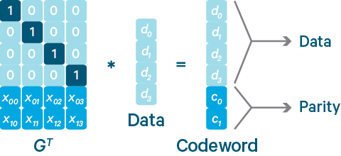

##### 6.12.3块组（BlockGroup）

　　对HDFS的一个普通文件来说，构成它的基本单位是块。对于EC模式下的文件，构成它的基本单位为块组。块组由一定数目的数据块加上生成的校验块放一起构成。以RS(6，3)为例，每一个块组包含1-6个数据块，以及3个校验块。进行EC编码的前提是每个块的长度一致。如果不一致，则应填充0。图2给出三种不同类型的块组及其编码。

##### 6.12.4连续布局（Contiguous Layout）VS条形布局（Striping Layout）

　　数据被依次写入一个块中，一个块写满之后再写入下一个块，数据的这种分布方式被称为连续布局。在一些分布式文件系统如QFS和Ceph中，广泛使用另外一种布局：条形布局。条（stripe）是由若干个相同大小单元（cell）构成的序列。在条形布局下，数据被依次写入条的各个单元中，当条被写满之后就写入下一个条，一个条的不同单元位于不同的数据块中。

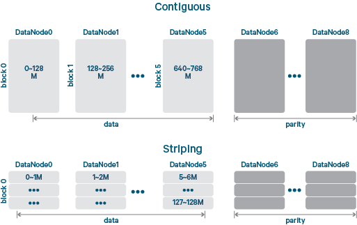

##### 6.12.5Erasure Coding技术的优劣势

###### 6.12.5.1优势

　　纠删码技术作为一门数据保护技术，自然有许多的优势，首先可以解决的就是目前分布式系统，云计算中采用副本来防止数据的丢失。副本机制确实可以解决数据丢失的问题，但是翻倍的数据存储空间也必然要被消耗，这一点却是非常致命的。EC技术的运用就可以直接解决这个问题。

###### 6.12.5.2劣势

EC技术的优势确实明显，但是他的使用也是需要一些代价的，一旦数据需要恢复，他会造成2大资源的消耗:

1.  网络带宽的消耗，因为数据恢复需要去读其他的数据块和校验块

2.  进行编码，解码计算需要消耗CPU资源

　　概况来讲一句话，就是既耗网络又耗CPU，看来代价也不小。所以这么来看，将此用于线上服务可能会觉得不够稳定，所以最好的选择是用于冷数据集群，有下面2点原因可以支持这种选择

1.  冷数据集群往往有大量的长期没有被访问的数据，体量确实很大，采用EC技术，可以大大减少副本数

2.  冷数据集群基本稳定，耗资源量少，所以一旦进行数据恢复，将不会对集群造成大的影响

出于上述2种原因，冷数据集群无非是一个很好的选择。

#### 6.13合成负载生成器

合成负载生成器（SLG）是用于在不同客户端负载下测试NameNode行为的工具。用户可以通过指定读取和写入的概率来生成读取、写入和列表请求的不同混合。用户通过调整工作线程的数量和操作之间的延迟的参数来控制负载的强度。当负载生成器正在运行时，用户可以配置和监视NameNode的运行。当Load
Generator退出时，它会打印一些NameNode统计信息，如每种操作的平均执行时间和NameNode吞吐量。

MAPREDUCE
---------

Mapreduce是一个计算框架，既然是做计算的框架，那么表现形式就是有个输入（input），mapreduce操作这个输（input），通过本身定义好的计算模型，得到一个输出（output），这个输出就是我们所需要的结果。

我们要学习的就是这个计算模型的运行规则。在运行一个mapreduce计算任务时候，任务过程被分为两个阶段：map阶段和reduce阶段，每个阶段都是用键值对（key/value）作为输入（input）和输出（output）。而程序员要做的就是定义好这两个阶段的函数：map函数和reduce函数。

### 1.设计理念

1.  分布式计算

2.  移动计算而不移动数据

### 2.计算框架

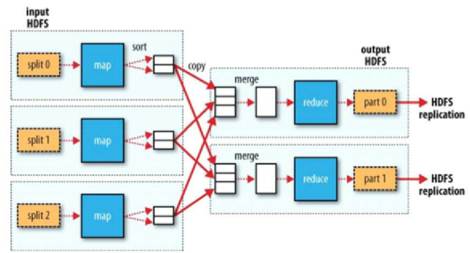

1.  第一个阶段是split，主要是将大文件切分成小文件。

2.  第二个阶段是map，做些基本的分析，一般一个split对应一个map。一般很少在map端做累加，如果文件较大，就要将split传给map的文件全部加载到内存。

3.  第三个阶段是shuffle，主要做排序、分区、分组，连接map与reduce。

4.  第四个阶段是reduce，做进一步分析，reduce在拿数据的时候是通过迭代器的方式拿的，避免了内存溢出的情况。

### 3.主从结构

主resourcemanager：

负责调度分配每一个task任务运行于nodemanager上，如果发现有失败的，就重新分配任务到其它节点，每一个hadoop集群中只有一个resourcemanager，一般它运行在master节点。

从nodemanager：

nodemanager主动与resourcemanager通信，接收作业，并负责执行每一个task任务，为了减少网络带宽，nodemanager最好运行在hdfs的datanode上。

### 4.组成

#### 4.1.MapReduce的split的大小

Split的最大值为：max\_split

Split的最小值为：min\_split

Block的大小：block

切分规则：max(min\_split,min(max\_split,block))，主要是为了减少网络带宽。

#### 4.2Mapper

MapReduce的思想：分而治之。Mapper负责“分”即把复杂的任务分解为若干个简单的任务执行，这样数据或计算规模相对于源任务大大缩小，就近计算，即会被分配到存放了所需数据的节点进行计算，并且这些小任务可以并行计算，彼此间几乎没有依赖关系。

计算框架Mapper中resourcemanager主要是对计算流程的管理，数据存放在datanode上，计算也在这上面计算。同时，namenode管理元数据信息，过程中resourcemanager会请求namenode。

#### 4.3Shuffle

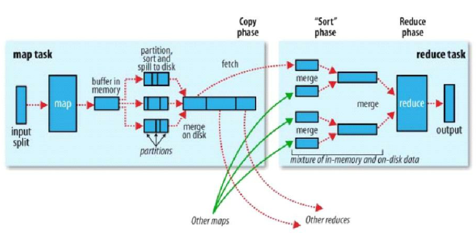

Shuffle是介于mapper与reducer中间的一个步骤，hadoop一般都是移动计算而不移动数据，但是在shuffle阶段有数据的移动。首先map以K-Value键值对的形式输出，输出后写到内存缓冲区，每一个map\_task都有一个内存缓冲区（默认100MB）存储着map的输出结果。当写入内存缓冲区中的数据达到了一定的阈值时，将缓冲区的数据以一个临时文件的方式存放到磁盘（split）。溢写是由单独线程来完成，不影响往缓冲区写map结果的线程（split.percent）默认是0.8，将溢写的过程中的一个个磁盘小文件进行分区，分区的目的是为了标记这些数据都是由后面的哪个reduce来处理。分区的默认规则是key的hash值%reduce的个数。当溢写线程启动后，需要对这80MB空间内的KEY做排序（sort）。将磁盘小文件合并成一个大文件（combiner），然后reduce主动去map端把属于自己的数据拉取过来，到了reduce端要进行二次排序（分组）。同时reduce端的数据也是加载到内存的，内存满了同样会触发溢写。过多的小文件同样会合并成大文件，最后是reduce的输出。

#### 4.4Reducer

Reducer主要是对map阶段的进行汇总，Reduce的数目由mapred-site.xml配置文件里的项目mapred.reduce.tasks决定，缺省值为1，用户可以覆盖。

##### 4.4.1计算框架Reducer

其中resourcemanager用于调度，reduce从map端拿数据，并进行汇总，将结果输出到hdfs中。

YARN
----

### 1.简介

YARN的基本思想是将资源管理和作业调度的功能分成独立的守护进程。ResourceManager和NodeManager构成了数据计算框架，其中ResourceManager（RM）负责协调整个系统的所有应用程序的资源，NodeManager是每个机器框架的代理，是执行应用程序的容器，监控应用程序的资源使用情况
(CPU，内存，硬盘，网络 )
并且向ApplicationMaster汇报。每个应用程序的ApplicationMaster实际上是一个负责跟ResourceManager协商资源，和NodeManager一起执行和监控任务的框架。

MapReduce下一代架构

ResourceManager拥有两大主要组件：Scheduler and ApplicationsManager。

1.  Scheduler负责给所有的运行的应用程序分配资源，受制于容量和队列等。Scheduler仅仅是调度而不关心应用程序的状态监控跟踪。也不保证失败任务和应用失败以及硬件失败。仅仅关心应用程序的资源需求，是一个抽象的资源容器，包括内存，cpu，硬盘，网络等元素。

2.  Scheduler是插件化的负责在各种队列和应用程序直接隔离集群资源，现在的MR调度机制包括CapacityScheduler
    和FairScheduler都是插件化的。

3.  CapacityScheduler支持层次队列，支持共享集群资源。

4.  ApplicationsManager
    负责接收任务提交，协调容器去执行应用,尤其ApplicationMaster，同时当ApplicationMaster失败了提供重启服务。

5.  NodeManager在每个节点上都有，负责容器，监控资源使用情况，上报状态信息到 ResourceManager/Scheduler。

6.  每个应用的ApplicationMaster用于协调从Scheduler的资源容器状态跟踪监控。

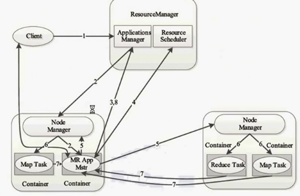

### 2.命令

#### 2.1概述

YARN命令由bin/yarn脚本调用。运行不带任何参数的yarn脚本将打印所有命令的描述。

用法：yarn [SHELL\_OPTIONS] COMMAND [GENERIC\_OPTIONS] [COMMAND\_OPTIONS]

| 命令选项                 | 描述                     |
|--------------------------|--------------------------|
| SHELL\_OPTIONS           | 常见的一组shell选项      |
| GENERIC\_OPTIONS         | 多个命令支持的通用选项集 |
| COMMAND COMMAND\_OPTIONS | 有其选项的各种命令       |

#### 2.2用户命令

Hadoop集群用户使用的命令。

#### 2.3管理命令

Hadoop集群管理员使用的命令。

### 3.调度

#### 3.1容量调度

##### 3.1.1目的

容量调度，对于Hadoop的一个可插入的调度程序，允许用于 multiple-tenants安全地共享一个大集群，使得他们的应用程序是根据所分配容量限制分配资源，及时处理。

##### 3.1.2概述

该容量调度被设计为运行Hadoop的一个共享的应用程序，在操作者友好的方式multi-tenant实现集群的最大化吞吐量和集群的最大利用率。

传统上每个组织都有它自己的私有组具有足够的能力来满足组织的SLA下的峰值或接近峰值条件下的计算资源。这通常会导致平均利用率和管理多个独立的群集不平衡，使之成为每个组织开销之一。组织之间共享集群是运行大型的Hadoop的安装，因为这使他们能够获得规模经济的好处，而无需创建私人集群的成本效益的方式。然而，组织都在关注共享群集，因为他们担心别人使用，这是他们的SLA至关重要的资源。

该容量调度被设计成允许共享一个大的集群，同时给每个组织能力的保证。其中心思想是，在Hadoop集群中的可用资源，谁共同出资建设集群的基础上需要计算需求多个组织之间共享。有一个组织可以访问不被他人使用任何产能过剩的一个额外的好处。这提供了弹性的组织以具有成本效益的方式。

跨组织共享集群就必须对multi-tenant的大力支持，因为每个组织必须保证能力和安全防护装置，以确保共享群集是不受单个表面应用程序或用户或设定物。该容量调度提供了一套严格的限制，以确保单个应用程序或用户或队列都不能消耗在集群中的资源不成比例。此外，容量调度提供initialized/pending

从单用户应用程序的限制和排队控制，以确保公平集群和稳定性。

由容量调度提供的初级抽象是队列中的概念。这些队列通常设置由管理员反映共享集群的经济性。

为进一步控制和可预测的资源共享，在容量调度支持层次化队列，以确保资源的子队列的组织之间共享其他队列。

#### 3.2公平调度

##### 3.2.1目的

公平调度，一个用于Hadoop的可插入调度程序，它允许YARN应用程序公平地共享大型集群中的资源。

##### 3.2.2介绍

公平调度是将资源分配给应用程序的方法，使所有的应用程序得到的平均值，资源随时间的相等份额。Hadoop的下一代系统能够调度多个资源类型。默认情况下，公平调度器调度仅在内存中实现公平调度。它可以被配置为内存和CPU调度，利用资源优势公平的概念。此方法有由Ghodsi等人开发的。在应用程序使用的集群中，当有一个单一的应用程序运行时。当其他应用程序提交后，即释放被分配给新的应用程序的资源，这样每个应用程序对最终得到的资源量大致相当。不同于默认Hadoop的调度，形成应用程序的队列，这让短暂的应用程序在合理的时间内完成，而不会饿死长时间运行的应用程序。它也是一种合理的方式来共享多个用户之间的集群资源。最后在公平共享的同时还能配合的应用程序优先级
作为权重来确定总的资源为每个应用程序应该得到的资源数。

调度组织进一步应用到“队列”，并在这些队列之间分享资源??。默认情况下，所有用户共享一个单一的队列，命名为“default”。如果一个应用程序专门列出一个队列在一个容器资源请求，该请求被提交到该队列。它也可以分配基于包括通过配置请求中的用户名的队列。在每个队列调度策略用于共享运行的应用程序之间的资源。默认的是基于存储器的公平共享，但是FIFO和多资源具有优势资源公平也可以配置。队列可以被安排在一个层次结构来划分资源，并与重量配置为共享集群中的特定比例。

除了提供公平共享，公平调度器允许分配最低保证分享的队列，这是保证某些用户，组或生产应用程序总能得到足够的资源是有效的。当队列中包含的应用程序，它得到至少为其最小的份额，但是当队列并不需要它的全面保证份额，则超出部分拆分其他正在运行的应用程序之间。这让调度保障能力的同时有效地利用资源，当这些队列不包含应用程序的队列。

公平调度器让默认情况下运行的所有应用程序，但它也可以通过配置文件限制运行的每个用户和每个队列的应用程序的数量。这可能是有用的，当一个用户必须同时提交上百的应用程序，或在总体上提高性能，如果同时运行了太多的应用程序会导致创建太多的中间数据或过多的上下文切换。限制应用程序不会造成任何其后提交的应用程序失败，只能等待调度的队列中，直到一些用户的较早的应用程序完成的。

#### 3.3机会型容器

##### 3.3.1主要目标

与仅存在未分配资源时在节点中调度的现有YARN容器不同，机会性容器可以被分派到NM，即使它们在该节点处的执行不能立即开始。在这种情况下，机会性容器将在该NM处排队，直到资源变得可用。机会性容器执行的主要目标是提高集群资源利用率，从而增加任务吞吐量。资源利用率和任务吞吐量改进对于包括相对较短任务（秒级）的工作负载更加明显。

##### 3.3.2概述

YARN（公平和容量调度程序）中的现有调度程序仅在调度容器时在该节点上有未分配资源时才将容器分配给节点。这种保证的执行类型的优点在于，一旦AM将容器分派给节点，容器执行将立即开始，因为它保证将有可用的资源。此外，除非违反公平或能力限制，否则保证容器运行到完成而不被抢占。

虽然此设计提供了更可预测的任务执行，但它有两个主要缺点，可能导致次优的集群资源利用率：

**1）
反馈延迟。**当容器在节点完成其执行时，RM通过下一个NM-RM心跳通知有可用资源，然后RM在该节点调度新容器，AM通过下一个AM-RM心跳通知，最后AM在节点启动新的容器。这些延迟导致空闲节点资源，这又导致较低的资源利用，特别是当工作负载涉及持续时间相对较短的任务时。

**2)
分配与已利用资源。**RM基于在每个节点处分配的资源来分配容器，这可能显着高于实际使用的资源（例如，考虑已经分配了4GB内存但仅使用2GB的容器）。这降低了有效的资源利用，并且如果RM在调度期间考虑所利用的资源，则可以避免这种情况。然而，这必须以允许在运行的容器的所利用的资源增加的情况下回收资源的方式来完成。

为了减轻上述问题，除现有的容器，我们介绍的概念机会主义容器。即使在调度的时刻没有可用的（未分配的）资源，也可以将机会性容器分派给NM。在这种情况下，机会性容器将在NM处排队，等待资源变得可用于其开始执行。机会性容器具有比保证容器低的优先级，这意味着它们可以被抢占以保证容器开始它们的执行。因此，它们可以用于提高集群资源利用率，而不会影响现有保证容器的执行。

机会性容器的另一个优点是它们在NM处引入执行优先级的概念。例如，不要求严格执行保证的较低优先级作业可以对其任务使用机会性容器或容器执行类型的混合。

我们介绍了两种分配机会主义容器的方法：集中式和分布式。在集中式调度中，机会性容器通过YARN
RM分配，而在分布式容器中，通过驻留在每个NM的本地调度器来分配。集中式分配允许更高质量的布置决策，并且实现跨应用的更多涉及的共享策略（例如，公平性）。另一方面，分布式调度可以提供更快的容器分配，这对于短任务是有用的，因为它避免了到RM的往返。在这两种情况下，保证容器的调度保持完整，并通过YARN
RM（使用现有的公平或容量调度程序）进行。

注意，在当前实现中，我们基于分配（和未使用）资源来分配容器。因此，我们处理上述“反馈延迟”问题，而不是“分配与利用资源”问题。

#### 3.4.YARN安全容器

##### 3.4.1安全容器概述

1.  容器隔离

容器执行器必须访问容器所需的本地文件和目录，例如jar，配置文件，日志文件，共享对象等。虽然它是由NodeManager启动的，但容器不应该访问NodeManager的私有文件和配置。运行由不同用户提交的应用程序的容器应该隔离，并且无法访问其他文件和目录。

1.  Linux安全容器执行程序

在Linux环境中，安全容器执行程序是LinuxContainerExecutor。它使用一个名为container-executor的外部程序来启动容器。此程序具有setuid访问权限标志，允许其启动具有YARN应用程序用户权限的容器。

##### 3.4.2Yarn的工作流程

步骤1：用户将应用程序提交到ResourceManager上。

步骤2：ResourceManager为应用程序ApplicationMaster申请资源，并与某个NodeManager通信，以启动ApplicationMaster。

步骤3：ApplicationMaster与ResourceManager通信，为内部要执行的任务申请资源，一旦得到资源后，将于NodeManager通信，以启动对应的任务。

步骤4：所有任务运行完成后，ApplicationMaster向ResourceManager注销，整个应用程序运行结束。

上述步骤中，步骤2\~3涉及到资源申请与使用，而这正是Container出现的地方。

### 4.ResourceManger

#### 4.1概述

ResourceManager是管理资源和调度YARN中运行的application的中心机构。因此，它在Apache
YARN 集群中存在潜在的单点故障。下面给出有关ResourceManager
Restart特性，该特性强化ResourceManager可以跨越重启操作继续运转，另外让ResourceManager的停机时间对终端用户不可见。

ResourceManager Restart特性分成两个阶段：

1.  ResourceManager Restart阶段1（Non-work-preserving RM restart）：RM在插件化的
    state-store中持久化application/attempt状态以及其他证书信息。在重启过程中RM会从state-store中重载这些信息，并且重新启动之前Running的application。用户不需要重新提交这些application。

2.  ResourceManager Restart阶段 2 (Work-preserving RM
    restart):聚焦在通过结合重启过程中来自NodeManager的容器状态和来自ApplicationMaster的容器请求重新构建ResourceManager的运行状态。与阶段1的关键不同是之前运行中的应用程序在RM重启中不会被kill，所以application不会因为RM的中断丢失它的工作内容。

#### 4.2高可用性

ResourceManager（RM）负责跟踪集群中的资源，并调度应用程序（例如MapReduce作业）。在Hadoop
2.4之前，ResourceManager是YARN集群中的单点故障。高可用性功能以活动/备用ResourceManager添加冗余，以消除这种单点故障。

### 5.NodeManager

NodeManager（NM）是YARN中每个节点上的代理，它管理Hadoop集群中单个计算节点，包括与ResourceManger保持通信，监督Container的生命周期管理，监控每个Container的资源使用（内存、CPU等）情况，追踪节点健康状况，管理日志和不同应用程序用到的附属服务（auxiliary
service）。NodeManager负责启动和管理节点上的容器。容器执行AppMaster指定的任务。

1.  健康检查服务

NodeManager运行服务以确定其正在执行的节点的运行状况。服务对磁盘以及任何用户指定的测试执行检查。如果任何健康检查失败，则NodeManager将该节点标记为不正常，并将其传达给ResourceManager，ResourceManager将停止向该节点分配容器。节点状态的通信是作为NodeManager和ResourceManager之间的心跳的一部分来完成的。磁盘检查器和运行状况监视器运行的时间间隔不影响心跳间隔。当心跳发生时，两个检查的状态用于确定节点的运行状况。

1.  磁盘检查程序

磁盘检查程序检查NodeManager配置使用的磁盘的状态（local-dirs和log-dirs，分别使用yarn.nodemanager.local-dirs和yarn.nodemanager.log-dirs配置）。检查包括权限和可用磁盘空间。它还检查文件系统不处于只读状态。默认情况下，检查以2分钟间隔运行，但可以配置为按用户期望的频率运行。如果磁盘检查失败，NodeManager停止使用该特定磁盘，但仍报告节点状态为正常。但是，如果多个磁盘无法通过检查（可以配置该数目，如下所述），则会将该节点报告为对ResourceManager不正常，并且不会将新容器分配给该节点。

1.  外部健康脚本

用户可以指定自己的健康检查器脚本，由健康检查器服务调用。用户可以指定超时以及要传递给脚本的选项。如果脚本使用非零退出代码退出，超时或抛出异常，则会将节点标记为不正常。请注意，如果由于权限或路径不正确而无法执行脚本，则会将其视为失败，并将该节点报告为不正常。请注意，健康检查脚本不是强制性的。如果未指定脚本，则仅使用磁盘检查程序状态来确定节点的运行状况。

### 6.节点标签

节点标签是一种对具有类似特征的节点进行分组的方法，应用程序可以指定运行的位置

现在我们只支持节点分区，即：

一个节点可以只有一个节点分区，因此一个节点分区将一个集群分区为几个不相交的子集群。默认情况下，节点属于DEFAULT分区（partition
=“”）

用户需要配置每个分区可以使用不同队列的资源量。

有两种节点分区：

1.  Exclusive：容器将被分配给具有完全匹配节点分区的节点。（例如，请求分区=“x”将被分配给具有分区=“x”的节点，要求DEFAULT分区将被分配给DEFAULT分区节点）。

2.  Non-exclusive：如果分区是非排他的，它将空闲资源共享给请求DEFAULT分区的容器。

用户可以指定每个队列可以访问的节点标签集，一个应用程序只能使用可以由包含应用程序的队列访问的节点标签的子集。

### 7.扩展阅读

#### 7.1Web应用程序代理

Web应用程序代理是YARN的一部分。同时也是资源管理器（RM）的一部分，它可以在独立模式下运行。用于减少YARN遭受Web攻击的可能性。ResourceManager
Web的访问基于受信用户，当Application
Master运行于一个非受信用户，其提供给ResourceManager的将是非受信连接，Web
Application Proxy可以阻止这种连接提供给RM。

#### 7.2时间轴服务器

##### 7.2.1介绍

以一种通用的方式向YARN Timeline
Server上注册应用程序的当前和历史状态，便于存储和检索。它主要有两大职责：

1.  持久化应用程序的具体信息

收集并检索应用程序或者框架的具体信息。例如，hadoop
MR框架里面的与分片线关系的信息，诸如map tasks、reduce
tasks、counters等。应用程序开发者可以在App
Master端或者应用程序需的containers中通过TimelineClient将这些信息发送给Timeline
Server。

这些信息都可以通过REST APIs在具体App或者执行框架的UI界面查询到。

1.  持久化已完成的应用程序的Generic information

关于这一点，在Application history server中，显然只支持MR框架的job。Generic
information包括了像\*queue-name，\*用户信息等用户程序级别的数据，还有设置在ApplicationSubmissionContext中的信息，用于运行应用程序的application-attempts
列表，关于每个application-attempt的信息，container列表以及运行在每个application-attempt下的每个container的信息。

##### 7.2.2时间轴框架

1.  Timeline Domain

Timeline Domain为Timeline
Server提供了一个命令空间，使得用户可以搜集多个节点，将它们与其他用户和应用程序隔离开来。Timeline
server
security就定义在这一层。一个Domain首先是用于存储用户的信息、读写ACL信息、创建和修改时间戳。每个Domain以一个唯一的ID在整个YARN集群中标识。

1.  Timeline Entity

一个Timeline
Entity（即Timeline实体）包含一个概念实体的元信息以及它的相关的events.一个实体可以是一个application，一个
application
attempt，一个container卓尔其他任何的应用自定义的object。它还包含多个Primary
filters用于作为timeline
store中多个实体的索引。其他的数据可以以非索引的方式存储。每个实体都通过一个EntityId和EntityType唯一的确定。

1.  Timeline Events

Timeline
Events用于描述一个与某个具体Application的timeline实体相关的event。用户也可以随意定义一个event方法，比如启动一个应用程序，获取分配的container、操作失败或者其他的与用户和集群操作相关的失败信息等等。

##### 7.2.3时间轴服务v.2

YARN时间轴服务v.2是时间轴服务的下一个主要迭代，遵循v.1和v.1.5。V.2是为了解决v.1的两个主要挑战而创建的。

1)可扩展性

V.1限于写入/读取和存储的单个实例，并且不能超出群集扩展。V.2使用更可扩展的分布式写入架构和可扩展存储。

YARN时间轴服务v.2将数据的收集（写入）与服务（读取）数据分离。它使用分布式收集器，每个YARN应用程序基本上有一个收集器。阅读器是专用于通过REST
API提供查询的单独实例。YARN Timeline Service v.2选择Apache
HBase作为主要后备存储，因为Apache
HBase可以很好地扩展性，同时保持读取和写入的良好响应。

2)可用性改进

在许多情况下，用户对YARN应用程序的“流”或逻辑组级别的信息感兴趣。启动一组或一系列YARN应用程序以完成逻辑应用程序是更常见的。时间轴服务v.2明确支持流的概念。此外，它支持在流级别聚合。

流层次

#### 7.3应用程序

客户端提交应用到Resource
Manager，首先客户端需要使用ApplicationClientProtocol连接ResourceManager获取一个ApplicationId，通过ApplicationClientProtocol\#getNewApplication(类名\#方法)，然后通过ApplicationClientProtocol\#submitApplication方法，提交应用运行。作为 ApplicationClientProtocol\#submitApplication方法的一部分，客户端需要提供足够的信息到ResourceManager用来‘发布’应用的第一个Container作为ApplicationMaster。你需要提供的信息包括应用运行所需要的本地文件或者jar，实际的执行的命令行（和必要的命令行参数），环境设置（可选）等等。你需要描述ApplicationMaster运行的Unix进程资源。

YARN的ResourceManager将会发布ApplicationMaster（按照指定的）。然后ApplicationMaster将会采用ApplicationMasterProtocol与ResourceManager 进行通讯，首先ApplicationMaster会使用ApplicationMasterProtocol\#allocate方法注册自己到ResourceManager.为了完成指定的任务。ApplicationMaster要通过ApplicationMasterProtocol\#allocate来请求和接收containers。在一个container分配给他之后，ApplicationMaster使用ContainerManager\#startContainer来与NodeManager
通讯发布任务到这个container。作为发布到container的部分，ApplicationMaster需要指明ContainerLaunchContext（这个类似于ApplicationSubmissionContext）并且发布的信息应包括指定的命令行，环境等。一旦任务完成ApplicationMaster会通过ApplicationMasterProtocol\#finishApplicationMaster通知ResourceManager完成。

同时，客户端通过ResourceManager监控应用的状态或者是直接查询ApplicationMaster（如果支持这个服务的话），如有需要客户端也可以通过ApplicationClientProtocol\#forceKillApplication杀掉应用的进程。

#### 7.4应用程序安全

任何编写YARN应用程序的人都需要了解该过程，以便编写短期应用程序或长期服务。他们还需要在早期开发阶段开始在安全集群上测试，以便编写实际工作的代码。

YARN安全性如何工作

YARN资源管理器（RM）和节点管理器（NM）协作以用该用户的身份和因此的用户的访问权限来执行用户的应用。

（活动）资源管理器：

查找群集中的空间以部署应用程序的核心，应用程序主（AM）。

请求该节点上的NM分配容器并在其中启动AM。

与AM通信，以便AM可以请求新的容器并操纵/释放当前容器，并提供关于已分配和正在运行的容器的通知。

节点管理器：

本地化资源：从HDFS或其他文件系统下载到本地目录。这是使用附加到容器启动上下文的委托令牌来完成的。（对于非HDFS资源，使用其他凭据，如群集配置文件中的对象存储库登录详细信息）

以用户身份启动应用程序。

监视应用程序并向RM报告故障。

要在集群中执行代码，YARN应用程序必须：

有一个客户端应用程序，它设置了ApplicationSubmissionContext详细说明是什么推出。这包括：

集群文件系统中要“本地化”的文件列表。

要在容器中设置的环境变量。

在容器中执行以启动应用程序的命令。

YARN启动应用程序所需的任何安全凭证。

应用程序与任何Hadoop集群服务和应用程序交互所需的任何安全凭证。

有一个Application Master，当启动时，向YARN
RM注册并监听事件。任何AM它希望执行的其他容器的工作必须要求他们离开RM，并且在分配时，创建ContainerLaunchContext包含要执行的命令，环境执行命令，双星定位和所有相关的安全证书。

即使NM处理本地化过程，AM也必须能够检索在启动时提供的安全证书，以便它自己可以与HDFS和任何其他服务一起工作，并将这些证书中的一些或全部传递到启动容器。

获取和添加令牌到YARN应用程序

YARN应用所需的代理令牌必须从作为认证用户执行的程序中获取。对于YARN应用程序，这意味着用户启动应用程序。它是YARN应用程序的客户端部分，必须这样做：

通过UserGroupInformation登录。

识别必须获取的所有令牌。

从特定的Hadoop服务请求这些令牌。

Marshall将所有令牌转换成字节缓冲区。

将它们添加到ApplicationSubmissionContext中的ContainerLaunchContext。

需要哪些令牌？通常，至少需要一个令牌来访问HDFS。

应用程序必须从与其打算交互的每个文件系统请求委派令牌 -
包括集群的主FS。FileSystem.addDelegationTokens（renewer，credentials）可以用来收集这些; 它是没有发出令牌（包括非kerberized
HDFS集群）的那些文件系统上的无操作。

与其他服务（如Apache HBase和Apache
Hive）通信的应用程序必须从这些服务请求令牌，使用这些服务的库来获取委派令牌。所有令牌可以添加到相同的凭据集，然后保存到字节缓冲区以提交。

应用程序时间表服务器还需要一个委派令牌。这是在AM启动时自动处理的。

#### 7.5CGroups

CGroups是将任务集及其所有未来的子任务聚集/分组成具有专门层次。CGroups是一个Linux内核功能，并被并入内核版本2.6.24。从YARN的角度来看，这允许容器在其资源使用中受到限制。一个很好的例子是CPU使用率。没有CGroups，很难限制容器CPU的使用。目前，CGroups仅用于限制CPU使用。

#### 7.6预约系统

该预约系统为用户提供了资源预留，以确保可以随时运行重要作业的能力。ReservationSystem执行细力度的资源控制，并提供对绝对资
源量（而不是集群大小的百分比）的保证。保留可以是可延展的或具有成组含义，并且可以具有时变资源要求。ReservationSystem是YARN
ResourceManager的组件。

应用场景
--------

美国著名科技博客GigaOM的专栏作家Derrick
Harris跟踪云计算和Hadoop技术已有多年时间，在一篇文章中总结了10个Hadoop的应用场景，下面分享给大家：

**1.在线旅游：**目前全球范围内80%的在线旅游网站都是在使用Cloudera公司提供的Hadoop发行版，其中SearchBI网站曾经报道过的Expedia也在其中。

**2.移动数据：**Cloudera运营总监称，美国有70%的智能手机数据服务背后都是由Hadoop来支撑的，也就是说，包括数据的存储以及无线运营商的数据处理等，都是在利用Hadoop技术。

**3.电子商务：**这一场景应该是非常确定的，eBay就是最大的实践者之一。国内的电商在Hadoop技术上也是储备颇为雄厚的。

**4.能源开采：**美国Chevron公司是全美第二大石油公司，他们的IT部门主管介绍了Chevron使用Hadoop的经验，他们利用Hadoop进行数据的收集和处理，其中这些数据是海洋的地震数据，以便于他们找到油矿的位置。

**5.节能：**另外一家能源服务商Opower也在使用Hadoop，为消费者提供节约电费的服务，其中对用户电费单进行了预测分析。

**6.基础架构管理：**这是一个非常基础的应用场景，用户可以用Hadoop从服务器、交换机以及其他的设备中收集并分析数据。

**7.图像处理：**创业公司Skybox
Imaging使用Hadoop来存储并处理图片数据，从卫星中拍摄的高清图像中探测地理变化。

**8.诈骗检测：**这个场景用户接触的比较少，一般金融服务或者政府机构会用到。利用Hadoop来存储所有的客户交易数据，包括一些非结构化的数据，能够帮助机构发现客户的异常活动，预防欺诈行为。

**9.IT安全：**除企业IT基础机构的管理之外，Hadoop还可以用来处理机器生成数据以便甄别来自恶意软件或者网络中的攻击。

**10.医疗保健：**医疗行业也会用到Hadoop，像IBM的Watson就会使用Hadoop集群作为其服务的基础，包括语义分析等高级分析技术等。医疗机构可以利用语义分析为患者提供医护人员，并协助医生更好地为患者进行诊断。

#### 主要的场景分类如下：

1.大数据量存储：分布式存储（各种云盘，百度、360还有云平台均有hadoop应用）

2.日志处理: Hadoop擅长这个

3.海量计算: 并行计算

4.ETL:数据抽取到oracle、mysql、DB2、mongdb及主流数据库

5.使用HBase做数据分析:
用扩展性应对大量读写操作—Facebook构建了基于HBase的实时数据分析系统

6.机器学习: 比如Apache Mahout项目（常见领域：协作筛选、集群、归类）

7.搜索引擎:hadoop + lucene实现

8.数据挖掘：目前比较流行的广告推荐

9.大量地从文件中顺序读。HDFS对顺序读进行了优化，代价是对于随机的访问负载较高。

10.用户行为特征建模

11.个性化广告推荐

12.智能仪器推荐

资源推荐
--------

### 网站

#### 1.1官网

我推荐给大家的是HADOOP官网：http://hadoop.apache.org/，因为官网是一项技术的第一手信息来源，并且可以最全面及最直接的了解此技术，如果有英文不好的，可以使用谷歌的网页翻译，正确率在90%以上，对于学习一项技术来说，还是可以的。或者大家可以访问http://hadoop.apache.org/docs/r1.0.4/cn/
这个网址，看一下1.0的中文版,虽然现在已经到3.0了,但是对于对MAPREDUCE的理解，帮助还是很大的。

### 2.书籍

#### 2.1《HADOOP权威指南》

这本书很全面的介绍了hadoop，本书是将作者Tom
White的英文原版书籍进行了翻译，作者从2006年起就开始为hadoop做贡献，是hadoop开发社区受人尊敬的资深成员，精通hadoop技术的若干领域，
由他写出的hadoop书籍，通俗易懂，适合入门hadoop。

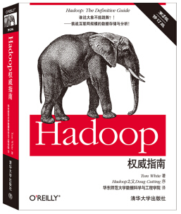

#### 2.2《hadoop技术内幕》

之所以给大家推荐《hadoop技术内幕》是因为此书的作者是董西成，他是Hadoop领域资深的实践者，他将hadoop的技术分成3部分：MapReduce、HDFS、YARN，每部分都进行了详细的阐述。

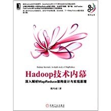

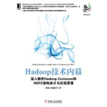

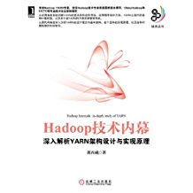

### 3.网课

#### 3.1极客学院网课

笔者将所有网上的视频与网课浏览了一遍，大部分的视频都有些老。极客学院的网课值得推荐。

http://www.jikexueyuan.com/course/hadoop/

#### 3.2尚学堂hadoop视频分享

鉴于网上的视频资料大多都有些老，笔者将在尚学堂学习的视频分享给大家。

http://pan.baidu.com/s/1qYkDqZq

### 4.社区

#### 4.1hadoop技术社区

这个社区中涵盖了有关hadoop的资讯、博客、论坛、hadoop资料下载、及hadoop的有关的活动。

http://hadoop.csdn.net/

八、进一步学习
--------------

### 1.论文归纳

如下是Google大数据三篇著名论文的中文版,是比较权威的论文资料。在这里分享给读者。

#### 1.1Google File System中文版

http://blog.bizcloudsoft.com/wp-content/uploads/Google-File-System%E4%B8%AD%E6%96%87%E7%89%88\_1.0.pdf

#### Google Bigtable中文版

http://blog.bizcloudsoft.com/wp-content/uploads/Google-Bigtable%E4%B8%AD%E6%96%87%E7%89%88\_1.0.pdf

#### Google MapReduce中文版

http://blog.bizcloudsoft.com/wp-content/uploads/Google-MapReduce%E4%B8%AD%E6%96%87%E7%89%88\_1.0.pdf

### 2.优秀博文

#### 2.1董的博文

笔者之所以首先推荐“董的博客”是由于他是hadoop技术内幕的作者、资深Hadoop技术实践者和研究者，曾参与商用Hadoop原型研发，以及分布式日志系统、全网图片搜索引擎、Hadoop调度器等项目的设计与研发。对hadoop有自己独到的见解。网址为：http://dongxicheng.org/

#### 2.2[bigdata\_player的博文](http://blog.csdn.net/bigdata_player)

如果有刚入门hadoop的读者,可以读一下bigdata\_player的三篇博文：

1.“Hadoop 基础知识---之HDFS篇”，
网址为：http://blog.csdn.net/bigdata\_player/article/details/51932437

2.“Hadoop
基础知识---之MapReduce篇”，网址为：http://blog.csdn.net/bigdata\_player/article/details/52050400

3.“Hadoop基础知识---之YARN原理简述”，网址为：http://blog.csdn.net/bigdata\_player/article/details/52057176

#### 2.3[既认准这条路，又何必在意要走多久](http://blog.csdn.net/linlinv3)的博文

在初学hadoop的时候，免不了要去官网下载hadoop的安装包，而下载下来的安装包无法直接使用，需要手动去编译。读者可以参照此博文来编译hadoop的包。网址为：http://blog.csdn.net/linlinv3/article/details/49358217
