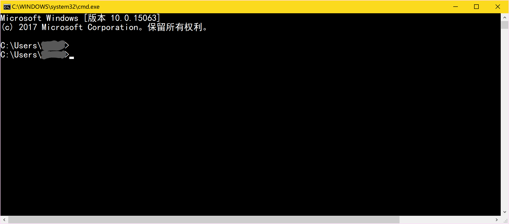
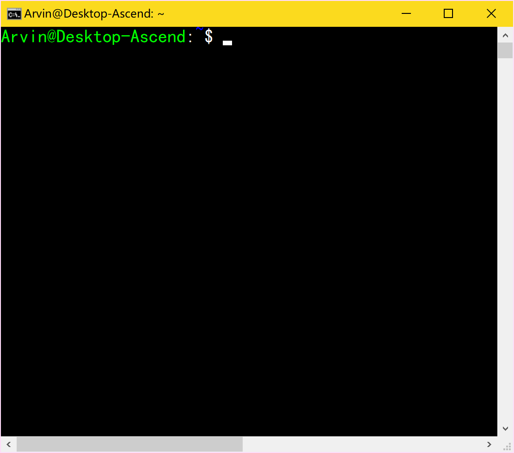
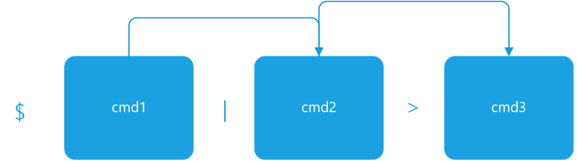

<span style="font-size: xx-large;font-weight: bold;">一文读懂Shell</span>  
<span style="font-size: medium;font-weight: bold;">文\/邱依强</span>😁


# 1. 简述 - 什么是Shell
在计算机科学技术中，Shell是一种特殊的应用程序，它是一种方便使用操作系统的接口，能够连接用户与操作系统的“心脏（即内核，Kernel）”，通常分为CLI（Command Line Interface）和GUI（Graphical User Interface）两种。GUI常见于Windows系统，其系统软件--Windows Explorer即是使用最多的GUI；CLI是更为“古老”的Shell，从Windows-Dos到Unix-like计算机中的Bash，都属于CLI。这样的计算机接口软件之所以被我们称作为Shell，就是它很形象地，像Shell一样包围着我们的计算机操作系统内核（OS Kernel），起到保护我们计算机操作系统的同时，也大大“美化”了我们的操作方式。

# 2. <ruby>OS Kernel<rt>操作系统内核</rt></ruby>
计算机操作系统内核作为一种软件，是一个计算机系统最核心的组成部分，可以对一个计算机系统进行完全控制。内核程序在计算机启动时时作为最先启动的部分，它处理其他进程的启动以及系统的输入输出请求（I/O requests）并将其转化为机器语言后交由CPU处理。操作系统内核还监听处理包括内存、键盘、鼠标设备和扬声器等硬件，是最接近计算机系统硬件的一层软件。  
操作系统内核分为单内核（Monolithic Kernels）、微内核(MicroKernels)、混合内核(Hybrid Kernels)和外内核(Exokernels)。采用单内核的操作系统主要是Unix和Linux；采用微内核的操作系统有MacOS等；混合内核的代表是Windows系列操作系统；而外内核还停留在研究阶段，剑桥、MIT等从事着这样的研究。  

# 3. 常见的Shell
## 3.1. Ms-Dos / cmd.exe
Ms-Dos是Microsoft Disk Operation System的简称，是微软公司收购的西雅图电脑公司后的产品，其用户接口（UI）即是一种**CLI**式的Shell，后来在window 1.0等系统推出后，Windows中的cmd.exe程序接管了Dos的功能，被我们称作命令行。能够在cmd.exe中运行的shell脚本后缀名为.cmd、.bat(批处理shell脚本)。  

Cmd的运行方式是：通过Windows+R(un)组合键打开运行，输入cmd并回车进入，进入后会呈现如下图所示的界面。  



## 3.2. Powershell
Powershell包括Windows Powershell和Powershell core，是一种命令行外壳(**CLI Shell**)程序脚本环境，使命令行用户和脚本编写者可以利用 .NET Framework的强大功能。Powershell拥有对于COM和WMI的完全控制，促使能够让系统管理员对本地和远程的计算机进行控制。Powershell一开始只在微软的Windows操作系统中提供，后来在2016年8月18日，微软将其进行了开源，使得其也能够变得跨平台化。  
Windows PowerShell入门主要面向之前没有 Windows PowerShell背景知识的 IT 专业人员、程序员和高级用户。Powershell的打开方式有：在Windows的运行中（Windows+R）输入Powershell；从开始菜单的应用程序目录选择Windows Powershell。Powershell打开后会呈现如下的界面：

.png)

Powershell带有一个集成开发环境：Windows Powershell ISE。在Windows PowerShell ISE中，可以在单一Windows图形用户界面中运行命令以及编写、测试和调试脚本，该用户界面具有多行编辑、Tab补齐、语法着色、选择性执行、上下文相关帮助等功能，而且还支持从右到左书写语言的功能。

.png)
<span style="font-size:xx-small;">(Powershell ISE)</span>

## 3.3. Bash
Bash，是一个为GNU计划编写的Unix shell。它的名字是一系列缩写：Bourne-Again SHell — 这是关于Bourne shell（sh）的一个双关语（Bourne again / born again）。Bourne shell是一个早期的重要shell，由史蒂夫·伯恩在1978年前后编写，并同Version 7 Unix一起发布。bash则在1987年由布莱恩·福克斯创造。在1990年，Chet Ramey成为了主要的维护者。  
bash是大多数Linux系统以及Mac OS X默认的shell，它能运行于大多数Unix-Like的操作系统之上。bash的命令语法是Bourne shell命令语法的超集。数量庞大的Bourne shell脚本大多不经修改即可以在bash中执行，只有使用了Bourne的特殊变量或内置命令的脚本才需要修改。  

<span style="font-size:xx-small;">(Bash Shell)</span>

## 3.4. 其他Shell
除了上述三种比较常用的shell外，还有（不仅限于）：
- Bourne Shell（/usr/bin/sh或/bin/sh）
- C Shell（/usr/bin/csh）
- K Shell（/usr/bin/ksh）
- Shell for Root（/sbin/sh）
# 4. Bash
Bash是几乎所有的Linux发行版的默认shell，使用bash在自动执行命令、批处理、程序安装和大量重复执行的动作上简单易用，优秀之处众所周知，bash也是我们使用最多的CLI shell之一。  

本文将主要从Bash的以下几个方面陈述：常用命令、命令参数、pip、Bash编程和Bash案例。非Linux用户可以通过文末bash在线工具进行学习和练习。

## 4.1. 提示符
- 提示符示例：  
    `Arvin@Arvin-Linux:/$      `  
    `User@Hostname:/$      `  
    `User@Hostname:/home #       `
- 在上面的提示符示例中，位于提示符`@`前的的字符串（如`Arvin`、`User`）表示***当前用户***，位于提示符`@`之后`:`之前的字符串(如`Arvin-Linux`、`Hostname`)表示***主机名***，位于`:`提示符之后，`$`或`#`之前的部分(如`/`、`/home`)表示当前的<ruby>***工作路径***<rt>Working Directory</rt></ruby>。  
- 提示符`$`表示普通用户，`#`表示root用户，均是权限标识符；以下列出的命令中，权限标识符后紧跟的字符串是执行的***Shell命令***，再接着是***参数***，参数可以是选项，也可以是指代具体实体如文件等的名称。
- Bash提示符是通过环境变量<ruby>`PS1`<rt>Prompt String 1</rt></ruby>来设置的，修改`PS1`的值，就可以修改提示字符串。作为环境变量，提示符的配置信息通常放置在存储环境变量的文件`~/.bashrc`中。


## 4.2. 常用命令
- `man`：manual命令，用于查看帮助手册；  
  *eg*: `$ man cmd`,其中`cmd`为需要查看的命令的名称。

- `cd`： change directory命令，可以修改当前的工作目录；  
  *eg:* `$ cd /home`

- `l`: list命令，列出当前工作目录的内容；  
  *eg:* `$ l -l`;

- `cp`: copy命令，用于复制文件或目录；  
  *eg:* `$ cp source_directory destination_directory` ，其中，`source_directory`是源文件（夹）路径、`destination_directory`是目的路径，下同。

- `mv`: move命令，移动文件或目录；  
  *eg:* `$ mv source_directory destination_derectory`

- `rm`: remove命令，移除文件或目录；  
  *eg:* `$ rm fileOrDirectory`,其中，`fileOrDirectory`代表文件或者目录（下同），需要注意的是，删除目录时，需要加上参数`-r`；如果删除时加入`-i`，则会弹出确认提示。

- `mkdir`: make directory命令，创建目录；  
  *eg:* `$ mkdir newDirectory`，其中，`newDirectory`代表新建的目录名称

- `chmod`: change mode命令，用于修改文件或目录的属性，如可执行权限等，在shell脚本编程中经常使用；  
  *eg:* `# chmod 755 fileOrDirectory`，其中，`755`代表权限编码。在Linux中的文件会有如`-rwxr-xr-x`所示的权限提示符，从左至右，第1位指示当前项是文件或者目录的属性，第2-4位数字代表文件所有者的权限，5-7位数字代表同组用户的权限，8-10数字代表其他用户的权限。权限由长度为10位的二进制编码提供支持，通过其对应的十进制4、2、1的组合，得到以下几种权限：0（没有权限）、4（读取权限）、5（4+1 | 读取+执行）、6（4+2 | 读取+写入）、7（4+2+1 | 读取+写入+执行）。

 - `cat`: concatenate files and print on the standard output 命令, 连接文件并将其输出到屏幕上；  
  *eg:* `$cat fileOrDirectory`

- `grep`: Global regular expression print命令；  
  *eg:*` $ grep 'word' file`，其中，`'word'`代表需要查找的字符串，用`''`或`""`包围；`file`需要被查找的文件，即执行命令后将从`file`中查找指定字符串。

- `find`: 查找文件或目录；  
  *eg:*` $ find fileOrDirectory`

- `ps`： processes selection命令，用于查找特定的程序或进程；  
  *eg:*` $ ps aux`,其中`aux`是`ps`命令的参数。


## 4.3.	<ruby>管道<rt>pipe</rt></ruby>
pipe，又称作管道，在bash命令中，表示为`|`（普通管道），*eg:* `$ cmd1 | cmd2`。管道是一种使用非常频繁的通信机制。从本质上说，管道也是一种文件，但它又和一般的文件有所不同，管道可以克服使用文件进行通信的一些问题。实际上管道是一个固定大小的缓冲区。在Linux中，该缓冲区的大小为1页，即4K字节，使得它的大小不像文件那样不加检验地增长。pip的工作模式（其中的`>`是重定向符号）：




管道可以将一个命令的输出作为另一个文件或者命令的输入，使得信息能够像连通了一根管子一样，自然而然地导通过去。

*eg:* `$ ps -aux | grep 'bash'`，这一个命令的用途是从进程列表中查找带有“bash”关键字的进程。其执行过程是先通过`ps`命令查找所有的进程，然后通过管道将结果传给`grep`命令作为输入，`grep`命令执行查找后打印到屏幕。

### 4.4 重定向
重定向是指对于输入输出，对其位置进行重新指定而不是一定位于可视的控制台界面。Bash中可以使用`>`、`<`、`>>`和`<<`进行输入输出的重定向。

重定向符号`>`与`<`会覆盖原有文件，而符号`>>`和`<<`会采用尾加的方法进行重定向。

*eg:* `$ echo $PATH >> path_info.sh`，此命令执行的操作时将bash中的环境变量输出到文件名为path_info的shell脚本文件中，此处，输出的位置被重定向到了文件`path_info.sh`。

## 4.4.	Bash编程
当我们需要对某一个任务进行批处理、重复操作或者自动任务执行的时候，我们希望我们的命令能够保存起来并且一次一次地重复使用，这时候我们就需要编写shell脚本，把所需要的命令保存到文本文件中，在Linux中有很多文本编辑器，如vim等。通常，shell脚本文件的后缀名为“.sh” 。

### 4.4.1. 运行环境
编写shell脚本文件的时候，需要在第一行声明运行脚本的环境，如下所示：  
    `#!/bin/bash`  
> 在bash脚本编程中，也可以使用注释，使用方式是在注释前面添加一个‘#’  

### 4.4.2. 变量
Bash脚本中的变量定义过程如下：
```
#!/bin/bash
VarName="value"
```
>变量定义的时候，注意`=`的前后是没有空格的，即`VarName = "value"`是带有语法错误不能初始化的。

引用变量的过程如下：
```
#!/bin/bash
name=${VarName}
```
>注意：引用变量的时候不一定在变量前后添加`{}`，但花括号起着区分变量边界的作用，所以建议养成添加花括号的习惯。

### 4.4.3. echo与printf
`echo`和`printf`都是用于输出的关键字，`printf`可以格式化输出，其与C语言中"printf"的区别是，bash中的`printf`不含有C语言的括号。  
*eg:*   
```
#!/bin/bash
name="shell"
Echo "hello,{$name}"
Prointf "hello,%s" "${name}"
```

### 4.4.4. 运算符
Bash 支持很多运算符，包括算数运算符、关系运算符、布尔运算符、字符串运算符和文件测试运算符。
算术运算符使用方法如下；
```
#!/bin/bash
a=10
b=20
# add
val=`expr $a + $b`
echo "a + b : $val"
# minus
val=`expr $a - $b`
echo "a - b : $val"
# multiply
val=`expr $a \* $b`
echo "a * b : $val"

# devide
val=`expr $b / $a`
echo "b / a : $val"

# Complementation
val=`expr $b % $a`
echo "b % a : $val"
```

关系运算符使用方法如下,一般包括在流程控制中：
```
#!/bin/bash
a=10
b=20

# equal
if [ $a -eq $b ]  
then
   echo "$a -eq $b : a is equal to b"
else
   echo "$a -eq $b: a is not equal to b"
fi

# NOT equal
if [ $a -ne $b ]  
then
   echo "$a -ne $b: a is not equal to b"
else
   echo "$a -ne $b : a is equal to b"
fi

# greater than
if [ $a -gt $b ]  
then
   echo "$a -gt $b: a is greater than b"
else
   echo "$a -gt $b: a is not greater than b"
fi

# less than
if [ $a -lt $b ]  
then
   echo "$a -lt $b: a is less than b"
else
   echo "$a -lt $b: a is not less than b"
fi

# greater or equal
if [ $a -ge $b ]  
then
   echo "$a -ge $b: a is greater or  equal to b"
else
   echo "$a -ge $b: a is not greater or equal to b"
fi

# less or equal
if [ $a -le $b ]
then
   echo "$a -le $b: a is less or  equal to b"
else
   echo "$a -le $b: a is not less or equal to b"
fi
```

布尔运算符使用方法如下：
```
#!/bin/bash
a=10
b=20

# NOT equal
if [ $a != $b ]
then
   echo "$a != $b : a is not equal to b"
else
   echo "$a != $b: a is equal to b"
fi

# and operator, '-a'
if [ $a -lt 100 -a $b -gt 15 ]
then
   echo "$a -lt 100 -a $b -gt 15 : returns true"
else
   echo "$a -lt 100 -a $b -gt 15 : returns false"
fi
# OR:
if [ $a -lt 100] && [$b -gt 15 ]
then
   echo "$a -lt 100 -a $b -gt 15 : returns true"
fi


# or operator, '-o'
if [ $a -lt 100 -o $b -gt 100 ]
then
   echo "$a -lt 100 -o $b -gt 100 : returns true"
else
   echo "$a -lt 100 -o $b -gt 100 : returns false"
fi
if [ $a -lt 5 -o $b -gt 100 ]
then
   echo "$a -lt 100 -o $b -gt 100 : returns true"
else
   echo "$a -lt 100 -o $b -gt 100 : returns false"
fi
# OR:
if [ $a -lt 100] || [$b -gt 100 ]
then
   echo "$a -lt 100 -o $b -gt 100 : returns true"
fi
```

字符串运算符使用如下：
```
#!/bin/bash
a="abc"
b="efg"

# string equal
if [ $a = $b ]
then
   echo "$a = $b : a is equal to b"
else
   echo "$a = $b: a is not equal to b"
fi

# string NOT equal
if [ $a != $b ]
then
   echo "$a != $b : a is not equal to b"
else
   echo "$a != $b: a is equal to b"
fi

# zero length string
if [ -z $a ]
then
   echo "-z $a : string length is zero"
else
   echo "-z $a : string length is not zero"
fi

# non-zero length string
if [ -n $a ]
then
   echo "-n $a : string length is not zero"
else
   echo "-n $a : string length is zero"
fi

# empty string
if [ $a ]
then
   echo "$a : string is not empty"
else
   echo "$a : string is empty"
fi
```

文件测试运算符使用方法如下;
```
#!/bin/sh
file="/home/user/Documents/test.sh"

# read access
if [ -r $file ]
then
   echo "File has read access"
else
   echo "File does not have read access"
fi

# write access
if [ -w $file ]
then
   echo "File has write permission"
else
   echo "File does not have write permission"
fi

# excutable access
if [ -x $file ]
then
   echo "File has execute permission"
else
   echo "File does not have execute permission"
fi

# ordinary file tag
if [ -f $file ]
then
   echo "File is an ordinary file"
else
   echo "This is sepcial file"
fi

# directory tag
if [ -d $file ]
then
   echo "File is a directory"
else
   echo "This is not a directory"
fi

# empty file tag
if [ -s $file ]
then
   echo "File size is zero"
else
   echo "File size is not zero"
fi

# existence tag
if [ -e $file ]
then
   echo "File exists"
else
   echo "File does not exist"
fi
```
### 4.4.5. 流程控制
- `if-else`和`if-elif-else`  
使用时以if开始的选择结构用其倒序fi结束，其他流程控制关键字亦是如此。

*eg:*
```
if [ $varA == $varB ]
then
	Do something
else
	Do something
fi

if [ $varA == $varB ]
then
	Do something
elif [ $varC == $varB ]
	Do something
else
	Do something
fi
```
>在流程控制中，需要注意其中的布尔表达式周围需要***严格***添加空格，如：表达式`$varA == $varB`，在流程控制中需要在表达式和`[`和`]`之间添加空格，添加后为:`[ $varA == $varB ]`。

- Case多项选择结构:
```
case $value in
condition1,condition2)
	do something
	;;
condition3)
	do domething
	;;
esac
```
>其中的`condition1`、`condition2`和`condition3`是条件表达式，`do something`为具体的业务，之后的`;;` ***不能*** 省略


- 循环结构:
```
# loop in list
for loop in 1 2 3 4 5
do
    echo "The value is: $loop"
done
# While do
while [ $varA == #varB ]
do
	do something
done

# Until do
Until循环：
until [ $varA == $varB ]
do
	do something
done
```
>在循环控制中，可以使用break和continue跳出循环

### 4.4.6. 函数
函数的定义方式如下:
```
function_name () {
    list of commands
    [ return value ]
}
```
>需要注意的是，在echo和printf中，不能够直接将函数调用得到返回值，需要首先将返回值赋予给一个变量再用于输出,*eg:*`var return_val=function_name`。

函数的调用和参数传入方法如下：
```
#!/bin/bash
funWithParam(){
    echo "The value of the first parameter is $1 !"  ## $1获取第一个参数
echo "The value of the second parameter is $2 !"
}

funWithParam 1 2   ## 函数调用以及传入参数的方式
```
 ## 5.文件包含
如果要在脚本中包含另外的文件，可以采用如下的方式：
```
#!/bin/bash
. filename  
```
或者：
```
Source filename ## 与上一个方法作用相同
```
> 第一种方法中，`.`与`filename`间***严格添加一个空格***

# 6. Bash案例
这是Bash脚本用于安装配置（卸载）JDK的一个案例，在这一段脚本中，首先提示用户确认安装目录，然后再解压安装文件、配置JDK，最后设置相关的触发器并返回完成信息。
```
#!/bin/bash
# Automatic (un)install and config JDK
# By Arvin (Email: Arvinsc@foxmail.com)
# Tested under ubuntu 16.04 (x64),
# with JDK pakage:
#       jdk-8u131-linux-x64.tar.gz
#       (from oracle site: http://www.oracle.com/technetwork/java/javase/downloads/index.html)

echo "*****************  Begin Install/Uninstall JDK  *****************"
read -p "Use default directory(/usr/local/jdk/)?(y or n)" use_default_dir

# concat x with string to ensure empty string condition still works as expected.
while [ "$use_default_dir"x != "y"x ] && [ "$use_default_dir"x != "n"x ]
do
  read -p "Use default directory(/usr/lib/jvm/)?(y or n)" use_default_dir
done

if [ "$use_default_dir"x == "y"x ]
then
  jdk_install_dir=/usr/local/jdk/
else
  read -p "input directory:" install_dir;
fi
jdk_install_dir=$jdk_install_dir'/'
echo "install directory: "$jdk_install_dir >> log_install_JDK.log

if [[ "$1"x == "uninstall"x ]]; then
  rm -fr $jdk_install_dir"/jdk1.8.0_131"
  update-alternatives --remove-all java
  update-alternatives --remove-all javac
  echo "please delete Enviroment variables manually in corrent directory. Such as followings:"
  read -p '''"# JAVA EV Var
  export JAVA_HOME=${jdk_install_dir}jdk1.8.0_131
  export JRE_HOME=${JAVA_HOME}/jre
  export CLASSPATH=.:${JAVA_HOME}/lib:${JRE_HOME}/lib
  export PATH=${JAVA_HOME}/bin:$PATH"
  press any key to continue ... ...
  '''
  vi /etc/profile
  source /etc/profile
  echo "JDK Removed, please log in again."
  exit 1
fi


echo "*****************   Unpacking JDK   *****************"
mkdir $jdk_install_dir
tar -zxvf jdk-8u131-linux-x64.tar.gz -C $jdk_install_dir >> log_install_JDK.log

echo "*****************  Configuring JDK Enviroment  *****************"
echo '''# JAVA EV Var
export JAVA_HOME='''${jdk_install_dir}'''jdk1.8.0_131
export JRE_HOME=${JAVA_HOME}/jre
export CLASSPATH=.:${JAVA_HOME}/lib:${JRE_HOME}/lib
export PATH=${JAVA_HOME}/bin:$PATH
''' >> /etc/profile
source /etc/profile

echo "*****************  Setting Triggers  *****************"
update-alternatives --install /usr/bin/java java ${jdk_install_dir}/jdk1.8.0_131/bin/java 300 >> log_install_JDK.log
update-alternatives --install /usr/bin/javac javac ${jdk_install_dir}/jdk1.8.0_131/bin/javac 300 >> log_install_JDK.log
update-alternatives --config java >> log_install_JDK.log

echo "*****************  display status  *****************"
update-alternatives --display java
update-alternatives --display javac

echo "JAVA HOME:"$JAVA_HOME

echo "Done"
```
# 7. 相关概念和工具
## 7.1. Vim
Vim是从 vi 发展出来的一个文本编辑器。代码补全、编译及错误跳转等方便编程的功能特别丰富，在程序员中被广泛使用，和Emacs并列成为类Unix系统用户最喜欢的文本编辑器。Vim的作者是：Bram Moolenaar，目前的最新版本为8.0版本，下载方式将在后文给出。

## 7.2. 正则表达式
正则表达式，又称规则表达式。（英语：Regular Expression，在代码中常简写为regex、regexp或RE），计算机科学的一个概念。正则表达式通常被用来检索、替换那些符合某个模式(规则)的文本。绝大多数语言都带有正则表达式的模块，在Unix-like中的使用有grep、sed等。

# 8. 继续学习
##### 8.1. Powershell：
- Wikipedia: http://t.cn/R6OKa6P
- 网站：http://t.cn/Rvttmg7  

##### 8.2. Bash下载：
- http://www.gnu.org/software/bash/  

##### 8.3. Bash学习：
- http://www.runoob.com/linux/linux-shell.html
- http://c.biancheng.net/cpp/shell/  
- [实验楼Shell学习](https://www.shiyanlou.com/courses/?category=Linux%E8%BF%90%E7%BB%B4&course_type=all&tag=Shell&fee=all)

##### 8.4. Bash在线学习工具：
- http://t.cn/R6bQZbn  

##### 8.5. Linux达人养成计划1：
- http://www.imooc.com/learn/175  

##### 8.6. Linux达人养成计划2：
- http://www.imooc.com/learn/111

##### 8.7. shell编程之环境变量配置文件：
- http://www.imooc.com/learn/361

##### 8.8. shell编程之变量：
- http://www.imooc.com/learn/336

##### 8.9. shell编程之运算符
- http://www.imooc.com/learn/355

##### 8.10. shell编程之条件判断与流程控制
- http://www.imooc.com/learn/408

##### 8.11. shell编程之正则表达式
- http://www.imooc.com/learn/378

##### 8.12. shell典型应用之主控脚本实现
- http://www.imooc.com/learn/522

##### 8.13. shell典型应用之Nginx和MySQL应用状态分析
- http://www.imooc.com/learn/539

##### 8.14. shell典型应用之应用日志分析
- http://www.imooc.com/learn/540
