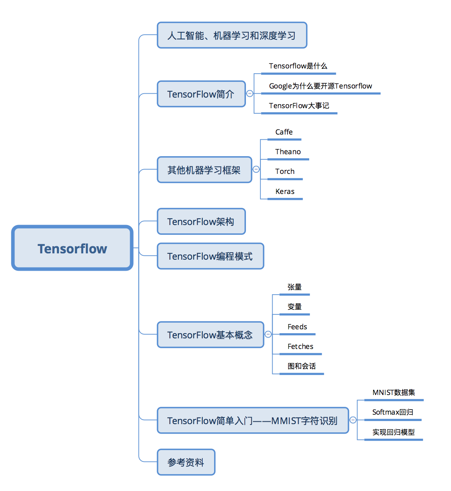
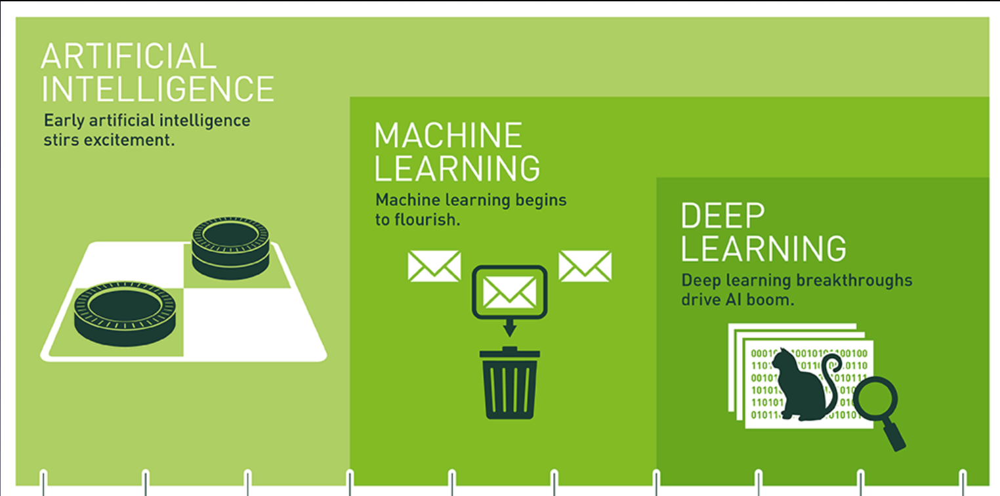
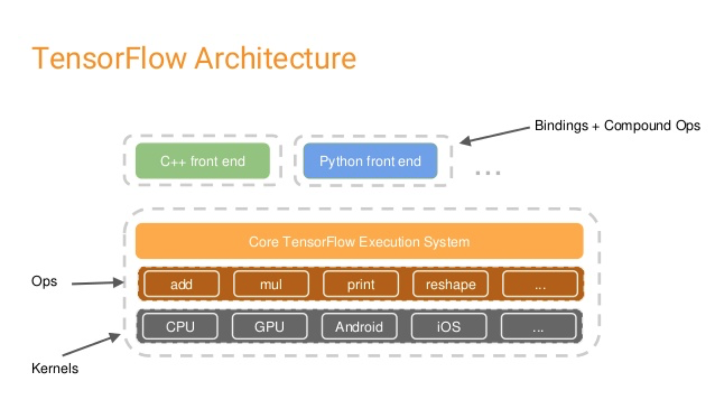
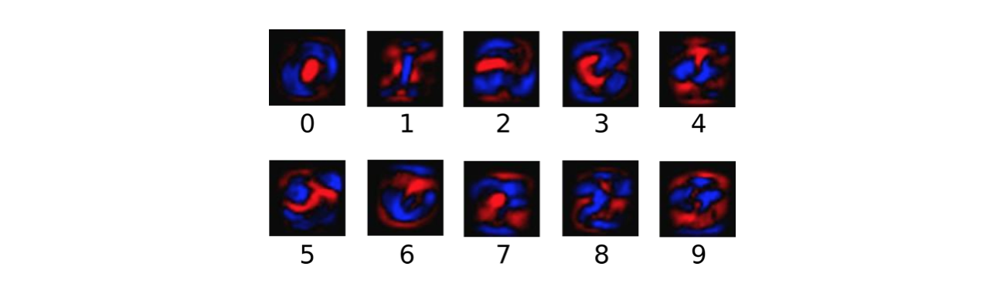

# 一文综述TensorFlow——机器学习的工业标准


## 人工智能、机器学习和深度学习

在介绍TensorFlow（以下简称为TF）之前，我们首先了解一下相关背景。TF是一种机器学习框架，而机器学习经常和人工智能，深度学习联系在一起，那么三者到底是什么关系呢？简单来讲三者可以理解为包含于被包含的关系。其中最大的是人工智能（以下简称为AI），AI最早起源于1956年的达特茅斯会议，当时AI的几位先驱在会上展示了最早的AI程序：Logic Theorist，能够自动推导数学原理第二章前52个定理中的38个，甚至其中一个定理的证明过程比书中给出的还要优雅，他们甚至曾尝试要发表这一新的证明方式（不过后来被拒了）。总之，简单来说，AI就是赋予机器以人的智能，让机器具有学习和认知的能力。

机器学习（以下简称为ML）则是实现AI的一种方法。举个简单的垃圾邮件过滤的例子，我们人类判断一个邮件是否是垃圾邮件很简单，通过标题或内容很快就可以辨别。但是让机器完成这样的任务就没这么简单。对于经典的ML算法，首先需要从原始数据（邮件）中提取特征，比如发信人地址、邮件标题、邮件内容关键词等，从而将文字的邮件转换成包含多个特征的向量，然后利用逻辑回归算法在已经标定的数据集上进行训练，得到每个特征的权重。这些权重构成我们的预测模型，对于一封新的邮件，就可以用这个模型判断其是否是垃圾邮件。

传统的ML最大的问题就是特征提取。比如让机器识别照片中的动物是猫还是狗，如何设计特征？深度学习（以下简称为DL）正是为了解决特征提取的问题，我们不再需要人工设计特征，而是让算法从数据中自动学习特征，将简单的特征组合形成复杂的特征来解决这些问题，所以DL可以说是实现ML的一种技术。


## TensorFlow简介
### TensorFlow是什么
Tensorflow是一个Google开发的第二代机器学习系统，克服了第一代系统[DistBelief](https://research.google.com/pubs/pub40565.html)仅能开发神经网络算法、难以配置、依赖Google内部硬件等局限性，应用更加广泛，并且提高了灵活性和可移植性，速度和扩展性也有了大幅提高。字面上理解，TensorFlow就是以张量（Tensor）在计算图（Graph）上流动（Flow）的方式的实现和执行机器学习算法的框架。具有以下特点：

* 灵活性。TensorFlow不是一个严格的“神经网络”库。只要可以将计算表示成数据流图，就可以使用TensorFlow，比如科学计算中的偏微分求解等。（实际上其官网的介绍中对TF的定位就是基于数据流图的科学计算库，而非仅仅是机器学习库）
* 可移植性。同一份代码几乎不经过修改既可以部署到有任意数量CPU、GPU或TPU（Tensor Processing Unit，Google专门为机器学习开发的处理器）的PC、服务器或移动设备上。
* 自动求微分。同Theano一样，TensorFlow也支持自动求微分，用户不需要再通过反向传播求解梯度。
* 多语言支持。TensorFlow官方支持Python、C++、Go和Java接口，用户可以在硬件配置较好的机器中用Python进行实验，在资源较紧张或需要低延迟的环境中用C++进行部署。
* 性能。虽然TensorFlow最开始发布时仅支持单机，在性能评测上并不出色，但是凭借Google强大的开发实力，TensorFlow性能已经追上了其他框架。

### Google为什么开源Tensorflow
Google第一代分布式机器学习框架DistBelief在内部大规模使用后没有选择开源，而第二代TensorFlow于2015年11月在GitHub上开源，并在持续快速开发迭代中。TensorFlow最早由Google Brain的工程师开发，设计初衷是加速机器学习的研究，并快速地将研究原型转化为产品。Google选择开源TensorFlow的原因很简单：第一是希望借助社区的力量，大家一起完善TensorFlow。第二是回馈社区，Google希望让这个优秀的工具得到更多的应用，提高学术界和工业界使用机器学习的效率。

自从2015年11月开源以来，TensorFlow迅速在众多的机器学习框架中脱颖而出，在Github上获得了最多的Star。下图统计了Github上流行的机器学习框架的Star数量：


### TensorFlow大事记
* 2015年11月9日，Google Research 发布了文章：TensorFlow - Google’s latest machine learning system, open sourced for everyone，正式宣布其新一代机器学习系统开源。
* 2016年4月13日，TensorFlow v0.8发布，提供分布式计算支持。
* 2016年4月29日，开发AlphaGo的DeepMind宣布从Torch7平台转向TensorFlow。
* 2016年4月12日，基于TensorFlow的世界最准确的语法解析器SyntaxNet宣布开源。
* 2016年6月27日，TensorFlow v0.9发布，提高对移动设备的支持。
* 2016年8月30日，TF-Slim——TensorFlow的高层库发布，用户可以更简单快速地定义模型。
* 2017年2月15日，TensorFlow v1.0发布，提高了速度和灵活性，并且承诺提供稳定的Python API。


## 其他机器学习框架
### Caffe
Caffe全称为Convolutional Architecture for Fast Feature Embedding，目前由BVLC（Berkeley Vision and Learning Center）进行维护。其创始人是加州大学伯克利的Ph.D.贾杨清，后来曾在Google Brain工作，开发TensorFlow。

Caffe优点在于使用配置文件方式定义网络，容易上手。训练速度快，而且有大量训练好的经典模型。组件模块化，方便拓展到新的模型上。

Caffe最开始设计是只是针对图像，没有考虑文本、语音或者时间序列的数据，因此对卷积神经网络的支持很好，但是时间序列RNN、LSTM等支持不是很充分。要实现新的神经网络模块（Layer）时，需要用户自己写C++或CUDA代码实现正向和反向算法，对新用户有一定的难度。Caffe没有原生的分布式支持，官方仅支持单机多CPU的训练，不过有些第三方的支持，如雅虎开源的CaffeOnSpark，可借助Spark的分布式框架实现Caffe的大规模分布式训练。

### Theano
Theano诞生于2008年，由蒙特利尔大学Lisa Lab开发维护，可以算是机器学习库的始祖之一。其主要优势在于：

* 集成Numpy，可以直接使用Numpy的ndarray，接口学习成本低。
* 计算稳定性好，比如可以精确地计算输出值很小的函数。
* 动态生成C或者CUDA代码，用以编译成高效的机器代码。

Theano在学术界很流行，有丰富的文档和教程。但是移植性较差，没有底层C++的结构，模型的部署非常不方便，并且不支持各种移动设备，几乎没有在工业生产环境中的应用。

### Torch
Torch的定位是LuaJIT上的高效的科学计算库，其历史非常悠久，但真正发扬光大是在Facebook开源了其深度学习的组件之后。Torch与TensorFlow一样，采用了底层C++加脚本语言调用的方式，不过Torch使用的是Lua，其性能非常优秀，常见的代码通过JIT优化可以到C的性能的80%，但是相对Python并不是那么主流，对多数用户有学习成本。另外，Torch与Theano和TensorFlow采用符号编程模式不同，其采用命令式编程模式，所以实现某些复杂操作以及debug时更方便。

### Keras
Keras是一个崇尚极简、高度模块化的神经网络库，使用Python实现，可以运行在TensorFlow或Theano上，旨在让用户进行最快速的原型实验。不同于Theano、TensorFlow等支持通用的数值计算，Keras专注于深度学习，它提供了目前为止最方便的API，用户只需要将高级的模块拼在一起，就可以搭建神经网络，大大降低了编程开销、Keras所有模块都是简洁、易懂、完全可配置、可任意插拔的，基本没有使用限制，神经网络、损失函数、优化器、初始化方法、激活函数和正则化等模块都可以自由组合。使用Keras，只需要几行就可以实现一个MLP，十几行就可以实现一个AlexNet。如果Theano和TensorFlow是深度学习领域的Numpy，那么Keras就是这个领域的scikit-learn。Keras最大的问题就是目前无法直接使用多GPU，所以对大规模的数据处理速度没有其他支持多GPU和分布式的框架快。

## TensorFlow架构


TF的系统构架分为两部分：

* 前端：提供编程模型，负责构造计算图，提供Python，C++，Java，Go等多种语言支持。
* 后端：提供运行时环境，负责执行计算图，采用C++实现。

用户在搭建算法时，可以根据个人喜好和实际需求采用合适的前端语言来构建计算图。图搭建完成后，以Session为桥梁连接TF的后端，启动并执行图的计算过程。TF的后端根据当前硬件环境调用Operation的Kernal（Operation在某种硬件设备的特定实现）完成具体的计算。

**注：后文对Session，Operation有具体解释**

## TensorFlow编程模式
### 符号式编程 vs 命令式编程
和我们一般常用的命令式（Imperative）编程模式不同，TF采用的是符号式（Symbolic）编程。我们先认识一下两种编程模式：

命令式编程是很常见的编程模式，大多数Python或C++程序都采用命令式编程。命令式编程明确输入变量，根据程序逻辑逐步运算。下面是一段命令式编程的Python代码

```
import numpy as np
a = np.ones(10)
b = np.ones(10) * 2
c = b * a
d = c + 1
```

执行完第一步`a = np.ones(10)`后，程序得到了输入变量`a`，第二句后得到了`b`，当执行`c = b * a`时，程序通过乘法计算而得到了`c`。

符号式编程则将计算过程抽象为计算图，所有输入节点、运算节点和输出节点均符号化处理。将上述命令式编程代码转换为符号式编程：

```
A = Variable('A')
B = Variable('B')
C = B * A
D = C + Constant(1)
# compiles the function
f = compile(D)
d = f(A=np.ones(10), B=np.ones(10)*2)
```

当前四步执行后，程序并没有A、B、C、D的值，仅仅是构建了由这四个符号构成的计算图，如下图所示：


大多数符号式编程的程序中都或显式或隐式地包含编译的步骤，将前面定义的计算图打包成可以调用的函数，而实际的计算则发生在编译后。

Theano和TensorFlow属于典型的符号式编程模式，而Torch则是命令式编程模式。在灵活性上，命令式编程模式更优，而在内存和计算上，符号式编程效率更高。


### TensorFlow基本概念
要使用TensorFlow，我们必须理解TensorFlow

* 使用图（Graph）表示计算流程
* 在会话（Session）中执行图
* 使用张量（Tensor）表示数据
* 使用变量（Variable）维护状态
* 使用feed和fetch为任意的操作赋值或从中获取数据

TF使用`graph`表示计算流程。图中的节点称为操作（Operation，以下简称OP）。每个OP接受0到多个Tensor，执行计算，输出0到多个Tensor。图是对计算流程的描述，需要在Session中运行。Session将计算图的OP分配到CPU或GPU等计算单元，并提供相关的计算方法，并且会返回OP的结果。

#### 张量（Tensor）
TF使用Tensor表示所有数据，相当于Numpy中的ndarray，0维的数值、一维的矢量、二维的矩阵到n维数组都是Tensor。相对于Numpy，TensorFlow提供了创建张量函数的方法，以及导数的自动计算。下表对比了Numpy和TensorFlow的基本用法。

|Numpy|TensorFlow|
|:--:|:--:|
|`a = np.zeros((2,2)); b = np.ones((2,2))`|`a = tf.zeros((2,2)); b = tf.ones((2,2))`|
|`np.sum(b, axis=1)`|`tf.reduce_sum(a, reduction_indices=[1])`|
|`a.shape`|`a.get_shape`|
|`np.reshape(a, (1,4))`|`tf.reshape(a, (1,4))`|
|`b * 5 + 1`|`b * 5 + 1`|
|`np.dot(a,b)`|`tf.matmul(a,b)`|
|`a[0,0], a[:,0], a[0,:]`|`a[0,0], a[:,0], a[0,:]`|

#### 变量（Variable）
在训练模型时，Variable被用来存储和更新参数。Variable包含张量储存在内存的缓冲区中，必须显式地进行初始化，在训练后可以写入磁盘。下面代码中的Variable充当了一个简单的计数器角色：

```
# Create a Variable, that will be initialized to the scalar value 0.
state = tf.Variable(0, name="counter")

# Create an Op to add one to `state`.

one = tf.constant(1)
new_value = tf.add(state, one)
update = tf.assign(state, new_value)

# Variables must be initialized by running an `init` Op after having
# launched the graph.  We first have to add the `init` Op to the graph.
init_op = tf.initialize_all_variables()

# Launch the graph and run the ops.
with tf.Session() as sess:
  # Run the 'init' op
  sess.run(init_op)
  # Print the initial value of 'state'
  print(sess.run(state))
  # Run the op that updates 'state' and print 'state'.
  for _ in range(3):
    sess.run(update)
    print(sess.run(state))

# output:

# 0
# 1
# 2
# 3
```
上述代码中`assign()`操作同`add()`一样，都是在构建计算图而没有执行实际的计算。直到`run()`函数才会真正执行赋值等计算操作。

一般来说，用户使用一系列Variable来表示一个统计模型，在训练过程中运行图计算来不断更新，训练完成后可以使用这些Variable构成的模型进行预测。

#### Feed
TensorFlow除了可以使用Variable和Constant引入数据外，还提供了Feed机制实现从外部导入数据。一般Feed总是与占位符`placeholder`一起使用。

```
input1 = tf.placeholder(tf.float32)
input2 = tf.placeholder(tf.float32)
output = tf.mul(input1, input2)

with tf.Session() as sess:
  print(sess.run([output], feed_dict={input1:[7.], input2:[2.]}))

# output:
# [array([ 14.], dtype=float32)]
```

#### Fetch
要获取操作的输出，需要执行会话的`run()`函数，并且提供需要提取的OP。下面是获取输出的典型例子：

```
input1 = tf.constant([3.0])
input2 = tf.constant([2.0])
input3 = tf.constant([5.0])
intermed = tf.add(input2, input3)
mul = tf.mul(input1, intermed)

with tf.Session() as sess:
  result = sess.run([mul, intermed])
  print(result)

# output:
# [array([ 21.], dtype=float32), array([ 7.], dtype=float32)]
```

#### 图和会话
由于TF采用符号式编程模式，所以TF程序通常可以分为两部分：图的构建和图的执行。


##### 图的构建
构建图的第一步，是创建源OP(source op)，源操作不需要任何输入，例如常量(constant)，源操作的输出被传递给其它操作做运算。

Python库中，OP构造器的返回值代表被构造出的OP的输出，这些返回值可以传递给其它OP构造器作为输入。

TensorFlow Python库有一个默认图 (default graph)，OP构造器可以为其增加节点。这个默认图对许多程序来说已经足够用了。

```
import tensorflow as tf

# Create a Constant op that produces a 1x2 matrix.  The op is
# added as a node to the default graph.
#
# The value returned by the constructor represents the output
# of the Constant op.
matrix1 = tf.constant([[3., 3.]])

# Create another Constant that produces a 2x1 matrix.
matrix2 = tf.constant([[2.],[2.]])

# Create a Matmul op that takes 'matrix1' and 'matrix2' as inputs.
# The returned value, 'product', represents the result of the matrix
# multiplication.
product = tf.matmul(matrix1, matrix2)
```

上面使用TensorFlow提供的默认图构建了包含三个节点的计算图：两个`constant()`操作和一个`matmul()`操作。要实际执行矩阵乘法，必须在Session中运行该计算图。

##### 图的执行
要执行计算图，首先需要创建Session对象，如果不提供参数，Session构造器将运行默认图。

```
# Launch the default graph.
sess = tf.Session()

# To run the matmul op we call the session 'run()' method, passing 'product'
# which represents the output of the matmul op.  This indicates to the call
# that we want to get the output of the matmul op back.
#
# All inputs needed by the op are run automatically by the session.  They
# typically are run in parallel.
#
# The call 'run(product)' thus causes the execution of three ops in the
# graph: the two constants and matmul.
#
# The output of the op is returned in 'result' as a numpy `ndarray` object.
result = sess.run(product)
print(result)
# ==> [[ 12.]]

# Close the Session when we're done.
sess.close()
```

Session结束后，需要关闭以释放资源。用户也可以使用`with`控制语句自动关闭会话。

```
with tf.Session() as sess:
  result = sess.run([product])
  print(result)
```

## TensorFlow简单入门--MNIST字符识别
MNIST是一个简单的计算机视觉数据集，包含共7万个手写数字字符，以灰度图表示：


MNIST同时包含每个手写字符对应的数字，称为标签（label）。上图对应的标签为5，0，4，1。

接下来，我们将使用TensorFlow训练一个字符识别的多分类器，通过字符图片预测对应的数字，这里我们使用最简单的多分类器--Softmax回归。

### MNIST数据集
首先读取MNIST数据集，

```
from tensorflow.examples.tutorials.mnist import input_data
mnist = input_data.read_data_sets("MNIST_data/", one_hot=True)
```

MNIST数据集被读入mnist对象中，分为三部分：55000行的训练集（`mnist.train`）、10000行的测试集（`mnist.test`）和5000行的验证集（`mnist.validation`）。这样的切分很重要，在机器学习模型设计时必须有一个单独的测试数据集不用于训练而是用来评估这个模型的性能，从而更加容易把设计的模型推广到其他数据集上（泛化）。

每个MNIST数据都包含一个字符图片和对应的label，分别用“x”和“y”表示。每个图片“x”由28$\times$28个像素构成，展开得到长度为784的向量。最后，我们得到的训练数据集即形状为`[55000, 784]`的二维数组以及对应的标签（0-9）。

为了方便实现，这里使用“one-hot vector”，即向量中除一个元素为1，其余均为0。举个例子：对于标签3，对应的“one-hot vector”为[0,0,0,1,0,0,0,0,0,0]，所以训练集的标签`mnist.train.labels`为形状为`[55000, 10]`的二维数组。


### Softmax回归
Softmax回归是二分类器logistic回归的推广，是一种最简单的多分类器。Softmax回归分为两步，首先通过加权求和得到一张给定图片属于特定数字类的证据（evidence），如果这个像素具有很强的证据说明这张图片不属于该类，那么相应的权值为负数，相反如果这个像素拥有有利的证据支持这张图片属于这个类，那么权值是正数。

下面的图片显示了一个模型学习到的图片上每个像素对于特定数字类的权值。红色代表负数权值，蓝色代表正数权值。


我们也需要加入一个额外的偏置量（bias），因为输入往往会带有一些无关的干扰量。因此对于给定的输入图片 $x$它代表的是数字$i$的证据可以表示为

$$\text{evidence}_{i}=\sum_{j}W_{i,j}x_{j}+b_{i}$$

其中$W_{i,j}$为$i$像素对$j$字符的权重，$b_{i}$为数字$i$类的偏置量，$j$代表给定图片$x$的像素索引用于像素求和。然后用softmax函数可以把这些证据转换成概率$y$：

$$y=\text{softmax}(\text{evidence})$$

这里的softmax可以看成是一个激励（activation）函数或者链接（link）函数，把我们定义的线性函数的输出转换成我们想要的格式，也就是关于10个数字类的概率分布。因此，给定一张图片，它对于每一个数字的吻合度可以被softmax函数转换成为一个概率值。softmax函数可以定义为：

$$\text{softmax}(x)=\text{nomalize}(\text{exp}(x))$$

用矩阵来表示：

$$y=\text{softmax}(Wx+b)$$

### 实现回归模型
TF程序可以分为图的构建和图的执行两部分，而图的构建又可细分为输入图、推断图、训练图和评估图四部分。

使用TF之前，首先导入它：

```
import tensorflow as tf
```
#### 输入图

```
x = tf.placeholder("float", [None, 784])
y_ = tf.placeholder("float", [None, 10])
```

这里的`x`和`y`不是一个特定的值，而是两个占位符（placeholder），我们在TF运行计算时输入这个值。我们希望能够输入任意数量的MNIST图像，每一张图展平成784维的向量。我们用2维的浮点数张量来表示这些图片，这个张量的形状是`[None，784]`。（这里的None表示此张量的第一个维度可以是任何长度的。）

#### 推断图 

```
W = tf.Variable(tf.zeros([784,10]))
b = tf.Variable(tf.zeros([10]))
y = tf.nn.softmax(tf.matmul(x,W) + b)
```

对于模型中的权重和偏置量这些参数，我们使用Variable来表示。初始化模型参数，这里我们用全为零的张量来初始化W和b。因为我们要学习W和b的值，它们的初值可以随意设置。注意，W的维度是`[784，10]`，因为我们想要用784维的图片向量乘以它以得到一个10维的证据值向量，每一位对应不同数字类。b的形状是[10]，所以我们可以直接把它加到输出上面。

我们用`tf.matmul(​​X，W)`表示x乘以W，对应之前等式里面的，这里x是一个2维张量拥有多个输入。然后再加上`b`，把和输入到`tf.nn.softmax`函数里面。这样就得到了推断结果`y`。

#### 训练图
计算图的第三个要素是训练图。为了训练我们的模型，我们首先需要定义一个指标来评估这个模型是好的。其实，在机器学习，我们通常定义指标来表示一个模型是坏的，这个指标称为代价（cost）或损失（loss），然后尽量最小化这个指标。

一个非常常见的代价函数是“交叉熵”（cross-entropy）。交叉熵产生于信息论里面的信息压缩编码技术，但是它后来演变成为从博弈论到机器学习等其他领域里的重要技术手段。它的定义如下：

$$H_{y^{'}}(y) = -\sum_{i}y_{i}^{'}\text{log}(y_{i})$$

$y$是我们预测的概率分布，$y'$是实际的分布（我们输入的one-hot vector)。比较粗糙的理解是，交叉熵是用来衡量我们的预测用于描述真相的低效性。

实现交叉熵:

```
cross_entropy = -tf.reduce_sum(y_*tf.log(y))
```

首先，用`tf.log`计算`y`的每个元素的对数。接下来，我们把`y_`的每一个元素和`tf.log(y_)`的对应元素相乘。最后，用`tf.reduce_sum`计算张量的所有元素的总和。（注意，这里的交叉熵不仅仅用来衡量单一的一对预测和真实值，而是所有100幅图片的交叉熵的总和。对于100个数据点的预测表现比单一数据点的表现能更好地描述我们的模型的性能。

现在我们知道我们需要我们的模型做什么啦，用TensorFlow来训练它是非常容易的。因为TensorFlow拥有一张描述你各个计算单元的图，它可以自动地使用反向传播算法(backpropagation algorithm)来有效地确定你的变量是如何影响你想要最小化的那个代价函数的。然后，TensorFlow会用你选择的优化算法来不断地修改变量以降低代价函数。

```
train_step = tf.train.GradientDescentOptimizer(0.5).minimize(cross_entropy)
```

在这里，我们要求TF用梯度下降算法（gradient descent algorithm）以0.5的学习速率最小化交叉熵。梯度下降算法（gradient descent algorithm）是一个简单的学习过程，TF只需将每个变量一点点地往使代价不断降低的方向移动。当然TF也提供了其他许多优化算法：只要简单地调整一行代码就可以使用其他的算法。

TF在这里实际上所做的是，它会在后台给描述你的计算的那张图里面增加一系列新的计算操作单元用于实现反向传播算法和梯度下降算法。然后，它返回给你的只是一个单一的操作，当运行这个操作时，它用梯度下降算法训练你的模型，微调你的变量，不断减少代价。

我们现在可以创建一个Session来运行模型，

```
sess = tf.InteractiveSession()
```

首先我们需要初始化所有变量，

```
tf.global_variables_initializer().run()
```

然后开始训练模型，这里我们让模型循环训练1000次！

```
for _ in range(1000):
  batch_xs, batch_ys = mnist.train.next_batch(100)
  sess.run(train_step, feed_dict={x: batch_xs, y_: batch_ys})
```

该循环的每个步骤中，我们都会随机抓取训练数据中的100个批处理数据点，然后我们用这些数据点作为参数替换之前的占位符来运行train_step。

使用一小部分的随机数据来进行训练被称为随机训练（stochastic training）- 在这里更确切的说是随机梯度下降训练。在理想情况下，我们希望用我们所有的数据来进行每一步的训练，因为这能给我们更好的训练结果，但显然这需要很大的计算开销。所以，每一次训练我们可以使用不同的数据子集，这样做既可以减少计算开销，又可以最大化地学习到数据集的总体特性。

#### 评估图
最后，我们要评估模型的性能，还需要构建评估图。

首先让我们找出那些预测正确的标签。tf.argmax 是一个非常有用的函数，它能给出某个tensor对象在某一维上的其数据最大值所在的索引值。由于标签向量是由0,1组成，因此最大值1所在的索引位置就是类别标签，比如tf.argmax(y,1)返回的是模型对于任一输入x预测到的标签值，而 tf.argmax(y_,1) 代表正确的标签，我们可以用 tf.equal 来检测我们的预测是否真实标签匹配(索引位置一样表示匹配)。

```
correct_prediction = tf.equal(tf.argmax(y,1), tf.argmax(y_,1))
```

这行代码会给我们一组布尔值。为了确定正确预测项的比例，我们可以把布尔值转换成浮点数，然后取平均值。例如，[True, False, True, True] 会变成 [1,0,1,1] ，取平均值后得到 0.75.

```
accuracy = tf.reduce_mean(tf.cast(correct_prediction, tf.float32))
```

最后，我们计算所学习到的模型在测试数据集上面的正确率。

```
print(sess.run(accuracy, feed_dict={x: mnist.test.images, y_: mnist.test.labels}))
```

这个最终结果值应该大约是92%。


## 参考资料
### 官网
* [TensorFlow Website](https://www.tensorflow.org)(最权威、详细的文档)

### 视频教程
* [TF开发者Sherry Moore的教程](https://www.youtube.com/watch?v=Ejec3ID_h0w&t=2117s)
* [周莫烦的TF教程](https://www.youtube.com/watch?v=2FmcHiLCwTU&list=PL2-dafEMk2A7EEME489DsI468AB0wQsMV)
* [Siraj的TF教程](https://www.youtube.com/watch?v=Se9ByBnKb0o&list=PLXO45tsB95cJHXaDKpbwr5fC_CCYylw1f)

### 书
* [Python Machine Learning](https://www.amazon.com/Python-Machine-Learning-Sebastian-Raschka/dp/1783555130/ref=sr_1_1?ie=UTF8&qid=1491489025&sr=8-1&keywords=python+machine+learning)(常用机器学习算法讲解与实践)
* [TensorFlow实战](https://item.jd.com/12125568.html)(TensorFlow实现多种机器学习算法)

### 文章
* [深入浅出Tensorflow（一）：深度学习及TensorFlow简介](http://www.infoq.com/cn/articles/introduction-of-tensorflow-part01)
* [Programming Models for Deep Learning](http://mxnet.io/architecture/program_model.html#symbolic-and-imperative-programs)
* [TensorFlow学习笔记1：入门](http://www.jeyzhang.com/tensorflow-learning-notes.html)
* [图解TensorFlow架构与设计](https://mp.weixin.qq.com/s?__biz=MzAwNDI4ODcxNA==&mid=2652244394&idx=1&sn=8c66795bc0e0d262f8defd18c07165a3&chksm=80cc900fb7bb1919fac16e6b4bf836d8e61915b05c3e7bf86a7e5518b8c1bd5f5c54b651e309&mpshare=1&scene=24&srcid=0404YB28YWRDy8DJZUUzLoAw&key=4ab4dfbdf0fdc9bb1486bb0bcb9fe0df6a4429cdab00e0deb0572f1822635797fc3f4ea10f5680ca964614ab8f7aa8c204350a54758269752e9a66c43e1a67424a7f990381309784207bad6f66c4a4de&ascene=0&uin=NjA5NDE0MDQw&devicetype=iMac+MacBookPro11%2C3+OSX+OSX+10.11.6+build(15G1004)&version=12020110&nettype=WIFI&fontScale=100&pass_ticket=2bZi%2Bru%2FAjM0rUi2gnl6U3N%2BINehYJPKw06DCLRAYFqJzVOY91Jbf4xaZGgLD5Ld)
