**一文读懂大数据计算框架与平台**

1.  **前言**

计算机的基本工作就是处理数据，包括磁盘文件中的数据，通过网络传输的数据流或数据包，数据库中的结构化数据等。随着互联网、物联网等技术得到越来越广泛的应用，数据规模不断增加，TB、PB量级成为常态，对数据的处理已无法由单台计算机完成，而只能由多台机器共同承担计算任务。而在分布式环境中进行大数据处理，除了与存储系统打交道外，还涉及计算任务的分工，计算负荷的分配，计算机之间的数据迁移等工作，并且要考虑计算机或网络发生故障时的数据安全，情况要复杂得多。

举一个简单的例子，假设我们要从销售记录中统计各种商品销售额。在单机环境中，我们只需把销售记录扫描一遍，对各商品的销售额进行累加即可。如果销售记录存放在关系数据库中，则更省事，执行一个SQL语句就可以了。现在假定销售记录实在太多，需要设计出由多台计算机来统计销售额的方案。为保证计算的正确、可靠、高效及方便，这个方案需要考虑下列问题：

1.  如何为每台机器分配任务，是先按商品种类对销售记录分组，不同机器处理不同商品种类的销售记录，还是随机向各台机器分发一部分销售记录进行统计，最后把各台机器的统计结果按商品种类合并？

2.  上述两种方式都涉及数据的排序问题，应选择哪种排序算法？应该在哪台机器上执行排序过程？

3.  如何定义每台机器处理的数据从哪里来，处理结果到哪里去？数据是主动发送，还是接收方申请时才发送？如果是主动发送，接收方处理不过来怎么办？如果是申请时才发送，那发送方应该保存数据多久？

4.  会不会任务分配不均，有的机器很快就处理完了，有的机器一直忙着？甚至，闲着的机器需要等忙着的机器处理完后才能开始执行？

5.  如果增加一台机器，它能不能减轻其他机器的负荷，从而缩短任务执行时间？

6.  如果一台机器挂了，它没有完成的任务该交给谁？会不会遗漏统计或重复统计？

7.  统计过程中，机器之间如何协调，是否需要专门的一台机器指挥调度其他机器？如果这台机器挂了呢？

8.  （可选）如果销售记录在源源不断地增加，统计还没执行完新记录又来了，如何保证统计结果的准确性？能不能保证结果是实时更新的？再次统计时能不能避免大量重复计算？

9.  （可选）能不能让用户执行一句SQL就可以得到结果？

上述问题中，除了第1个外，其余的都与具体任务无关，在其他分布式计算的场合也会遇到，而且解决起来都相当棘手。即使第1个问题中的分组、统计，在很多数据处理场合也会涉及，只是具体方式不同。如果能把这些问题的解决方案封装到一个计算框架中，则可大大简化这类应用程序的开发。

2004年前后，Google先后发表三篇论文分别介绍分布式文件系统GFS、并行计算模型MapReduce、非关系数据存储系统BigTable，第一次提出了针对大数据分布式处理的可重用方案。在Google论文的启发下，Yahoo的工程师Doug
Cutting和Mike
Cafarella开发了Hadoop。在借鉴和改进Hadoop的基础上，又先后诞生了数十种应用于分布式环境的大数据计算框架。本文在参考业界惯例的基础上，对这些框架按下列标准分类：

1.  如果不涉及上面提出的第8、9两个问题，则属于批处理框架。批处理框架重点关心数据处理的吞吐量，又可分为非迭代式和迭代式两类，迭代式包括DAG（有向无环图）、图计算等模型。

2.  若针对第8个问题提出来应对方案，则分两种情况：如果重点关心处理的实时性，则属于流计算框架；如果侧重于避免重复计算，则属于增量计算框架。

3.  如果重点关注的是第9个问题，则属于交互式分析框架。

本文下面分别讨论批处理、流计算、交互式分析三种类别的框架，然后简要介绍大数据计算框架的一些发展趋势。文章最后介绍这一领域的学习资料。

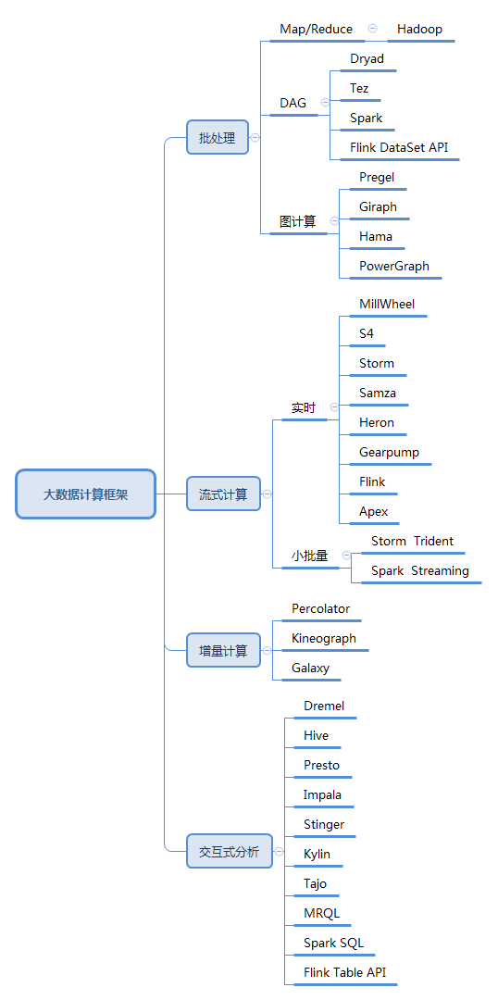

1.  大数据计算框架全景图

2.  **批处理框架**

    1.  **Hadoop**

Hadoop最初主要包含分布式文件系统HDFS和计算框架MapReduce两部分，是从Nutch中独立出来的项目。在2.0版本中，又把资源管理和任务调度功能从MapReduce中剥离形成YARN，使其他框架也可以像MapReduce那样运行在Hadoop之上。与之前的分布式计算框架相比，Hadoop隐藏了很多繁琐的细节，如容错、负载均衡等，更便于使用。Hadoop也具有很强的横向扩展能力，可以很容易地把新计算机接入到集群中参与计算。在开源社区的支持下，Hadoop不断发展完善，并集成了众多优秀的产品如非关系数据库HBase、数据仓库Hive、数据处理工具Sqoop、机器学习算法库Mahout、一致性服务软件ZooKeeper、管理工具Ambari等，形成了相对完整的生态圈和分布式计算事实上的标准。

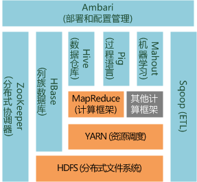

1.  Hadoop生态圈（删减版）

MapReduce可以理解为把一堆杂乱无章的数据按照某种特征归并起来，然后处理并得到最后的结果。基本处理步骤如下：

1.  把输入文件按照一定的标准分片，每个分片对应一个map任务。一般情况下，MapReduce和HDFS运行在同一组计算机上，也就是说，每台计算机同时承担存储和计算任务，因此分片通常不涉及计算机之间的数据复制。

2.  按照一定的规则把分片中的内容解析成键值对。通常选择一种预定义的规则即可。

3.  执行map任务，处理每个键值对，输出零个或多个键值对。

4.  MapReduce获取应用程序定义的分组方式，并按分组对map任务输出的键值对排序。默认每个键名一组。

5.  待所有节点都执行完上述步骤后，MapReduce启动Reduce任务。每个分组对应一个Reduce任务。

6.  执行reduce任务的进程通过网络获取指定组的所有键值对。

7.  把键名相同的值合并为列表。

8.  执行reduce任务，处理每个键对应的列表，输出结果。

1.  MapReduce处理过程

在上面的步骤中，应用程序主要负责设计map和reduce任务，其他工作均由框架负责。在定义map任务输出数据的方式时，键的选择至关重要，除了影响结果的正确性外，也决定数据如何分组、排序、传输，以及执行reduce任务的计算机如何分工。前面提到的商品销售统计的例子，可选择商品种类为键。MapReduce执行商品销售统计的过程大致如下：

1.  把销售记录分片，分配给多台机器。

2.  每条销售记录被解析成键值对，其中值为销售记录的内容，键可忽略。

3.  执行map任务，每条销售记录被转换为新的键值对，其中键为商品种类，值为该条记录中商品的销售额。

4.  MapReduce把map任务生成的数据按商品种类排序。

5.  待所有节点都完成排序后，MapReduce启动reduce任务。每个商品种类对应一个reduce任务。

6.  执行reduce任务的进程通过网络获取指定商品种类的各次销售额。

7.  MapReduce把同一种商品下的各次销售额合并到列表中。

8.  执行reduce任务，累加各次销售额，得到该种商品的总销售额。

上面的过程还有优化的空间。在传输各种商品每次的销售额数据前，可先在map端对各种商品的销售额进行小计，由此可大大减少网络传输的负荷。MapReduce通过一个可选的combine任务支持该类型的优化。

1.  **DAG模型**

现在假设我们的目标更进一步，希望知道销售得最好的前10种商品。我们可以分两个环节来计算：

1.  统计各种商品的销售额。通过MapReduce实现，这在前面已经讨论过。

2.  对商品种类按销售额排名。可以通过一个排序过程完成。假定商品种类非常多，需要通过多台计算机来加快计算速度的话，我们可以用另一个MapReduce过程来实现，其基本思路是把map和reduce分别当作小组赛和决赛，先计算各分片的前10名，汇总后再计算总排行榜的前10名。

从上面的例子可以看出，通过多个MapReduce的组合，可以表达复杂的计算问题。不过，组合过程需要人工设计，比较麻烦。另外，每个阶段都需要所有的计算机同步，影响了执行效率。为克服上述问题，业界提出了DAG（有向无环图）计算模型，其核心思想是把任务在内部分解为若干存在先后顺序的子任务，由此可更灵活地表达各种复杂的依赖关系。Microsoft
Dryad、Google FlumeJava、Apache
Tez是最早出现的DAG模型。Dryad定义了串接、全连接、融合等若干简单的DAG模型，通过组合这些简单结构来描述复杂的任务，FlumeJava、Tez则通过组合若干MapReduce形成DAG任务。

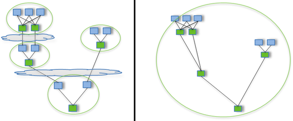

1.  MapReduce（左）与Tez（右）执行复杂任务时对比

MapReduce的另一个不足之处是使用磁盘存储中间结果，严重影响了系统的性能，这在机器学习等需要迭代计算的场合更为明显。加州大学伯克利分校AMP实验室开发的Spark克服了上述问题。Spark对早期的DAG模型作了改进，提出了基于内存的分布式存储抽象模型RDD（Resilient
Distributed
Datasets，可恢复分布式数据集），把中间数据有选择地加载并驻留到内存中，减少磁盘IO开销。与Hadoop相比，Spark基于内存的运算要快100倍以上，基于磁盘的运算也要快10倍以上。

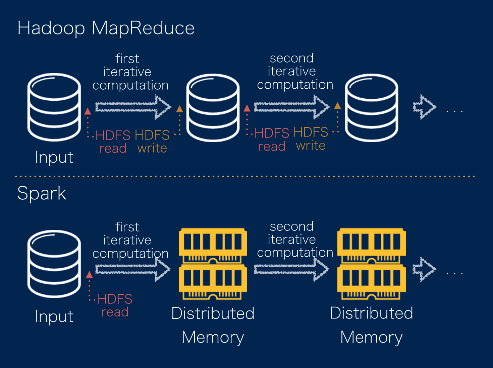

1.  MapReduce与Spark中间结果保存方式对比

Spark为RDD提供了丰富的操作方法，其中map、 filter、 flatMap、
sample、groupByKey、
reduceByKey、union、join、cogroup、mapValues、sort、partionBy用于执行数据转换，生成新的RDD，而count、collect、
reduce、lookup、save用于收集或输出计算结果。如前面统计商品销售额的例子，在Spark中只需要调用map和reduceByKey两个转换操作就可以实现，整个程序包括加载销售记录和保存统计结果在内也只需要寥寥几行代码，并且支持Java、Scala、Python、R等多种开发语言，比MapReduce编程要方便得多。下图说明reduceByKey的内部实现。

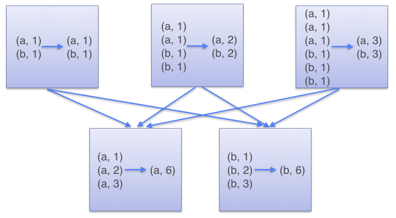

1.  RDD reduceByKey内部实现

RDD由于把数据存放在内存中而不是磁盘上，因此需要比Hadoop更多地考虑容错问题。分布式数据集的容错有两种方式：数据检查点和记录数据的更新。处理海量数据时，数据检查点操作成本很高， 因此Spark默认选择记录更新的方式。不过如果更新粒度太细太多，记录更新成本也不低。因此，RDD只支持粗粒度转换，即只记录单个块上执行的单个操作，然后将创建RDD的一系列变换序列记录下来，类似于数据库中的日志。 当RDD的部分分区数据丢失时，Spark根据之前记录的演变过程重新运算，恢复丢失的数据分区。Spark生态圈的另一项目Alluxio（原名Tachyon）也采用类似的思路，使数据写入速度比HDFS有数量级的提升。

下面总结Spark对MapReduce的改进：

1.  MapReduce抽象层次低，需要手工编写代码完成；Spark基于RDD抽象，使数据处理逻辑的代码非常简短。

2.  MapReduce只提供了map和reduce两个操作，表达力欠缺；Spark提供了很多转换和动作，很多关系数据库中常见的操作如JOIN、GROUP
    BY已经在RDD中实现。

3.  MapReduce中，只有map和reduce两个阶段，复杂的计算需要大量的组合，并且由开发者自己定义组合方式；Spark中，RDD可以连续执行多个转换操作，如果这些操作对应的RDD分区不变的话，还可以放在同一个任务中执行。

4.  MapReduce处理逻辑隐藏在代码中，不直观；Spark代码不包含操作细节，逻辑更清晰。

5.  MapReduce中间结果放在HDFS中；Spark中间结果放在内存中，内存放不下时才写入本地磁盘而不是HDFS，这显著提高了性能，特别是在迭代式数据处理的场合。

6.  MapReduce中，reduce任务需要等待所有map任务完成后才可以开始；在Spark中，分区相同的转换构成流水线放到同一个任务中运行。

7.  **流计算框架**

    1.  **流计算概述**

在大数据时代，数据通常都是持续不断动态产生的。在很多场合，数据需要在非常短的时间内得到处理，并且还要考虑容错、拥塞控制等问题，避免数据遗漏或重复计算。流计算框架则是针对这一类问题的解决方案。流计算框架一般采用DAG（有向无环图）模型。图中的节点分为两类：一类是数据的输入节点，负责与外界交互而向系统提供数据；另一类是数据的计算节点，负责完成某种处理功能如过滤、累加、合并等。从外部系统不断传入的实时数据则流经这些节点，把它们串接起来。如果把数据流比作水的话，输入节点好比是喷头，源源不断地出水，计算节点则相当于水管的转接口。如下图所示。

1.  流计算DAG模型示意图

为提高并发性，每一个计算节点对应的数据处理功能被分配到多个任务（相同或不同计算机上的线程）。在设计DAG时，需要考虑如何把待处理的数据分发到下游计算节点对应的各个任务，这在实时计算中称为分组（Grouping）。最简单的方案是为每个任务复制一份，不过这样效率很低，更好的方式是每个任务处理数据的不同部分。随机分组能达到负载均衡的效果，应优先考虑。不过在执行累加、数据关联等操作时，需要保证同一属性的数据被固定分发到对应的任务，这时应采用定向分组。在某些情况下，还需要自定义分组方案。

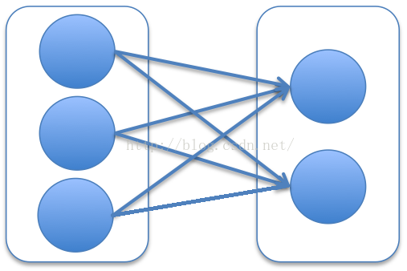

1.  全复制

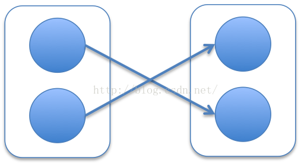

1.  随机分组

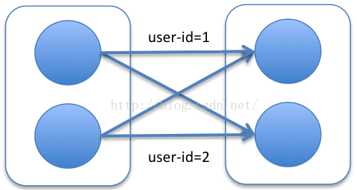

1.  定向分组

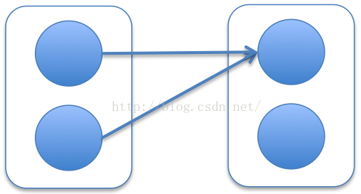

1.  固定发送给一个任务

2.  流计算分组

由于应用场合的广泛性，目前市面上已经有不少流计算平台，包括Google
MillWheel、Twitter Heron和Apache项目Storm、Samza、S4、Flink、Apex、Gearpump。

1.  **Storm及Trident**

在流计算框架中，目前人气最高，应用最广泛的要数Storm。这是由于Storm具有简单的编程模型，且支持Java、Ruby、Python等多种开发语言。Storm也具有良好的性能，在多节点集群上每秒可以处理上百万条消息。Storm在容错方面也设计得很优雅。下面介绍Storm确保消息可靠性的思路。

在DAG模型中，确保消息可靠的难点在于，原始数据被当前的计算节点成功处理后，还不能被丢弃，因为它生成的数据仍然可能在后续的计算节点上处理失败，需要由该消息重新生成。而如果要对消息在各个计算节点的处理情况都作跟踪记录的话，则会消耗大量资源。Storm的解决思路，是为每条消息分派一个ID作为唯一性标识，并在消息中包含原始输入消息的ID。同时用一个响应中心（Acker）维护每条原始输入消息的状态，状态的初值为该原始输入消息的ID。每个计算节点成功执行后，则把输入和输出消息的ID进行异或，再异或对应的原始输入消息的状态。由于每条消息在生成和处理时分别被异或一次，则成功执行后所有消息均被异或两次，对应的原始输入消息的状态为0。因此当状态为0后可安全清除原始输入消息的内容，而如果超过指定时间间隔后状态仍不为0，则认为处理该消息的某个环节出了问题，需要重新执行。

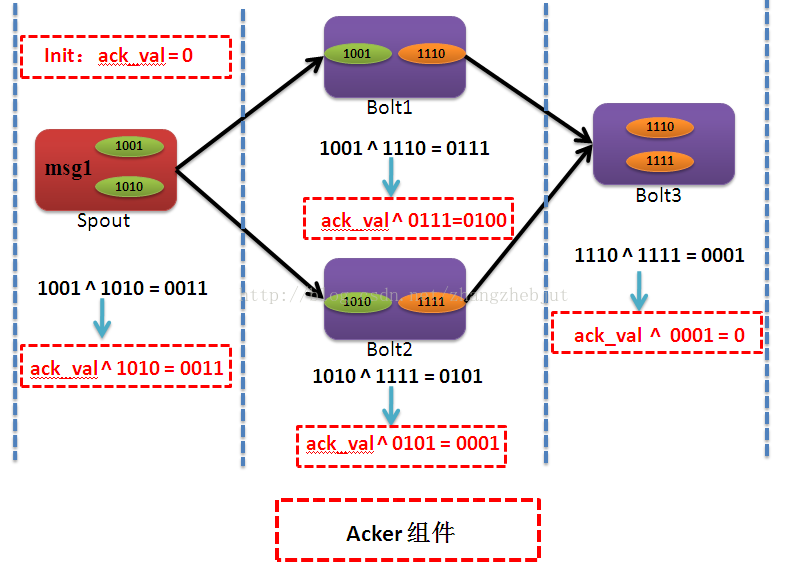

1.  Storm保证消息可靠性过程示意图

Storm还实现了更高层次的抽象框架Trident。Trident以微批处理的方式处理数据流，比如每次处理100条记录。Trident提供了过滤、分组、连接、窗口操作、聚合、状态管理等操作，支持跨批次进行聚合处理，并对执行过程进行优化，包括多个操作的合并、数据传输前的本地聚合等。以微批处理方式处理数据流的框架还有Spark
Streaming。

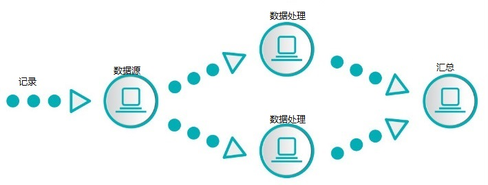

1.  实时流处理

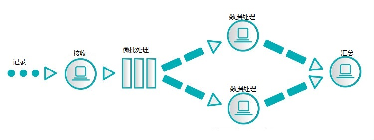

1.  微批处理

2.  实时流处理与微批处理比较

下面是Storm、Trident与另外几种流计算框架的对比：

|            | Storm    | Trident  | Spark Streaming | Samza    | Flink    |
|------------|----------|----------|-----------------|----------|----------|
| 模型       | 实时流   | 微批处理 | 微批处理        | 实时流   | 实时流   |
| API        | 组合式   | 组合式   | 声明式          | 组合式   | 声明式   |
| 可靠性保证 | 至少一次 | 正好一次 | 正好一次        | 至少一次 | 正好一次 |
| 容错方式   | 记录确认 | 记录确认 | 记录更新        | 日志     | 检查点   |
| 状态管理   | 无       | 有       | 有              | 有       | 有       |
| 延迟       | 很低     | 中       | 中              | 低       | 低       |
| 吞吐量     | 低       | 中       | 高              | 高       | 高       |
| 成熟度     | 高       | 高       | 高              | 中       | 低       |

1.  **交互式分析框架**

    1.  **概述**

在解决了大数据的可靠存储和高效计算后，如何为数据分析人员提供便利日益受到关注，而最便利的分析方式莫过于交互式查询。这几年交互式分析技术发展迅速，目前这一领域知名的平台有十余个，包括Google开发的Dremel和PowerDrill，Facebook开发的Presto，
Hadoop服务商Cloudera和HortonWorks分别开发的Impala和Stinger，以及Apache项目Hive、Drill、Tajo、Kylin、MRQL等。一些批处理和流计算平台如Spark和Flink也分别内置了交互式分析框架。由于SQL已被业界广泛接受，目前的交互式分析框架都支持用类似SQL的语言进行查询。早期的交互式分析平台建立在Hadoop的基础上，被称作SQL-on-Hadoop。后来的分析平台改用Spark、Storm等引擎，不过SQL-on-Hadoop的称呼还是沿用了下来。SQL-on-Hadoop也指为分布式数据存储提供SQL查询功能。

1.  **Hive**

Apache
Hive是最早出现的架构在Hadoop基础之上的大规模数据仓库，由Facebook设计并开源。Hive的基本思想是，通过定义模式信息，把HDFS中的文件组织成类似传统数据库的存储系统。Hive
保持着 Hadoop
所提供的可扩展性和灵活性。Hive支持熟悉的关系数据库概念，比如表、列和分区，包含对非结构化数据一定程度的
SQL
支持。它支持所有主要的原语类型（如整数、浮点数、字符串）和复杂类型（如字典、列表、结构）。它还支持使用类似
SQL 的声明性语言 Hive Query Language (HiveQL) 表达的查询，任何熟悉 SQL
的人都很容易理解它。HiveQL被编译为MapReduce过程执行。下图说明如何通过MapReduce实现JOIN和GROUP
BY。

1.  实现JOIN

1.  实现GROUP BY

2.  部分HiveQL操作的实现方式

Hive与传统关系数据库对比如下：

|              | Hive           | 关系数据库       |
|--------------|----------------|------------------|
| 事务         | 不支持         | 支持             |
| 随机插入数据 | 不支持         | 支持             |
| 执行延迟     | 高             | 低               |
| 执行         | MapReduce      | 数据库引擎       |
| 横向扩展     | 支持上百个节点 | 很少超过20个节点 |
| 数据规模     | 大             | 小               |
| 硬件要求     | 普通机器       | 高端专用机器     |
| 字节成本     | 低             | 高               |

Hive的主要弱点是由于建立在MapReduce的基础上，性能受到限制。很多交互式分析平台基于对Hive的改进和扩展，包括Stinger、Presto、Kylin等。其中Kylin是中国团队提交到Apache上的项目，其与众不同的地方是提供多维分析（OLAP）能力。Kylin对多维分析可能用到的度量进行预计算，供查询时直接访问，由此提供快速查询和高并发能力。Kylin在eBay、百度、京东、网易、美团均有应用。

1.  **SQL引擎Calcite**

对于交互式分析，SQL查询引擎的优劣对性能的影响举足轻重。Spark开发了自己的查询引擎Catalyst，而包括Hive、Drill、Kylin、Flink在内的很多交互式分析平台及数据仓库使用Calcite（原名optiq）作为SQL引擎。Calcite是一个Apache孵化项目，其创建者Julian
Hyde曾是Oracle数据库SQL引擎的主要开发者。Calcite具有下列几个技术特点：

1.  支持标准SQL语言。

2.  支持OLAP。

3.  支持对流数据的查询。

4.  独立于编程语言和数据源，可以支持不同的前端和后端。

5.  支持关系代数、可定制的逻辑规划规则和基于成本模型优化的查询引擎。

6.  支持物化视图（materialized view）的管理。

由于分布式场景远比传统的数据存储环境更复杂，Calcite和Catalyst都还处于向Oracle、MySQL等经典关系数据库引擎学习的阶段，在性能优化的道路上还有很长的路要走。

1.  **其他类型的框架**

除了上面介绍的几种类型的框架外，还有一些目前还不太热门但具有重要潜力的框架类型。图计算是DAG之外的另一种迭代式计算模型，它以图论为基础对现实世界建模和计算，擅长表达数据之间的关联性，适用于PageRank计算、社交网络分析、推荐系统及机器学习。这一类框架有Google
Pregel、Apache Giraph、Apache
Hama、PowerGraph、，其中PowerGraph是这一领域目前最杰出的代表。很多图数据库也内置图计算框架。

另一类是增量计算框架，探讨如何只对部分新增数据进行计算来极大提升计算过程的效率，可应用到数据增量或周期性更新的场合。这一类框架包括Google
Percolator、Microsoft Kineograph、阿里Galaxy等。

另外还有像Apache Ignite、Apache
Geode（GemFire的开源版本）这样的高性能事务处理框架。

1.  **总结与展望**

从Hadoop横空出世到现在10余年的时间中，大数据分布式计算技术得到了迅猛发展。不过由于历史尚短，这方面的技术远未成熟。各种框架都还在不断改进，并相互竞争。

性能优化毫无疑问是大数据计算框架改进的重点方向之一。而性能的提高很大程度上取决于内存的有效利用。这包括前面提到的内存计算，现已在各种类型的框架中广泛采用。内存资源的分配管理对性能也有重要影响，JVM垃圾回收在给开发人员带来便利的同时，也制约了内存的有效利用。另外，Java的对象创建及序列化也比较浪费资源。在内存优化方面做足功夫的代表是Flink。出于性能方面的考虑，Flink很多组件自行管理内存，无需依赖JVM垃圾回收机制。Flink还用到开辟内存池、用二进制数据代替对象、量身定制序列化、定制缓存友好的算法等优化手段。Flink还在任务的执行方面进行优化，包括多阶段并行执行和增量迭代。

拥抱机器学习和人工智能也是大数据计算的潮流之一。Spark和Flink分别推出机器学习库Spark
ML和Flink
ML。更多的平台在第三方大数据计算框架上提供机器学习，如Mahout、Oryx及一干Apache孵化项目SystemML、HiveMall、PredictionIO、SAMOA、MADLib。这些机器学习平台一般都同时支持多个计算框架，如Mahout同时以Spark、Flink、H2O为引擎，SAMOA则使用S4、Storm、Samza。在深度学习掀起热潮后，又有社区探索把深度学习框架与现有分布式计算框架结合起来，这样的项目有SparkNet、Caffe
on Spark、TensorFrames等。

在同一平台上支持多种框架也是发展趋势之一，尤其对于那些开发实力较为雄厚的社区。Spark以批处理模型为核心，实现了交互式分析框架Spark
SQL、流计算框架Spark Streaming（及正在实现的Structured
Streaming）、图计算框架GraphX、机器学习库Spark
ML。而Flink在提供低延迟的流计算的同时，批处理、关系计算、图计算、机器学习，一个也没落下，目标直奔大数据通用计算平台。Google的BEAM（意为Batch+strEAM）则试图把Spark、Flink、Apex这样的计算框架纳入自己制定的标准之下，颇有号令江湖之意。

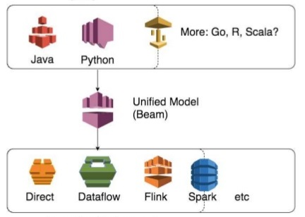

1.  BEAM的统一模型

2.  **学习资料**

最后介绍一下大数据计算方面的学习资料。入门前的了解、知识面的拓展及知识的零散积累靠长期访问相关的网站、论坛、微信订阅号，问题解答则靠对搜索引擎的熟练驾驭。需要指出的是，网上的内容良萎不齐，很多资料是过时的，以讹传讹也是常有的事，要注意鉴别。论坛首推知乎、Quora、Stack
Overflow，运气好的话开发者亲自给你解答。其他值得关注的网站或论坛包括炼数成金、人大经济论坛、CSDN、博客园、云栖社区、360大数据、推酷、伯乐在线、小象学院等。微信订阅号中，可订阅的有大数据文摘、InfoQ、THU数据派、CSDN大数据、大数据杂谈、数据猿、Hadoop技术博文等，各人根据偏好取舍。

若要进行系统的学习，则首先应参考官方网站文档。不少大数据平台的官方文档内容都比较详实，胜过多数教材。另外，官方文档与产品通常同步更新，这个优势是其他资料无法做到的。不过要说可读性，书籍或视频教程要强得多。视频资料可以从上文提到的部分网站论坛下载。书籍方面，国外O'Reilly、Manning两家出版社在大数据领域出版了不少优秀书籍，特别是Manning的In
Action系列和O'Reilly的Definitive
Guide系列。前者侧重提高动手能力，后者则知识比较全面。In Action和Definitive
Guide系列的书籍很多已翻译为中文，一般分别译为xxx实战、xxx权威指南。另外一家出版社Packt也值得关注。Packt的书比较薄，适合入门。至于中文原创书籍，推荐张俊林的《大数据日知录》，该书是对大数据存储和处理技术的全面梳理，系统性强。其他书籍不逐一点评，若想购买或阅读可参考豆瓣对该书的评分。

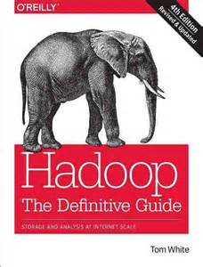

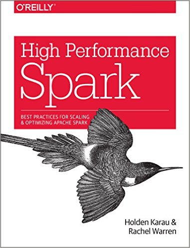

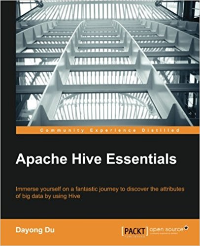

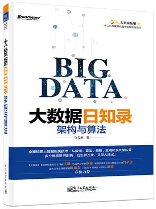

1.  部分推荐书籍

对希望对大数据框架内部机制有深入的理解的读者，建议首先检索相关论文来阅读。Google的那几篇论文这里就不一一列出了，网上很容易搜到。其他推荐的论文如下：

| 框架或技术      | 相关论文题目                                                                                 |
|-----------------|----------------------------------------------------------------------------------------------|
| Spark RDD       | Resilient Distributed Datasets: A Fault-Tolerant Abstraction for In-Memory Cluster Computing |
| Spark Streaming | Discretized Streams: A Fault-Tolerant Model for Scalable Stream Processing                   |
| Storm           | STORM: Spatio-Temporal Online Reasoning and Management of Large Spatio-Temporal Data         |
| Flink CEP       | Efficient Pattern Matching over Event Streams                                                |
| Alluxio         | Tachyon: Reliable, Memory Speed Storage for Cluster Computing Frameworks                     |
| PowerGraph      | PowerGraph: Distributed Graph-Parallel Computation on Natural Graphs                         |

参考文献

1.  《大数据日知录》 张俊林著

2.  《PayPal高级工程总监：读完这100篇论文 就能成大数据高手》
    http://www.csdn.net/article/2015-07-07/2825148/1

3.  《脱离JVM？
    Hadoop生态圈的挣扎与演化》李呈祥，https://zhuanlan.zhihu.com/p/20228397?columnSlug=hadoop
