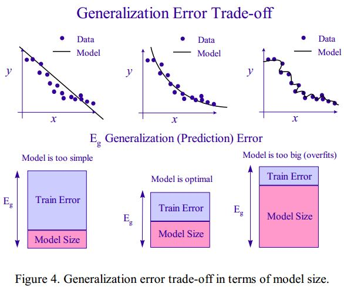
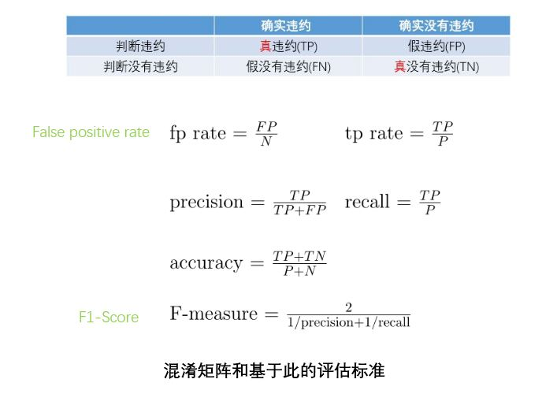
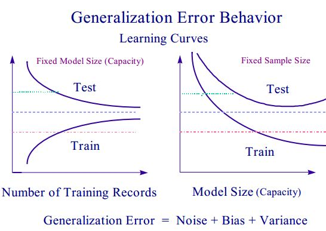

# 一文读懂机器学习信用模型

## 一、前言  
P2P(peer-to-peer)网络借贷自提出以来，就迅速地发展到了英国、美国、日本和中国等地。作为互联网金融的一种，这是一种线上小额度贷款，利用网络平台的方便简捷，意在将小额度的社会闲散资金聚集起来，提供给有资金需求的个人或者微小企业，比如工商个体户。比较著名的有英国的Zopa、美国Prosper，Lending Club等。而P2P自2007年传入中国市场，也一度吸引了大批的参与者，然而时常出现的非法融资等借贷违约现象，限制了它的发展。当然，这里面有诸多原因，比如互联网金融的制度还不完善，同时可以看到对于这种网络借贷，风险控制很关键。因为一旦把钱借出去，那么违约行为就不是债权人能控制的了，所以只能在贷款之前，先预测借款人是否会违约。这就需要对借款人的信用做一个评估。  

宏观上，全球性的经济危机，比如1980-1990年期间，日本仅在1993年8月的坏贷就在1600-2400亿美元之间，还有2008年席卷全球的次贷危机，很大程度上都来源于没有对信用风险做合理的预判。对危机更精确的评估能更好地利用资源。一个有关键就在于精确合乎实际的风险模型来预测危机和系统化的方法来得到这个模型。

传统的借贷业务，比如银行，有一套完整的信用评估系统。还有权威的征信机构（CRAS，Credit Rating Agencies），像央行的征信系统是通过商业银行、其它社会机构上报的数据，结合身份认证中心的身份审核，可以提供给银行系统信用查询和提供给个人信用报告。但对于其它征信机构和互联金融公司目前不提供直接查询服务。再比如，S&P、Moody's 和 Fitch这些征信机构，会要求提出信用评级申请的企业提供非常详尽的信息，而且对不同的邻域设有专家来评级。这些信用评估耗时长，成本高，而且复杂繁琐。  

虽然权威的信用评估比如央行的征信系统，在金融行业有重要的影响力，但是一方面，对不符合要求的个人或中小型企业，缺乏信用评估的来源；另一方面，它们收集的数据并没有想象的全面，数据量也可能没有预估的大。2006年1月开通运行的央行征信系统，至2013年初，有大概8亿人在其中有档案。在这个8亿人当中，只有不到3亿人有过银行或其他金融机构发生过借贷的记录，其中存在大量没有信贷记录的个人。与此同时，互联网中有大量的数据，包含了丰富的个人信息。像电商类网站，京东淘宝；信用卡类网站，我爱卡；支付类网站；包括社交网站，微博微信等等，我们在使用这些互联网平台的时候就留下了海量的数据，比如在支付类网站留下了购买信息，购买的品牌，价格高低就是一类重要的个人信息。将这些数据汇总，从大数据中提取信息，找到规律，进行信用评级。比如说阿里金融，阿里小额贷。  

前面说过传统的征信机构人工成本高，耗时也长，但是如果通过机器学习的方法基于大数据训练出信用模型，就可以自动地完成信用评级和违约预测等任务，而且效果可以比一般的统计方法获得的模型要好。一个比较典型的将机器学习和大数据分析结合起来的公司是ZestFinance,它的核心就在于训练合理的模型，从而提高信用评分的准确性。ZestFinance收集了更多信息，训练时包含了更多的特征，但是出结果的速度非常快。不同的商业银行和借贷公司会积累自己的用户数据，训练适合自己的信用模型。在7月14日的Strada大数据会议中，Data Incubator的创始人，李天惠博士就通过开源的机器学习工具Python基于现实数据训练了信用模型，达到了降低违约率的目的。接下来的部分，包括用机器学习的方法训练信用模型的一个完整的流程：  

+ 数据收集和预处理；  
+ 特征选择；
+ 模型选择与优化；    
+ 模型验证评估。  

值得注意的是，机器学习的方法已经在许多方面有了应用，在延续到信用模型上时，并没有太多创新，包括后面算法的选择上也是已经在其他邻域都有广泛应用的各种分类模型。但是，正如大多现实问题一样，用来训练信用模型的金融数据往往结构复杂，带有噪声，而且特异；甚至，由于市场的变化或者国家经济结构调整，这些数据会对这些变化有敏感的反映。**所以实际并没有统一的最优模型，模型的选择，规模和数据集的选择都需要根据情况的不同作调整，在准确性，训练速度和复杂度，数据集大小之间做权衡**。可以说，每一个用来学习的数据集都有时间和空间上的特异性，所以下面的内容还会讨论实际应用中的矛盾和问题。

## 二、数据收集和清洗 
### 2.1 数据来源  
不管是银行，企业，或者网络借贷平台，电商等都有自己的内部数据，在学习模型上的时候，肯定会包括这些。同时，CRAs或者不同的行业，有传统结构化的数据集，有惯用的数据信息。在这里，我们只是学习一个信用模型，可以选择公开的数据。比如，P2P网络借贷，Lending Club有它的所有交易信息以及从彭博机(Bloomberg)获取公开信息。那么除了这些内部数据，就会有一些创新的地方。比如前面提到的ZestFinance还希望包含用户的信用行为，比如还款意愿的信息，所以除了传统的征信中有的违约历史、账户数、借贷历史等，还会有大数据征信数据，网络点击率、搬家次数等等。为了使信用模型更准确，就要包含尽可能全面丰富的信息，然而现实数据永远不可能收集得完美，因为它的复杂性，有很多特征的关系并不直观，所以在学习信用模型的过程中，可能会不断地增加或删除数据特征。  
### 2.2 数据清洗 
对原始数据，我们可以通过可视化工具，先初步探索一下数据的特点。可以画直方图、散点图等，或者用Pandas、matplotlib等整理原始数据集。比如在李博士的这个例子中，在2014年美国Lending Club上所有的贷款中，大部分人还是按时还款了的，但是不还款的人，可能真的就只会还20%的本金，那么不还款的损失是很大的。还要筛选掉有许多缺失值的项，处理出现的异常值，等等都是训练机器模型时常规的数据清洗过程。**在这里，还没有任何像标准化或者正则化这些处理，都到数据集划分以后再做。**

## 三、特征选择  
原始数据中含有噪声，希望通过特征选择剔除一些不重要的信息，但是在训练最开始的基准(benchmark)模型时，多保留一些特征，然后再根据信用模型的验证结果进行调整。  

**指标体系：**  
因为传统的信用模型依然有重要的价值，包括传统的统计学方法，所以征信机构等权威认证有基础的指标，也就是数据中的特征。而且，这些指标都有具体的解释，意义明确，比如公司信用评级和银行的个人信用评估。  

**基于模型的特征选择：**  
信用模型选用的是分类模型，比如回归模型，决策树，这些模型本身就会反映特征和模型的相关性。在训练模型的时候，对某一种分类算法还可以用不同的特征组合来训练模型，从中选出表现好的。当然，不同的算法训练得到的特征重要性会不同，但是应该尽量解释重要特征的意义。比如在Lending Club的贷款案例中，逻辑回归认为最重要的四个特征：

+ term：贷款的期限，长时间的，每月出的钱少一些，那这个人能按时还钱的可能性更大，也就不会违约。
+ 债务收入比：越高，违约几率越高。
+ 前六月的记录调查：已经申请了多次贷款，肯定有问题，那预计违约的可能性更大。
+ 账号数量：有更多的账号，违约率越低。因为有其他人给贷款，那说明信用较好。
  
**主成分分析：**  
主成分分析(PCA)是常用的一种特征降维方法，但是对于信息模型的训练来说，如果本来收集到的就特征不多，选择主要特征对数据的解释率又不高，可能PCA在这里不是一种好的特征选择的方法。  

其他还有如单变量特征选择等等，都是机器学习已有的方法，有需要可以自己选择。

## 四、模型选择和训练    
### 4.1 分类模型  
**信用模型本身是根据输入数据，输出信用等级，是否违约等分类情况的模型**。那么机器学习中的分类模型都可以套用到信用模型上。传统的统计学方法有Probit Regression，Multiple Discriminant Analysis等等。常用的机器学习分类算法有线性回归、支持向量机、神经网络和决策树等，K-近邻也可以用来给未知数据分类。这里只介绍机器学习的方法。从模型解释的角度来说，对信用模型最理想的应该是决策树算法，因为这样不仅可以用来预测，还能给现实世界的规则提供思路，因为它的分类本身就是基于规则的。  

**逻辑回归**  
可以用于二分类的机器学习模型中，最简单的就是线性模型了。当预测变量，也就是因变量是连续的时候，用线性回归。在这里是否违约是离散的，所以要用到逻辑回归。逻辑回归中将线性输入和分到不同类的概率用如下联系函数关联起来：  
=log\frac{P(y=1|\textbf{x};\theta)}{1-P(y=1|\textbf{x};\theta)}={\theta}^T\textbf{x}$$)
这样得到逻辑函数：  
 = \frac{1}{1+exp(-{\theta}^T\textbf{x})}$$) 其中，是表示样本的多维向量，是回归系数，系数越大表示对应的特征越重要。$)是输入一个时，输出y=1的概率。训练逻辑回归模型关键就是要找到效果最佳的。在分类的时候，设定一个阈值，比如当\ge0.5$)时，认为y=1，此时是决策边界。 

**支持向量机**  
支持向量机的想法就是通过核函数将数据映射到线性可分的高维特征空间中去，然后用一个超平面来划分数据，这个超平面的最佳位置是使得被分为两类的数据子集距离最远。这里涉及到两个超参数(Hyper Parameters)的调参问题：  

+ 惩罚系数C：C过大，要求模型过于拟合训练数据，也就是过拟合，泛化能力(预测未知数据的能力)就不太好，因为可能学习了噪声；过小，欠拟合。  
+ 如果使用径向基函数，自带的gamma参数。  

**决策树--CART(Classification and Regression Tree)**  
决策树是一种基于规则的分类模型，从原始数据集开始，每一次选取特征和分裂值来分裂节点，直到节点不再可分或者节点中的数据占总体的百分比最够小(预设值)，然后根据每个节点分类结果的误差大小，进行修剪(pruning)。决策树节点的个数，也即模型的规模会对准确性产生影响。对于决策树，可以进一步优化，在后面集成学习中会详细进一步说明。下图是对一家商业银行的抵押贷款数据训练的CART的节点示例和节点数目与误差的关系。  
  

**神经网络**  
神经网络实际是学习现实世界中物质的组成过程，它通过线性变换(矩阵运算)和非线性运算(激活函数，activation function)将原始输入投射到线性可分的空间中去做分类。神经网络每一层的节点数，即为矩阵的维度，体先它线性转换的能力(缩放，旋转，降维，平移)；层数，是激活函数的作用次数。从输入层输入特征向量，层层计算获得输出，如果不正确就从最后一层开始进行参数调整(权重矩阵)，层层反馈，也就是反向传播算法(backpropagation)。这个过程中又有激活函数，梯度下降法的选择和学习速率的设定，以求快速又准确地学习模型。  

**K最近邻**  
严格来说，K最近邻并没有训练一个信用模型，它只是对新来的数据找和它距离最近或者最相似的K个已知数据，然后据此来分类。但是我们知道，K最近邻问题中在处理高维问题时，原始数据集就要尽可能地大。所以如果能够获得的原始数据不够多的话，可能错误率也会很高。  
### 4.2 模型训练  
**划分训练集(train)和测试集(test)**  
我们训练信用模型的最终目的是能根据新的数据预测未知风险，信用等级等等。所以为了验证模型的准确性，要从原始数据中划分出训练集和测试集，在这里要注意两点：    

1. 分层划分，也就是说训练集和测试集中数据分类比例(比如违约和不违约)应该和原始数据集是一致的。  
2. 在一切正规化处理以前，划分数据集  
  这里要解释一下，正规化处理是指标准化：消除均值，单位化方查；正则化/归一化：使数据的范数为一等等。因为这些处理，很有可能用到了数据整体的信息，如果先处理，在进行数据集划分，那么训练数据中就提前知道了'未知'数据的部分信息，这会影响模型的验证结果。  

所以，正确的做法是，在使用数据训练模型之前划分数据集，然后对训练集做你想做的处理，保留处理时的参数再用同样的参数处理测试集。

## 五、模型优化  
### 5.1 交叉验证(Cross Validation)  
**过拟合**
我们用收集的数据来训练模型的时候，数据太少达不到学习的效果，数据量很大，而且在设置模型时又设定了低的误差容忍度，那么训练出来的模型可能会过分拟合训练数据。这样导致模型在训练集上做预测的时候效果很好，因为训练集的结果是确定的，就是收集的数据。但是对于新来的数据，预测就会不准确。因为，模型在过分拟合的时候，不仅学习了训练集的有效信息，还学习了包含的噪声，而这是我们不需要的。   

因为我们的最终目的是用训练的信用模型做违约预测，所以要想办法避免过拟合。一种常用的方法就是多次划分不同的训练集(train)和测试集(test)，用不同的训练集得到不同的模型，然后在测试集上做预测，来测试模型的好坏，选择效果最佳的一个，即交叉验证。其中，常用的一种是K次交叉验证。  

**K次交叉验证(K-fold Validation)：** 

1. 将数据集划分成K份；  
2. 进行K次模型训练和测试，每一次用不同的K-1个子集作为训练集，剩下的一个作为测试集；
3. 用一种度量标准来衡量模型的预测性能。

**scikikt-learn函数：**  
在scikit-learn中有现成的cross_val_score函数可以自动对模型做交叉验证，这个函数会按照设定的比例随机划分训练集合测试集。    

### 5.2 参数优化(Hyperparameter Optimization)  
在训练像SVM这样的模型时，模型自带了超参数(hyperparameters)，像SVM模型中的惩罚系数，表示对模型误差的容忍程度，过大会造成过拟合，过小，模型肯定准确率下降。所以需要根据模型的效果进行调整，一般是构造一个关于参数的代价函数(cost function)，然后求最优解。最直接的就是手动调参了，但是这需要有一定的经验，而且工作量大又耗时间。

**网格搜索：**  
网格搜索如字面意思，对每个需要调整的参数，给定搜索范围和每次搜索的步长，进行搜索，直观上看就是多层for循环。这是一种暴力解法，计算量也很大。  
不过，在scikit-learn中可以通过GridSearchCV来并行地进行参数搜索和交叉验证。

**贝叶斯优化：**  

**贝叶斯优化主要有两个函数，一个是被优化函数的先验假设：比如常用的高斯过程(Gauss Process)；另一个就是acquisition function的选择：用来从模型的后验中得到效用函数，好计算下一个要采样的值**

利用贝叶斯优化的方法来调参，可以在不知道具体函数的情况下，假定一个关于参数的函数，然后通过采样点来预计这个函数的最优值可能存在的位置，这样就得到一个新的采样点，重复进行下去直到得到满意的参数。比如假设服从高斯过程，那么从采样点和标准差。贝叶斯优化可以不知道具体函数关系，一般来说可以减少参数搜索的次数。  

### 5.3 集成学习 (Ensemble Learning) 
集成学习并不是一种特定的模型，而是指训练多个分类器，然后通过某种组合(比如投票)来决定结果。这样一来，可能各个小模型的效果有好有坏，但是通过集成后，往往会有更准确稳定的分类效果。  

1. 构建有差异性的分类器  
  + Bagging：对原有数据集进行有放回抽样，得到和原始数据集大小相同的不同训练集，进行训练。
  + Boosting：这是一个迭代的过程，每一次对容易出错的数据给予更高的权重，将一个弱分类器提升为一个强分类器。  
2. 对分类器结果进行整合  

**随机森林**  
基于前面的CART决策树算法，就可以通过集成学习中的Bagging方法，训练多个决策树，然后对分类的结果进行投票，以得到更准确的结果。并且这个时候就不用再对随机森林里的每棵树修剪了；又因为多棵决策树的训练集是又放回地抽样出和原数据集大小一样的数据，所以基本不会同时抽到整个原始样本，避免了过拟合。  

### 5.4 Pipeline  
在scikit-learn中有一个pipeline类，这不能算是对算法的改进，但是在用python训练信用模型的时候，pipeline可以对训练过程做一个包装，在需要重复对训练集和测试集应用各种数据转换器(transformor),比如StandardScaler；特征选择,比如PCA；最终的分类器(estimator)时，把这些步骤打包成一个pipeline模型，然后去处理，这样信用模型训练的过程就显得比较清晰：  

1. 加载数据，数据集划分  
2. pipeline：数据转换，特征降维(可选)，机器学习模型：逻辑回归，随机森林...  
3. 信用模型验证评估

## 六、信用模型评估  
由于现实数据的复杂性，和数据对市场的敏感性，没有最优模型，而且对不同的行业，不同的公司用途，要建立不同的模型；另一方面，不可能收集到完美的数据，还要受数据量、模型大小，和计算时间的制衡。所以在评价信用模型的时候，会考虑准确性，模型的复杂度和需要多大数据量及多大的模型规模可以有比较优的效果，还有恢复率，也就是情况变化的时候模型的适应能力。  

### 6.1 混淆矩阵  
混淆矩阵是在总结分类模型的预测结果时的情形表，包括记录的真实类别和分类模型判断的类别。比如这里真实类别有违约和不违约两种，一个二分类，那么混淆矩阵的形式是：  
   
一般来说，二分类的模型的评价指标有：Precision(精确率)，Recall(召回率)，F-Score和ROC、AUC。从混淆矩阵可以得出总的准确率，特别地，可以分别得到假违约和假没有违约的**误判率**，同时通过连续改变判定为违约的阈值，可以绘制出ROC曲线，从而更全面地分析和比较违约模型的性质。  
 
+ F-Score: P和R往往会出现相互制衡的关系，精确率高了，召回率下降，所以定义F-Score做一个调和，一般还是认为精确率更重要。  
  \frac{PR}{{\beta}^2P+R}$)，当时，就退化成调和平均，称为F1-score。  
  
### 6.2 ROC曲线和AUC  
POC曲线，横轴是FPR(False Positive Rate)，纵轴是TPR(True Positive Rate)。在(1,0)点，表示的是完美避过所有正确分类；(0,1)点则正相反，完全分类正确；而(1,1)点是将所有数据都分为Positive类里。y=x对角线表明一个随机分猜测的分类器。所以ROC曲线越偏向左上角越好。至于AUC是ROC曲线和X轴围成的面积，用具体数值来直观描述ROC曲线。  

绘制一条ROC曲线，是根据分类器对数据的分类结果，违约的概率或者评分，按顺序排列后，设定不同的阈值判断分到哪一类，然后计算出一组FPR和TPR，就可以画出POC曲线了。使用ROC曲线作为评判标准的好处是，实际数据集中常出现类不平衡的现象，比如实际不违约的人比违约的要多很多，这时候ROC曲线能保持不变。

### 6.3 误差曲线(error curves)  
画出误差曲线能帮助我们理解模型大小和数据集规模对准确性的影响。比如，决策树的节点代表了模型的大小，如果节点数太少，起不到描述数据的效果，太多又会过拟合，导致准确率下降。理论上数据越多，越能帮助信用模型学习信息，但是模型的大小限制了它能描述的数据。而且我们自己在学习训练一个信用模型的时候，可能得不到足够的数据，那么通过误差曲线的趋势，可以预计实际应用时需要多大规模的数据量以逼近模型的理论最优。  

## 七、信用模型应用 
### 7.1 应用  
**对单个金融机构的风险整合**
投资人或者金融机构为了降低风险，往往会选择各种证券投资组合，利益大的可能有高风险，所以和一些中庸的投资组合在一起。那么在整合投资组合的风险的时候，就可以对不同的情形建立独立的信用模型，计算出每一个的违约率。一种简单的整合办法，就是用违约率去乘风险资本(Capital at risk)然后简单加和。这样反过来可以用来评估选择这个投资组合需要的临时储蓄。  

只要是需要风险管理的地方，就会需要建立信用模型。除了证券投资，还有抵押贷款，信用卡，个人或商业贷款。另一方面，用信用模型整合风险后，有可以分配到新的金融衍生品中去，给风险合理估价在卖给其他的投资者。除此之外，对信用模型的解释，反过来能帮助完善条款。比如决策树模型，如果发现在保证金比较低的情况下，违约更可能发生，那么就应该提高保证金促使借款人还款。还有增加刺激机制，以鼓励借款人还款，这可以取得比一味加重违约惩罚更好的效果。

**对整个金融体系**
指定规章的机构，可能想获得整个金融系统的信息，好制定一个统一的规则。那么首先，可以分别对几个不同的代表性机构建立信用模型，然后比较这些模型的异同，决策树和变量对模型的敏感度也可以被用来比较，从中找到共同点以推广到整个行业。不过，这样做要冒着计算大量信息的风险。或者只从代表性的机构建立信用模型，然后以此为参照，来分析整体的情况。当然也可以像对单独的机构做风险组合那样，分别计算不同的风险，再评估整体的。比如墨西哥政府在1994-95年经济危机后针对不同的贷款类型：私人、商业、抵押和信用卡实施的财政援助，降低累积利息的负担，同时鼓励大家完成还款。更精确的信用模型能帮助这类政策更好地实施。

### 7.2 进一步研究  
因为信用模型总不够好，但是由于信用风险的损失也是巨大的，所以只有模型的预测效果提高一点点，也能大幅度降低损失。  

+ 从模型优化的角度，有针对信用模型改进的神经网络算法，还有结合聚类算法预处理和分类算法的集成学习方法。  
+ 从分析的风险类型和类型来看，总会有更完善的变量。针对不同的金融场景，可以建立不同的信用模型。

## 八、工具以及资料推荐  
### 8.1 python工具包  
**scikit-learn：**  python的机器学习和人工智能工具包，python完全开源，而且对常用的机器学习模型有现成的方法
  
+ [scikit-learn教程](https://scikit-learn.org/stable/tutorial/index.html)   
+ [结合scikit-learn的几种特征选择方法](http://www.cnblogs.com/hhh5460/p/5186226.html)   
+ [ 【scikit-learn】网格搜索来进行高效的参数调优 ](http://blog.csdn.net/jasonding1354/article/details/50562522)
+ [sklearn中的pipeline机制](http://blog.csdn.net/lanchunhui/article/details/50521648)  
+ [scikit-learn在实际项目中用到的点](http://www.cnblogs.com/jhcelue/p/6755485.html)   
+ [数据标准化+网格搜索+交叉验证+预测(python)](http://www.cnblogs.com/huadongw/p/6380482.html)  

### 8.2 博客及专栏推荐   
+ [基于逻辑回归的简单用户违约预测](http://blog.csdn.net/jiuduan2009/article/details/50158241)         
+ [网格搜索(参数选择)](http://www.cnblogs.com/sddai/p/6440797.html) 
+ [集成学习](http://www.cnblogs.com/GuoJiaSheng/p/4033584.html)
+ [银行客户信用评分及实现](http://www.36dsj.com/archives/75665)  
+ [大数据挖掘来进行风控](https://www.zhihu.com/question/30538874)  知乎专栏
+ [机器学习算法一览，解决思路和应用建议](http://blog.csdn.net/zdy0_2004/article/details/50475822)  
+ [ZestFinance](http://www.tmtpost.com/195557.html)  

### 8.3 论文参考  
+ Credit Risk Assessment using Statistical and Machine Learning: 
  Basic Methodology and Risk Modeling Applications by J. Galindo，P. Tamayo，1997  
+ Predicting Corporate Credit Ratings with
  Machine Learning Algorithms  by Ola Berger Bungum  
+ 随机森林在企业信用评估指标体系确定中的应用 林成德，彭国兰，厦门大学学报，2007  
+ Neural network credit scoring models by David West Computers & Operations Research，2000

*参考：上述推荐资料和2017年Strada大数据会议李天惠博士演讲*

