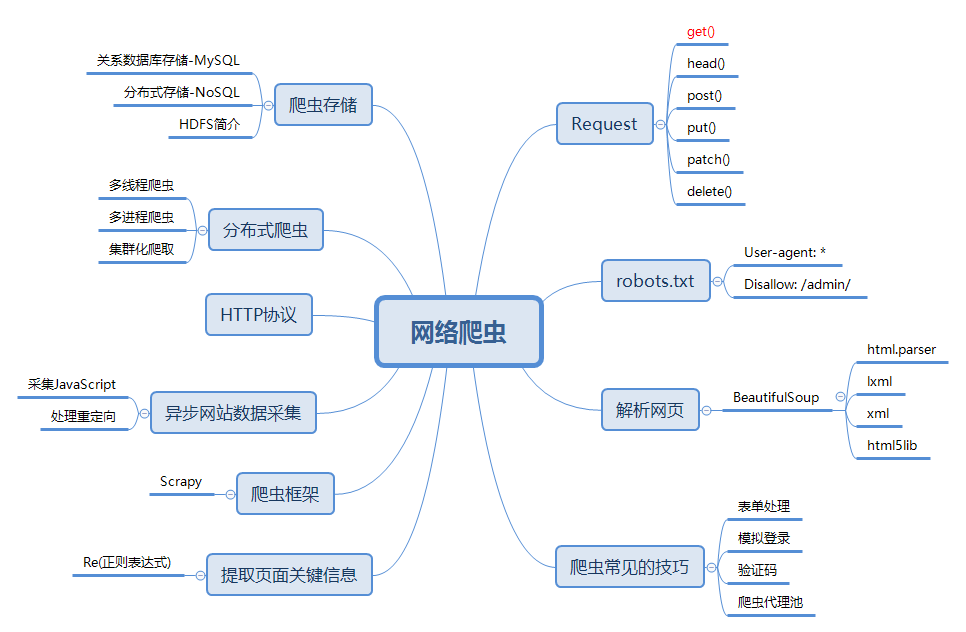
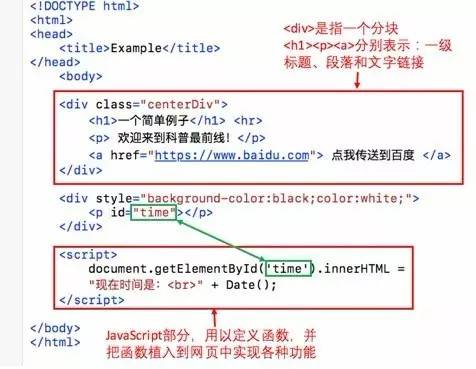
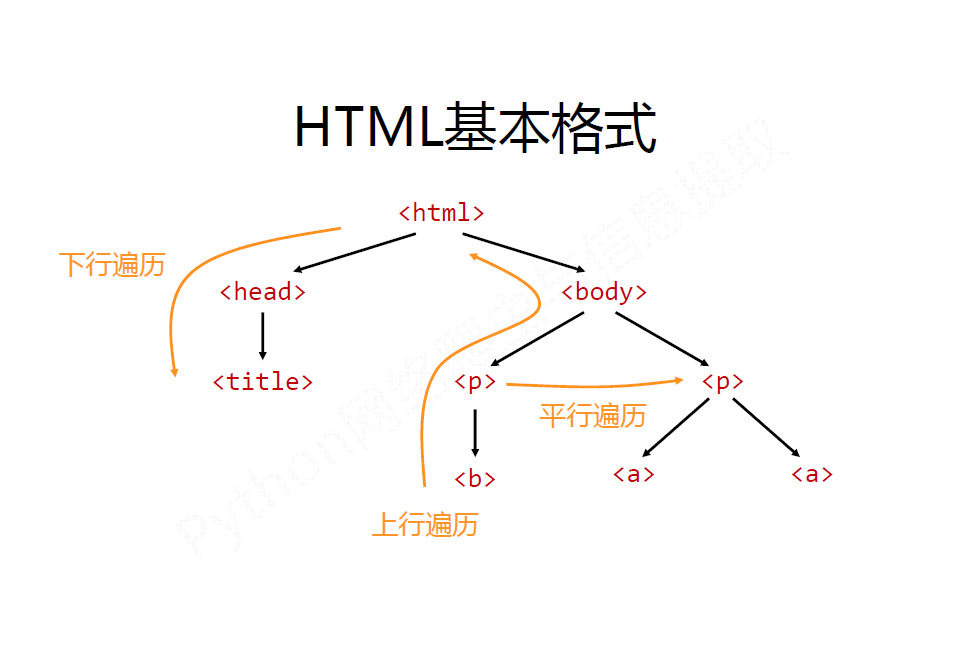
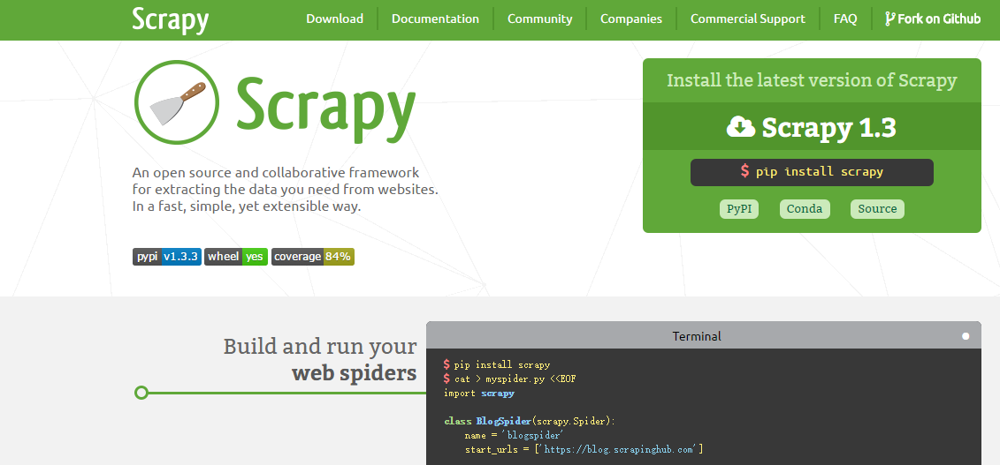
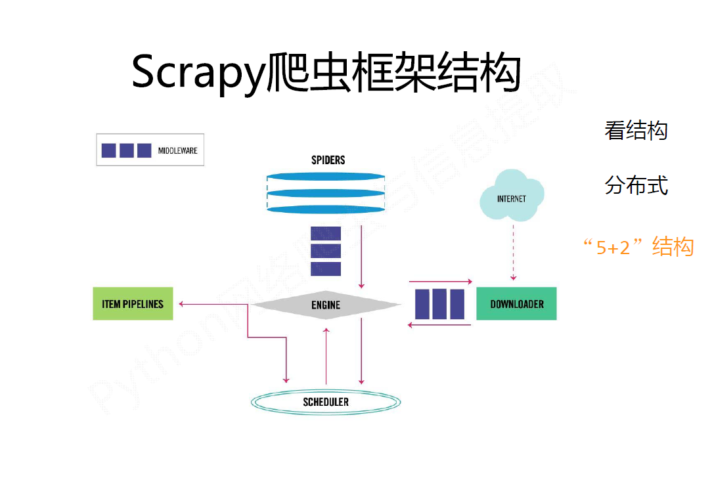
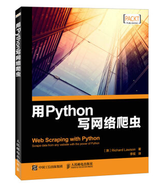

一文读懂网络爬虫

朱海龙



在当前数据爆发的时代，数据分析行业势头强劲，越来越多的人涉足数据分析领域。进入领域最想要的就是获取大量的数据来为自己的分析提供支持，但是如何获取互联网中的有效信息？这就促进了“爬虫”技术的飞速发展。

网络爬虫（又被称为网页蜘蛛，网络机器人，在*FOAF*社区中间，更经常的称为网页追逐者），是一种按照一定的规则，自动地抓取万维网信息的程序或者脚本。

传统爬虫从一个或若干初始网页的URL开始，获得初始网页上的URL，在抓取网页的过程中，不断从当前页面上抽取新的URL放入队列,直到满足系统的一定停止条件。聚焦爬虫的工作流程较为复杂，需要根据一定的网页分析算法过滤与主题无关的链接，保留有用的链接并将其放入等待抓取的URL队列。然后，它将根据一定的搜索策略从队列中选择下一步要抓取的网页URL，并重复上述过程，直到达到系统的某一条件时停止。另外，所有被爬虫抓取的网页将会被系统存贮，进行一定的分析、过滤，并建立索引，以便之后的查询和检索；对于聚焦爬虫来说，这一过程所得到的分析结果还可能对以后的抓取过程给出反馈和指导。

笔者是爬虫初学者，通过这篇综述来记录一下自己的心得体会。

[1. 初见爬虫 5](#初见爬虫)

[1.1 浅析HTTP协议 5](#浅析http协议)

[1.2 Requests库的7个主要方法： 10](#requests库的7个主要方法)

[2. Robots协议 10](#robots协议)

[3. 网页解析 11](#网页解析)

[3.1 BeautifulSoup的解析器 11](#beautifulsoup的解析器)

[3.2 BeautifulSoup类的基本元素 14](#beautifulsoup类的基本元素)

[3.3BeautifulSoup的遍历功能 14](#beautifulsoup的遍历功能)

[4. 正则表达式 15](#正则表达式)

[5. 爬虫框架Scrapy 16](#爬虫框架scrapy)

[5.1 Scrapy爬虫框架结构 17](#scrapy爬虫框架结构)

[5.2 数据流 17](#数据流)

[6. 分布式爬虫 18](#分布式爬虫)

[6.1 多线程爬虫 18](#多线程爬虫)

[6.2 多进程爬虫 19](#多进程爬虫)

[7. 异步网站数据采集 21](#异步网站数据采集)

[8. 爬虫的存储 21](#爬虫的存储)

[8.1 媒体文件 21](#媒体文件)

[8.2 把数据存储到CSV 22](#把数据存储到csv)

[8.3 MySQL 22](#mysql)

[9. 爬虫的常见技巧 23](#爬虫的常见技巧)

[10. 防爬虫 23](#防爬虫)

[11. 学习资料 24](#学习资料)

[推荐书籍 24](#推荐书籍)

[推荐博客 25](#推荐博客)

[推荐视频 25](#推荐视频)

1.初见爬虫
===========

使用Python中的*Requests*第三方库。在Requests的7个主要方法中，最常使用的就是get()方法，通过该方法构造一个向服务器请求资源的Request对象，结果返回一个包含服务器资源的额Response对象。通过Response对象则可以获取请求的返回状态、HTTP响应的字符串即URL对应的页面内容、页面的编码方式以及页面内容的二进制形式。

在了解get()方法之前我们先了解一下HTTP协议，通过对HTTP协议来理解我们访问网页这个过程到底都进行了哪些工作。

1.1 浅析HTTP协议
----------------

超文本传输协议（HTTP，HyperText Transfer
Protocol）是互联网上应用最为广泛的一种网络协议。所有的www文件都必须遵守这个标准。HTTP协议主要有几个特点：

1.  支持客户/服务器模式

2.  简单快捷：客服向服务器发出请求，只需要传送请求方法和路径。请求方法常用的有GET,
    HEAD,
    POST。每种方法规定了客户与服务器联系的类型不同。由于HTTP协议简单，使得HTTP服务器的程序规模小，因而通信速度快。

3.  灵活：HTTP允许传输任意类型的数据对象。

4.  无连接：无连接的含义是限制每次连接请求只处理一个请求。服务器处理完客户的请求，收到客户的应答后即断开连接，这种方式可以节省传输时间。

5.  无状态：HTTP协议是无状态协议。无状态是指协议对于事物处理没有记忆能力。缺少状态意味着如果后续处理需要前面的信息，则它必须重传，这样可能导致每次连接传送的数据量增大，另一方面，在服务器不需要先前信息时它的应答就较快。

下面通过一张图我们来了解一下访问网页的过程都发生了什么。


1.  首先浏览器拿到网址之后先将主机名解析出来。如*http://www.baidu.com/index.html*则会将主机名*www.baidu.com*解析出来。

2.  查找ip，根据主机名，会首先查找ip，首先查询hosts文件，成功则返回对应的ip地址，如果没有查询到，则去DNS服务器查询，成功就返回ip，否则会报告连接错误。

3.  发送http请求，浏览器会把自身相关信息与请求相关信息封装成HTTP请求
    消息发送给服务器。

4.  服务器处理请求，服务器读取HTTP请求中的内容，在经过解析主机，解析站点名称，解析访问资源后，会查找相关资源，如果查找成功，则返回状态码200，失败就会返回大名鼎鼎的404了，在服务器监测到请求不在的资源后，可以按照程序员设置的跳转到别的页面。所以有各种有个性的404错误页面。

5.  服务器返回HTTP响应，浏览器得到返回数据后就可以提取数据，然后调用解析内核进行翻译，最后显示出页面。之后浏览器会对其引用的文件比如图片，css，js等文件不断进行上述过程，直到所有文件都被下载下来之后，网页就会显示出来。

HTTP请求，http请求由三部分组成，分别是：请求行、消息报头、请求正文。请求方法（所有方法全为大写）有多种，各个方法的解释如下：

GET     请求获取Request-URI所标识的资源

POST    在Request-URI所标识的资源后附加新的数据

HEAD    请求获取由Request-URI所标识的资源的响应消息报头

PUT     请求服务器存储一个资源，并用Request-URI作为其标识

DELETE  请求服务器删除Request-URI所标识的资源

TRACE   请求服务器回送收到的请求信息，主要用于测试或诊断

CONNECT 保留将来使用

OPTIONS 请求查询服务器的性能，或者查询与资源相关的选项和需求  
应用举例:

GET方法：在浏览器的地址栏中输入网址的方式访问网页时，浏览器采用GET方法向服务器获取资源，eg:GET
/form.html HTTP/1.1 (CRLF)

HTTP响应也是由三个部分组成，分别是：状态行、消息报头、响应正文  
状态行格式如下：HTTP-Version Status-Code Reason-Phrase
CRLF,其中，HTTP-Version表示服务器HTTP协议的版本；Status-Code表示服务器发回的响应状态代码；Reason-Phrase表示状态代码的文本描述。

状态代码有三位数字组成，第一个数字定义了响应的类别，且有五种可能取值：

1xx：指示信息--表示请求已接收，继续处理

2xx：成功--表示请求已被成功接收、理解、接受

3xx：重定向--要完成请求必须进行更进一步的操作

4xx：客户端错误--请求有语法错误或请求无法实现

5xx：服务器端错误--服务器未能实现合法的请求

常见状态代码、状态描述、说明：200 OK      //客户端请求成功

400 Bad Request  //客户端请求有语法错误，不能被服务器所理解

401 Unauthorized
//请求未经授权，这个状态代码必须和WWW-Authenticate报头域一起使用 

403 Forbidden  //服务器收到请求，但是拒绝提供服务

404 Not Found  //请求资源不存在，eg：输入了错误的URL

500 Internal Server Error //服务器发生不可预期的错误

503 Server Unavailable 
//服务器当前不能处理客户端的请求，一段时间后可能恢复正常。

eg：HTTP/1.1 200 OK （CRLF）

详细的HTTP协议可以参考这篇文章：

<http://www.cnblogs.com/li0803/archive/2008/11/03/1324746.html>

前面我们了解了HTTP协议了解了，我们访问网页的过程，那么网页在是什么样子的。爬虫眼中的网页又是什么样子的。

网是静态的，但爬虫是动态的，所以爬虫的基本思想就是沿着网页（蜘蛛网的节点）上的链接的爬取有效信息。当然网页也有动态（一般用PHP或ASP等写成，例如用户登陆界面就是动态网页）的，但如果一张蛛网摇摇欲坠，蜘蛛会感到不那么安稳，所以动态网页的优先级一般会被搜索引擎排在静态网页的后面。

知道了爬虫的基本思想，那么具体如何操作呢？这得从网页的基本概念说起。一个网页有三大构成要素，分别是html文件、css文件和JavaScript文件。如果把一个网页看做一栋房子，那么html相当于房子外壳；css相当于地砖涂料，美化房子外观内饰；JavaScript则相当于家具电器浴池等，增加房子的功能。从上述比喻可以看出，html才是网页的根本，毕竟地砖颜料在市场上也有，家具电器都可以露天摆设，而房子外壳才是独一无二的。

下面就是一个简单网页的例子：


而在爬虫眼里，这个网页是这样的：



因此网页实质上就是超文本（hypertext），网页上的所有内容都是在形如“\<\>...\</\>”这样的标签之内的。如果我们要搜集网页上的所有超链接，只需寻找所有标签中前面是"href="的字符串，并查看提取出来的字符串是否以"http"（超文本转换协议，https表示安全的http协议）开头即可。如果超链接不以"http"开头，那么该链接很可能是网页所在的本地文件或者ftp或smtp（文件或邮件转换协议），应该过滤掉。

在Python中我们使用Requests库中的方法来帮助我们实现对网页的请求，从而达到实现爬虫的过程。

1.2 Requests库的7个主要方法：
-----------------------------

| 方法              | 说明                  |
| --------------- | ------------------- |
| requests        | 构造一个请求，支撑一下各方法的基础方法 |
| requests.get    | 获取HTML页面的主要方法       |
| requests.head   | 获取HTML页面页头信息的方法     |
| requests.post   | 向HTML网页提交POST请求     |
| requests.put    | 向HTML网页提交PUT请求      |
| requests.patch  | 向HTML网页提交局部修改请求     |
| requests.delete | 向HTMl页面提交删除请求       |

最常用的方法get用来实现一个简单的小爬虫，通过示例代码展示：

| import requests r = requests.get(url, timeout = 30) \#url请求地址，设置timeout访问时间 r.text \#通过.text得到网页内容 |
|-----------------------------------------------------------------------------------------------------------------------|

2.Robots协议
=============

Robots协议（也称为爬虫协议、机器人协议等）的全称是“网络爬虫排除标准”（Robots
Exclusion
Protocol），网站通过Robots协议告诉搜索引擎哪些页面可以抓取，哪些页面不能抓取。通过几个小例子来解读一下robots.txt中的内容，robots.txt默认放置于网站的根目录小，对于一个没有robots.txt文件的网站，默认是允许所有爬虫获取其网站内容的。

| User-agent: \* 这里的\*代表的所有的搜索引擎种类，\*是一个通配符 Disallow: /admin/ 这里定义是禁止爬寻admin目录下面的目录 Disallow: /require/ 这里定义是禁止爬寻require目录下面的目录 Disallow: /ABC/ 这里定义是禁止爬寻ABC目录下面的目录 Disallow: /cgi-bin/\*.htm 禁止访问/cgi-bin/目录下的所有以".htm"为后缀的URL(包含子目录)。 Disallow: /\*?\* 禁止访问网站中所有包含问号 (?) 的网址 Disallow: /.jpg\$ 禁止抓取网页所有的.jpg格式的图片 Disallow:/ab/adc.html 禁止爬取ab文件夹下面的adc.html文件。 Allow: /cgi-bin/　这里定义是允许爬寻cgi-bin目录下面的目录 Allow: /tmp 这里定义是允许爬寻tmp的整个目录 Allow: .htm\$ 仅允许访问以".htm"为后缀的URL。 Allow: .gif\$ 允许抓取网页和gif格式图片 Sitemap: 网站地图 告诉爬虫这个页面是网站地图 |
|------------------------------------------------------------------------------------------------------------------------------------------------------------------------------------------------------------------------------------------------------------------------------------------------------------------------------------------------------------------------------------------------------------------------------------------------------------------------------------------------------------------------------------------------------------------------------------------------------------------------------------------------------------------------------------------------------------------------------------------------|


我们对于robots协议的理解，如果是商业利益我们是必须要遵守robots协议内容，否则会承担相应的法律责任。当只是个人玩转网页、练习则是建议遵守，提高自己编写爬虫的友好程度。

3.网页解析
===========

BeautifulSoup尝试化平淡为神奇，通过定位HTML标签来格式化和组织复杂的网络信息，用简单易用的Python对象为我们展示XML结构信息。BeautifulSoup是解析、遍历、维护“标签树”的功能库。

3.1 BeautifulSoup的解析器
-------------------------

| **解析器**       | **使用方法**                                 | **优势**                         | **劣势**                              |
| ------------- | ---------------------------------------- | ------------------------------ | ----------------------------------- |
| Python标准库     | BeautifulSoup(markup, "html.parser")     | Python的内置标准库 执行速度适中 文档容错能力强    | Python 2.7.3 or 3.2.2)前 的版本中文档容错能力差 |
| lxml HTML 解析器 | BeautifulSoup(markup, "lxml")            | 速度快 文档容错能力强                    | 需要安装C语言库                            |
| lxml XML 解析器  | BeautifulSoup(markup, ["lxml", "xml"]) BeautifulSoup(markup, "xml") | 速度快 唯一支持XML的解析器                | 需要安装C语言库                            |
| html5lib      | BeautifulSoup(markup, "html5lib")        | 最好的容错性 以浏览器的方式解析文档生成HTML5格式的文档 | 速度慢 不依赖外部扩展                         |

BeautifulSoup通过以上四种解析器来对我们获取的网页内容进行解析。使用官网的例子来看一下解析结果。首先：

```html
html_doc = """
<html><head><title>The Dormouse's story</title></head>
<body>
<p class="title"><b>The Dormouse's story</b></p>

<p class="story">Once upon a time there were three little sisters; and their names were
<a href="http://example.com/elsie" class="sister" id="link1">Elsie</a>,
<a href="http://example.com/lacie" class="sister" id="link2">Lacie</a> and
<a href="http://example.com/tillie" class="sister" id="link3">Tillie</a>;
and they lived at the bottom of a well.</p>

<p class="story">...</p>
"""
```

以上的一段HTML内容，我们通过BeautifulSoup解析之后，并且输出解析后的结果来对比一下。

```html
from bs4 import BeautifulSoup
soup = BeautifulSoup(html_doc,’html.parser’)
print(soup.prettify())
# <html>
#  <head>
#   <title>
#    The Dormouse's story
#   </title>
#  </head>
#  <body>
#   <p class="title">
#    <b>
#     The Dormouse's story
#    </b>
#   </p>
#   <p class="story">
#    Once upon a time there were three little sisters; and their names were
#    <a class="sister" href="http://example.com/elsie" id="link1">
#     Elsie
#    </a>
#    ,
#    <a class="sister" href="http://example.com/lacie" id="link2">
#     Lacie
#    </a>
#    and
#    <a class="sister" href="http://example.com/tillie" id="link2">
#     Tillie
#    </a>
#    ; and they lived at the bottom of a well.
#   </p>
#   <p class="story">
#    ...
#   </p>
#  </body>
# </html>
```

通过解析的网页内容，我们就可以使用BeautifulSoup中的方法来轻而易举的获得网页中的主要信息。

```html
soup.title
# <title>The Dormouse's story</title>

soup.title.name
# u'title'

soup.title.string
# u'The Dormouse's story'

soup.title.parent.name
# u'head'

soup.p
# <p class="title"><b>The Dormouse's story</b></p>

soup.p['class']
# u'title'

soup.a
# <a class="sister" href="http://example.com/elsie" id="link1">Elsie</a>

soup.find_all('a')
# [<a class="sister" href="http://example.com/elsie" id="link1">Elsie</a>,
#  <a class="sister" href="http://example.com/lacie" id="link2">Lacie</a>,
#  <a class="sister" href="http://example.com/tillie" id="link3">Tillie</a>]

soup.find(id="link3")
# <a class="sister" href="http://example.com/tillie" id="link3">Tillie</a>
```


3.2 BeautifulSoup类的基本元素
-----------------------------

| 基本元素           | 说明                           |
| -------------- | ---------------------------- |
| Tag            | 标签，最基本单元，分别用\<\>\</\>表明开头和结尾 |
| Name           | 标签的名字，\<tag\>.name           |
| Attributes     | 标签的属性，字典形式，\<tag\>.attrs     |
| NavigableSring | 标签内非属性的字符串，\<tag\>.string    |
| Comment        | 标签内字符串的注释部分                  |

3.3BeautifulSoup的遍历功能
--------------------------

遍历分为上行遍历、下行遍历、平行遍历三种。



下行遍历：

| 属性           | 说明                     |
| ------------ | ---------------------- |
| .contents    | 子节点的列表，将Tag的所有儿子节点存入列表 |
| .children    | 子节点的迭代类型，循环遍历儿子节点      |
| .descendants | 子孙节点的迭代类型，包含所有子孙节点     |

上行遍历：

| 属性       | 说明                    |
| -------- | --------------------- |
| .parent  | 节点的父亲标签               |
| .parents | 节点的先辈的迭代类型，用于循环遍历先辈节点 |

平行遍历：

| 属性                 | 说明                        |
| ------------------ | ------------------------- |
| .next_sibling      | 返回按照HTML文本顺序的下一个平行节点标签    |
| .previous_sibling  | 返回按照HTML文本顺序上一个平行节点标签     |
| .next_sibling      | 迭代类型，返回按照HTML文本顺序后续平行节点标签 |
| .previous_siblings | 迭代类型，返回按照HTML文本顺序前续平行节点标签 |

4.正则表达式
=============

正则表达式，又称规则表达式。（英语：Regular
Expression，在代码中常简写为regex、regexp或RE），计算机科学的一个概念。正则表通常被用来检索、替换那些符合某个模式(规则)的文本。

笔者也是初学正则表达式，感觉自己不能简洁清晰的讲述正则表达式，建议参考网上的教程<http://deerchao.net/tutorials/regex/regex.htm#mission>。图文并茂，详细讲解了正则表达式。

通过掌握正则表示也可以帮助我们获取网页中的主要信息。

5.爬虫框架Scrapy
=================



Scrapy是Python开发的一个快速,高层次的屏幕抓取和web抓取框架，用于抓取web站点并从页面中提取结构化的数据。Scrapy用途广泛，可以用于数据挖掘、监测和自动化测试。

Scrapy吸引人的地方在于它是一个框架，任何人都可以根据需求方便的修改。它也提供了多种类型爬虫的基类，如BaseSpider、sitemap爬虫等，最新版本又提供了web2.0爬虫的支持。

5.1 Scrapy爬虫框架结构
----------------------



Engine：控制所有模块之间的数据流、根据条件触发事件。

Downloader：根据请求下载网页

Scheduler：对所有爬去请求进行调度管理

Spider：解析Downloader返回的响应、产生爬取项、产生额外的爬去请求。

Item
Pipelines：以流水线方式处理Spider产生的爬取项、可能包括清理、检验和查重爬取项中的HTML数据、将数据存储到数据库。

5.2 数据流
----------

1.引擎打开一个网站(open a
domain)，找到处理该网站的Spider并向该spider请求第一个要爬取的URL(s)。

2.引擎从Spider中获取到第一个要爬取的URL并在调度器(Scheduler)以Request调度。

3.引擎向调度器请求下一个要爬取的URL。

4.调度器返回下一个要爬取的URL给引擎，引擎将URL通过下载中间件(请求(request)方向)转发给下载器(Downloader)。

5.一旦页面下载完毕，下载器生成一个该页面的Response，并将其通过下载中间件(返回(response)方向)发送给引擎。

6.引擎从下载器中接收到Response并通过Spider中间件(输入方向)发送给Spider处理。

7.Spider处理Response并返回爬取到的Item及(跟进的)新的Request给引擎。

8.引擎将(Spider返回的)爬取到的Item给Item
Pipeline，将(Spider返回的)Request给调度器。

9.(从第二步)重复直到调度器中没有更多地request，引擎关闭该网站。

6.分布式爬虫
=============

6.1 多线程爬虫
--------------

在爬取数据量小的情况下，我们使用的都是串行下载网页的，只有前一次下载完成之后才会启动新的下载。数据量小的情况下尚可应对。但面对大型网站就会显得性能不足，如果我们可以同时下载多个网页，那么下载时间将会得到显著改善。

我们将串行下载爬虫扩展成并行下载。需要注意的是如果滥用这一功能，多线程爬虫请求内容过快，可能会造成服务器过载，或是IP地址被封禁。为了避免这一问题，我们的爬虫就要设置一个delay标识，用于设定请求同一域名时的最小时间间隔。

在Python中实现多线程是比较简单的，Python中的thread模块是比较底层的模块，Python的threading模块是对thread做了一些封装，可以更加方便的被使用。

简要的看一下thread模块中含函数和常量

import thread

thread.LockType \#锁对象的一种, 用于线程的同步

thread.error \#线程的异常

thread.start_new_thread(function, args[, kwargs]) \#创建一个新的线程

function : 线程执行函数

args : 线程执行函数的参数, 类似为tuple,

kwargs : 是一个字典

返回值: 返回线程的标识符

thread.exit() \#线程退出函数

thread.allocate_lock() \#生成一个未锁状态的锁对象

返回值: 返回一个锁对象

Thread中常用的函数和对象：

\#函数

threading.active_count() \#返回当前线程对象Thread的个数

threading.enumerate() \#返回当前运行的线程对象Thread(包括后台的)的list

threading.Condition() \#返回条件变量对象的工厂函数, 主要用户线程的并发

threading.current_thread() \#返回当前的线程对象Thread, 文档后面解释没看懂

threading.Lock() \#返回一个新的锁对象, 是在thread模块的基础上实现的
与acquire()和release()结合使用

\#类

threading.Thread \#一个表示线程控制的类, 这个类常被继承

thraeding.Timer \#定时器,线程在一定时间后执行

threading.ThreadError \#引发中各种线程相关异常

一般来说，使用线程有两种模式, 一种是创建线程要执行的函数,
把这个函数传递进Thread对象里，让它来执行.
另一种是直接从Thread继承，创建一个新的class，把线程执行的代码放到这个新的class里。

实现多进程的代码和例子参考：<http://www.jianshu.com/p/86b8e78c418a>

6.2 多进程爬虫
--------------

Python中的多线程其实并不是真正的多线程，并不能做到充分利用多核CPU资源。

如果想要充分利用，在python中大部分情况需要使用多进程，那么这个包就叫做
multiprocessing。

借助它，可以轻松完成从单进程到并发执行的转换。multiprocessing支持子进程、通信和共享数据、执行不同形式的同步，提供了Process、Queue、Pipe、Lock等组件。

Process基本使用：

在multiprocessing中，每一个进程都用一个Process类来表示。首先看下它的API。Process([group
[, target [, name [, args [, kwargs]]]]])

target表示调用对象，你可以传入方法的名字

args表示被调用对象的位置参数元组，比如target是函数a，他有两个参数m，n，那么args就传入(m,
n)即可

kwargs表示调用对象的字典

name是别名，相当于给这个进程取一个名字

group分组，实际上不使用

我们先用一个实例来感受一下：

```python
import multiprocessing
def process(num):
    print 'Process:', num
 
if __name__ == '__main__':
    for i in range(5):
        p = multiprocessing.Process(target=process, args=(i,))
        p.start()

```


最简单的创建Process的过程如上所示，target传入函数名，args是函数的参数，是元组的形式，如果只有一个参数，那就是长度为1的元组。

然后调用start()方法即可启动多个进程了。

另外你还可以通过 cpu_count() 方法还有 active_children() 方法获取当前机器的 CPU
核心数量以及得到目前所有的运行的进程。

通过一个实例来感受一下：

```python
import multiprocessing
import time

def process(num):
    time.sleep(num)
    print 'Process:', num

if __name__ == '__main__':
    for i in range(5):
        p = multiprocessing.Process(target=process, args=(i,))
        p.start()

    print('CPU number:' + str(multiprocessing.cpu_count()))
    for p in multiprocessing.active_children():
        print('Child process name: ' + p.name + ' id: ' + str(p.pid))

    print('Process Ended')

```


运行结果：

```python
CPU number:2
Child process name: Process-2 id: 16084
Child process name: Process-3 id: 10668
Child process name: Process-5 id: 15512
Child process name: Process-4 id: 9284
Child process name: Process-1 id: 16320
Process Ended
Process: 0
Process: 1
Process: 2
Process: 3
Process: 4

```


通过开启多个进程实现爬虫，会大大缩减爬取信息的速度。详细介绍请参考：

<http://cuiqingcai.com/3335.html>

7.异步网站数据采集
===================

在收集网页信息时我们会遇到，网页的加载模型为瀑布流形式，页面URL没有改变，但依然可以加载出内容。这时候就需要我们分析网页中JavaScript中的一些代码，从中获取我们所需要的数据。

面对使用JS渲染的页面推荐使用PhantomJS，无界面，可脚本编程的WebKit浏览器。参考*http://cuiqingcai.com/2577.html*。

Selenium一种自动化测试工具。可以方便实现Web界面测试。使用PhantomJS渲染解析JS，Selenium用来驱动以及写与Python的对接，然后Python进行后期处理。参考<http://cuiqingcai.com/2599.html>。

8.爬虫的存储
=============

在刚开始接触爬虫的时候，我们习惯将小的爬虫结果输出在命令行中，看着命令行中一行行的数据显得颇有成就感，但是随着数据的增多，并且需要进行数据分析时，将数据打印到命令行就不是办法了。为了可以远程使用大部分网络爬虫，我们还是需要将收集的数据存储起来。

8.1 媒体文件
------------

媒体文件常见的有两种存储方式：只获取URL链接，或者直接把源文件下载下来。但是推荐使用第一种方式。优点如下：

-   爬虫运行的更快，耗费的流量更少，因为只存储链接，不需要下载文件。

-   节省存储空间，因为不需要存储媒体文件。

-   存储URL的代码更容易写，也不需要实现文件下载代码

-   不下载文件能够降低目标主机服务器的负载。

>   当然这样做也存在一些缺点：

-   内嵌在我们网页中的外站链接被称为盗链，使用这种链接会让我们麻烦不断，每个网站都会实施防盗链措施。

-   因为你的链接文件在别人的服务器，所以我们的应用就要跟着别人的节奏运行了。

-   盗链很容易改变，如果把盗链放在博客等地，被对方发现很可能被恶搞。或者是把URL存储备用，等到用的时候发现链接已经过期了。

-   在现实中网络浏览器不仅可以访问HTML页面并切换页面，它们也会下载访问页面上的所有资源。下载文件会让我们的爬虫看起来更像人在浏览页面。

8.2 把数据存储到CSV
-------------------

CSV是存储表格数据的常用文件格式。每行都用一个换行符分隔，列与列之间用逗号分隔。Python中的CSV库可以非常简单的修改CSV文件，也可以从零开始创建一个CSV文件。

```python
import csv
csvfile = open(‘files/test.csv’, ‘w+’)
try:
    writer = csv.writer(csvfile)
writer.writerow((‘number’, ‘number plus 2’, ‘number times 2’))
for i in range(10):
    writer.writerow((i, i + 2,  i * 2)
finally:
    csvFile.close()

```


我们可以使用csv模块提供的功能将爬虫获取的信息存入csv文件中。

8.3 MySQL
---------

对于大量的爬虫数据，并且在之后我们需要反复用来筛选分析的数据，我们选择存储在数据库中。MySQL是目前最受欢迎的开源关系型数据库管理系统，它是一种非常灵活、稳定、功能齐全的DBMS，许多顶级网站都在用它，YouTube、Twitter、Facebook等。

Python中没有内置的MySQL支持工具，不过，有很多开源的库可以用来与MySQL做交互，最为出名的就是PyMySQL。

```python
import pymysql
conn = pymysql.connect(host = ‘127.0.0.1’ unix_socket=’/tmp/mysql.sock’, user = 
‘root’, passwd = none, db=’mysql’)
cur = conn.cursor()
cur.execute(“use scraping”)
cur.execute(“select * from pages”)
cur.close()

```


结合上述过程将爬虫获取到的数据存入数据库中。

# 9.爬虫的常见技巧

9.1 模拟登录
------------

目前的网站多是采用cookie跟踪用户是否已经登录的信息。一旦网站验证了你的登录权证，它就会保存在你浏览器的cookie中，里面通常包含一个服务器生成的命令牌、登录有效时限和状态跟踪信息。网站会把这个cookie当作信息验证的证据，在我们浏览网站的每个页面时出示给服务器。

通过Chrome等浏览器自带的开发者工具，我们从Network中获取请求网页的头部和表单，在Header中我们就可以查看cookie中存储的登录信息，我们可以通过Scrapy设置请求网页的头部信息，并将cookie存储在本地，来实现模拟登陆的效果。详细的操作可以查看博客：<http://www.jianshu.com/p/b7f41df6202d>

9.2 网页验证码
--------------

简单的说，验证码就是一张图片，图片上有字符串。网站是如何实现的呢？有WEB基础的人可能会知道，每个浏览器基本都有cookie，作为这次回话的唯一标示。每次访问网站，浏览器都会把这个cookie发送给服务器。验证码就是和这个cookie绑定到一起的。如何理解呢？举个例子，现在有网站W，有A和B两个人，同时访问W，W给A返回的验证码是X,给B返回的验证码是Y，这两个验证码都是正确的，但是如果A输入了B的验证码，肯定验证不通过。那服务器是怎么区分A和B呢，就是用到的cookie。再举个例子，有些网站你登录一次之后，下次继续访问可能就自动登陆了，也是用cookie来标示唯一身份的，如果清除了cookie也就无法自动登陆了。

对于一些简单的验证码我们可以通过机器识别，但是对于一些人眼都很难识别的验证码就只能寻找更加复杂的技术了。简单的验证码识别过程就是对验证码图片的一个处理过程。

-   灰度图转换，可以结合opencv中的imread方法。

-   图像去噪（均值滤波器、高斯滤波器等等）。

-   图像二值化（这个过程中验证码中的字符串已经成为黑色的，底色为白色）。

    

-   使用图像识别方式，识别图中的字符串达到识别验证码的目的。

推荐阅读：

<http://www.jianshu.com/p/dd699561671b>

<http://www.cnblogs.com/hearzeus/p/5166299.html>（上篇）

<http://www.cnblogs.com/hearzeus/p/5226546.html>（下篇）

9.3 爬虫代理池
--------------

由于笔者是个爬虫初学者也没有用到过这么复杂的技术，不过笔者在爬虫的过程中的确是体会了被封IP地址的痛苦。所以推荐大家有精力的可以来学习并完成一个。

推荐阅读：https://www.zhihu.com/question/47464143

10.防爬虫
==========

由于暴力爬虫会对网站的服务器产生很大的压力，所以各个网站对爬虫都有限制，大多数网站会定义robots.txt.文件可以让爬虫了解该网站的限制。限制是作为建议给出。但是爬虫前检查该文件可以最小化我们的爬虫被封禁的可能。

一篇关于反爬虫的文章，<https://segmentfault.com/a/1190000005840672>。来自携程技术中心。

11.学习资料
============

推荐书籍
--------

《Python网络数据采集》 陶俊杰、陈小莉 译


《用Python写网络爬虫》 李斌 译



推荐博客
--------

<http://cuiqingcai.com/>
崔庆才得个人博客，有大量关于爬虫的文章，而且讲解的比较细致。

数据挖掘与入门实战微信公众号分享的一篇文章，《Python开源爬虫项目代码：抓取淘宝、京东、QQ、知网数据》，有十九个开源的爬虫项目，可以给大家提供参考。<https://github.com/hlpassion/blog/issues/6>

推荐视频
--------

<http://study.163.com/course/introduction.htm?courseId=1002794001#/courseDetail>
网易云课堂，例子清晰，可以跟做。

<http://www.icourse163.org/course/BIT-1001870001#/info>
北京理工大学，Python网络爬虫与信息提取。
